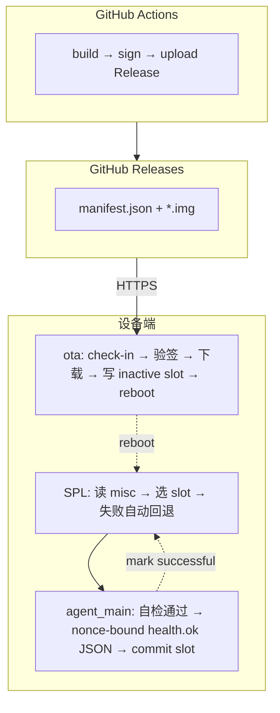
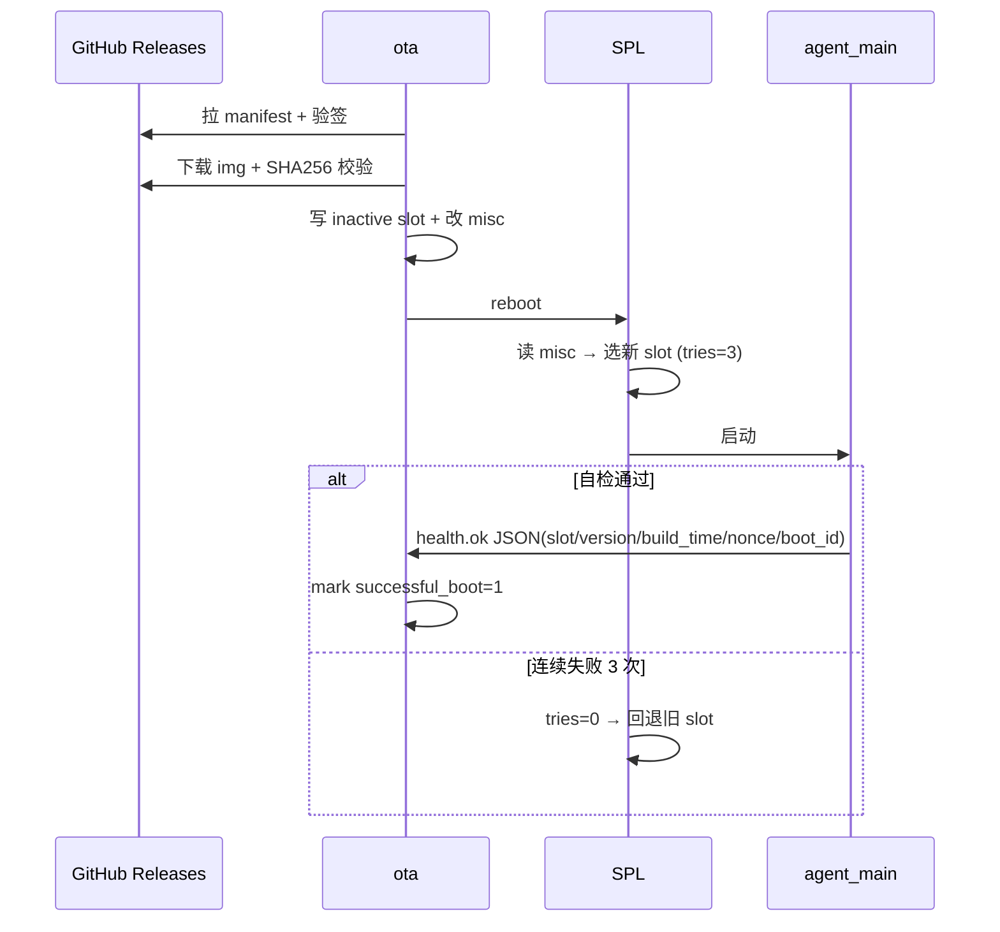

# Aiden 设备 OTA 升级方案提案

> 版本：v0.1（待评审）
> 目标硬件：Luckfox Pico Zero (RV1106 + 8GB eMMC)
> 适用范围：已发到现场的设备，需在线、安全、可回滚地升级固件

> [!IMPORTANT]
> Production implementation has superseded parts of this early proposal. Use `docs/superpowers/specs/2026-05-21-ota-production-design.md`, `docs/OTA_AB_VERIFICATION.md`, `docs/OTA_KEY_MANAGEMENT.md`, and `docs/OTA_DEVICE_ACCEPTANCE.md` as the source of truth for production behavior.
>
> Key production updates:
> - Rockchip SPL A/B metadata is stored at LBA 4, which is byte offset `2048` on 512-byte block devices. References to byte offset `4` in older notes are obsolete.
> - Runtime slot switches use default `tries=3`. The AVB field can represent `0..7`, and `7` remains the maximum accepted by tooling, but it is not the production default.
> - Manifest parts use `asset`, `asset_a`, and `asset_b` objects with `{name,size,sha256}`. `signature.algorithm` is `ed25519`. The older flat `asset_name` examples are superseded.
> - Release names and manifest versions use monotonic `YYYYMMDD-HHMMSS-<shortcommit>`, not `<commit>-<timestamp>`.

## 1. 背景与目标

### 1.1 现状

- 当前分区表：`32K(env),512K@32K(idblock),256K(uboot),32M(boot),512M(oem),256M(userdata),6G(rootfs)`
- 7.3G eMMC 大量浪费：rootfs 6G 实际用 231M，oem 512M 实际用 19M
- userdata 仅 256M，不足以支撑业务数据（特别是引入 memory service 之后）
- 升级路径只有 USB Maskrom 整盘烧录，无法用于已发货设备

### 1.2 设计目标

| 目标           | 描述                                            |
| -------------- | ----------------------------------------------- |
| 在线升级       | 设备运行中拉取固件、自我升级，不需要 USB 介入   |
| 断电安全       | 写入过程任何时刻断电，下次启动仍能正常工作      |
| 自动回滚       | 新固件启动失败时，bootloader 自动回退到上一版本 |
| 完整性         | 镜像内容防篡改、防中间人                        |
| 选择性更新     | 单次 OTA 可只更新部分分区（如只刷 oem）         |
| 不影响用户数据 | userdata 跨升级保留                             |
| 用户数据空间   | 给 userdata 预留 ≥3G                            |

### 1.3 非目标

- 不做差分升级（V1 全镜像替换，包大小可接受）
- 不做后台静默升级（升级时需 reboot，会有 ~30s 服务中断）
- 不做 uboot/idblock OTA（这部分需走工厂返修流程，避免 brick）

## 2. 总体架构：A/B 双分区 + GitHub Releases 分发

业界标准做法（Android、ChromeOS、特斯拉同款）。每个可升级分区有 A、B 两份，misc 分区记录当前活跃 slot。升级时写入 inactive slot，改 misc 切换，reboot。失败则 bootloader 自动回退。



### 升级与回滚时序



## 2.1 OTA 写入原理（与 USB 刷机的区别）

OTA **不依赖 upgrade_tool**。upgrade_tool 走 USB Rockusb 协议，要求设备进 Maskrom/Loader 模式（Linux 未启动）。OTA 是设备在 Linux 正常运行时，自己写自己的块设备：

```
upgrade_tool (USB 刷机):
  你的电脑 ──USB Rockusb──→ eMMC 指定偏移
  设备必须进 Maskrom，Linux 没跑

OTA (设备自刷):
  ota ──open("/dev/block/by-name/oem_b")──→ eMMC 指定偏移
  设备 Linux 正常运行，写的是 inactive slot（没挂载、没在用）
```

Go 代码里的核心写入逻辑：

```go
dst, _ := os.OpenFile("/dev/block/by-name/oem_b", os.O_WRONLY, 0)
src, _ := os.Open("/userdata/ota/oem.img")
io.Copy(dst, src)
dst.Sync()
dst.Close()
```

等价于 `dd if=/userdata/ota/oem.img of=/dev/block/by-name/oem_b bs=4M conv=fsync`。

因为写的是 inactive slot（当前没挂载），对正在运行的系统零影响。写完改 misc、reboot，SPL 选新 slot 启动。

## 3. 分区表设计

### 3.1 新分区表

```
RK_PARTITION_CMD_IN_ENV =
  32K(env),
  512K@32K(idblock),
  256K(uboot),
  4M(misc),               # 新增：A/B 状态机
  32M(boot_a),            # kernel + dtb (slot A)
  32M(boot_b),            #              (slot B)
  256M(oem_a),            # 业务程序   (slot A)
  256M(oem_b),            #            (slot B)
  1G(rootfs_a),           # 系统库     (slot A)
  1G(rootfs_b),           #            (slot B)
  4G(userdata)            # 用户数据 (跨升级保留)
```

### 3.2 容量核算

| 项                           | 大小     |
| ---------------------------- | -------- |
| env + idblock + uboot + misc | ~5 MB    |
| boot A+B                     | 64 MB    |
| oem A+B                      | 512 MB   |
| rootfs A+B                   | 2048 MB  |
| userdata                     | 4096 MB  |
| 合计                         | ~6725 MB |
| 板载 eMMC                    | 7296 MB  |
| 余量                         | ~570 MB  |

### 3.3 哪些 A/B、哪些不 A/B

| 分区     | A/B             | 理由                               |
| -------- | --------------- | ---------------------------------- |
| env      | 否              | bootargs，极少改，改了也走 USB     |
| idblock  | 否              | DDR init code，改一次 brick 风险高 |
| uboot    | 否              | 同上                               |
| misc     | 否 (但**可写**) | 存 A/B 状态机本身                  |
| boot     | 是              | 包含 kernel + dtb，OTA 经常需要动  |
| oem      | 是              | 业务程序，主要迭代物               |
| rootfs   | 是              | 系统库，大版本会动                 |
| userdata | 否              | 用户数据，跨升级保留               |

### 3.4 切换流程

```
启动时序：
  ROM → SPL (读 misc → 选 slot X)
      → uboot proper (从 boot_X 加载 kernel + dtb)
      → kernel (cmdline 里 root=/dev/by-name/rootfs_X)
      → init → systemd → agent_main + ota
```

## 4. misc 分区结构

### 4.1 数据格式（兼容 Rockchip SPL_AB / Android AVB AB）

`include/spl_ab.h` 中 `AB_METADATA_OFFSET = 4` 表示 LBA 4；在 512-byte block device 上对应字节偏移 `2048`。结构体复用 Android AVB AB metadata：

```c
struct AvbABData {
    uint8_t  magic[4];           // "\0AB0"
    uint8_t  version_major;      // 1
    uint8_t  version_minor;      // 0
    uint8_t  reserved1[2];
    AvbABSlotData slots[2];      // slots[0] = A, slots[1] = B
    uint8_t  reserved2[12];
    uint32_t crc32;              // big-endian, covers all above
};

struct AvbABSlotData {
    uint8_t  priority;           // 0-15, 高优先级先尝试
    uint8_t  tries_remaining;    // 0-7, 启动尝试计数；production 默认切换值为 3
    uint8_t  successful_boot;    // 0 or 1
    uint8_t  reserved;
};
```

### 4.2 状态转换

| 场景            | A 状态                       | B 状态                       |
| --------------- | ---------------------------- | ---------------------------- |
| 出厂            | priority=15, tries=0, succ=1 | priority=0, tries=0, succ=0  |
| OTA 写完 B 后   | priority=14, tries=0, succ=1 | priority=15, tries=3, succ=0 |
| B 启动 N 次成功 | priority=14, tries=0, succ=0 | priority=15, tries=0, succ=1 |
| B 启动失败 3 次 | priority=15, tries=0, succ=1 | priority=0, tries=0, succ=0  |

`successful_boot=1` 由 `ota` 在收到 health 信号后写入。
`tries_remaining` 由 SPL 在每次启动时自减。
SPL 选 slot 规则：取 `successful_boot=1 || tries_remaining>0` 中 priority 最高者。

## 5. ota 设计

### 5.1 代码组织

复用现有 Go module（`src/agent/`，go.mod 已存在），新增子命令：

```
src/agent/
  cmd/
    daemon/             # 现有 AI agent
    ota/          # 新增
      main.go           # daemon 入口
  internal/
    ota/
      manifest.go       # manifest 解析 + ed25519 验签
      download.go       # HTTP 下载 + 断点续传 + 限速
      verify.go         # SHA256 校验
      slot.go           # misc 分区读写 + AvbABData CRC32
      writer.go         # /dev/block/by-name/<part> dd 写入
      health.go         # nonce-bound health.ok 监听 + commit slot
      state.go          # 状态机 + 持久化到 /userdata/ota/state.json
```

构建集成：在 `_build.sh` 现有 Go agent 编译之后追加：

```bash
GOOS=linux GOARCH=arm GOARM=7 go build -buildvcs=false \
  -o "../../${BUILD_DIR}/bin/ota" ./cmd/ota
```

部署到 `/oem/usr/bin/ota`，跟 `agent_main` 同样通过 oem partition 升级。

### 5.2 状态机

```
        ┌─────────┐
        │  idle   │◄────────────────────────┐
        └────┬────┘                         │
             │ check_interval 到            │
        ┌────▼────────┐                     │
        │  checking   │ 拉 manifest + 验签   │
        └────┬────────┘                     │
             │ 有新版本                      │
        ┌────▼────────┐                     │
        │ downloading │ → /userdata/ota/    │
        └────┬────────┘                     │
             │ SHA256 OK                    │
        ┌────▼────────┐                     │
        │   writing   │ dd to inactive slot │
        └────┬────────┘                     │
             │                              │
        ┌────▼────────┐                     │
        │ marking_misc│ priority=15,tries=3 │
        └────┬────────┘                     │
             │                              │
        ┌────▼────────┐                     │
        │   reboot    │                     │
        └────┬────────┘                     │
             │ ←── 跨重启 ──                 │
        ┌────▼─────────┐                    │
        │ health_window│ 等 nonce health.ok │
        └────┬─────────┘                    │
       OK    │    超时                       │
       ┌─────┴───────┐                      │
       │             │                      │
  ┌────▼────┐  ┌─────▼──────┐               │
  │committed│  │SPL 自动回退│               │
  └────┬────┘  └─────┬──────┘               │
       └─────────────┴──────────────────────┘
```

状态持久化到 `/userdata/ota/state.json`，跨重启可恢复。

### 5.3 与 agent_main 的健康协议

简单约定（不需要 IPC）：

- `ota` 切换 slot 前删除旧 `/userdata/ota/health.ok`，并写入 `/userdata/ota/pending_boot.json`，其中包含目标 slot、version、build_time 和随机 nonce。
- `agent_main` 启动后完成自检（能跑通 LLM/STT/TTS pipeline 一次）后，只有在 `pending_boot.json` 存在时才写 `/userdata/ota/health.ok` JSON。该 JSON 必须绑定 pending boot 中的 slot、version、build_time、nonce，并包含当前 `/proc/sys/kernel/random/boot_id`。
- `ota` 在 health window 内只接受与 `pending_boot.json` 和当前 boot_id 匹配的 health marker → 调 `markSlotSuccessful` → `successful_boot=1, tries_remaining=0` → 删除 pending 和 health marker。
- 90 秒未见 health → `ota` 主动 reboot，让 SPL 在下一次启动时递减 tries；tries 用尽且 `successful_boot=0` 后 SPL 自动切回另一个 slot

可调参数：health 窗口长度、check 间隔。

## 6. Manifest 与签名

### 6.1 Manifest schema

Production schema supersedes the original flat `asset_name` sketch. Each part uses one of these asset forms:

- `asset`: slot-neutral object `{name,size,sha256}`, only when the same bytes are valid for both slots.
- `asset_a` and `asset_b`: slot-specific objects `{name,size,sha256}`.

`boot` must use `asset_a` and `asset_b` because boot images contain slot-specific DTB bootargs. `oem` and `rootfs` may use slot-specific assets or a slot-neutral `asset` when byte-identical. Signature metadata uses `signature.algorithm="ed25519"`; the manifest is signed over canonical JSON with `signature.value` removed.

```json
{
  "schema_version": 1,
  "channel": "stable",
  "version": "20260521-120000-abcdef0",
  "build_time": "2026-05-19T14:30:00Z",
  "parts": [
    {
      "name": "boot",
      "asset_a": { "name": "boot_a.img", "size": 33554432, "sha256": "..." },
      "asset_b": { "name": "boot_b.img", "size": 33554432, "sha256": "..." }
    },
    {
      "name": "oem",
      "asset_a": { "name": "oem_a.img", "size": 268435456, "sha256": "..." },
      "asset_b": { "name": "oem_b.img", "size": 268435456, "sha256": "..." }
    },
    {
      "name": "rootfs",
      "asset_a": { "name": "rootfs_a.img", "size": 1073741824, "sha256": "..." },
      "asset_b": { "name": "rootfs_b.img", "size": 1073741824, "sha256": "..." }
    }
  ],
  "signature": {
    "algorithm": "ed25519",
    "value": "base64..."
  }
}
```

签名覆盖除 `signature.value` 字段外的所有内容（规范化 JSON 后签）。
`parts` 数组可只含变化的分区，未列出的分区不动。
asset object 里的 `name` 是 GitHub Release asset 的文件名，设备端通过 GitHub API 动态解析为 `browser_download_url`，避免硬编码绝对 URL（migrating repo / fork / mirror 时不用改 manifest）。

### 6.2 公钥分发

- 生产私钥保存在 GitHub Secrets（或 HSM / KMS）
- 公钥**烧录时预置**到 `/oem/etc/ota_pubkey.pem`，与 oem 分区一起 OTA
- V1 production 使用 `/oem/etc/ota_pubkey.pem` 中的 Ed25519 公钥。安全轮换流程见 `docs/OTA_KEY_MANAGEMENT.md`：先用旧私钥签发包含新公钥或 keyring 的过渡 OTA，确认 fleet 接受后再切换 GitHub Secret 到新私钥。

### 6.3 防降级

`state.json` 记录 `last_committed_version`。manifest 里 `version` 必须 `>= last_committed_version`，否则拒绝。

## 7. 分发：GitHub Actions + Releases（无独立后端）

### 7.1 为什么不需要后端

现有 CI 流程是 daily cron + 手动触发，每次构建用 `YYYYMMDD-HHMMSS-<shortcommit>` 当 tag 创建一个滚动 Release（见 `.github/workflows/build.yml`）。GitHub Releases 天然提供：

- **对象存储**：Release assets，每个文件最大 2GB，CDN 加速
- **版本管理**：每个 Release 对应一个不可变 tag，按需保留所有历史版本
- **API 查询**：`GET /repos/{owner}/{repo}/releases/latest` 返回最新版本和所有 asset 下载链接

不需要额外的后端服务、OSS bucket、CDN 配置。

### 7.2 CI 发布流程

在现有 `.github/workflows/build.yml` 上**插入两个 step**，触发方式不动（保持 daily cron + workflow_dispatch）：

```yaml
# .github/workflows/build.yml （已有 → 插入新 step）
name: Build All
on:
  schedule:
    - cron: "0 0 * * *"
  workflow_dispatch:

permissions:
  contents: write

jobs:
  build:
    runs-on: ubuntu-latest # Linux，无 case-sensitive 问题
    steps:
      - uses: actions/checkout@v4
      - run: git submodule update --init --depth=1 pico-sdk
      - uses: docker/setup-buildx-action@v3
      - uses: actions/setup-go@v5
        with:
          go-version-file: src/agent/go.mod
          cache-dependency-path: src/agent/go.sum
      - run: ./build_image.sh

      # ──── 移到 build 之后，给 manifest 提供 version ────
      - name: Generate release name
        id: release_info
        run: |
          COMMIT_HASH=$(git rev-parse --short HEAD)
          TIMESTAMP=$(date -u +"%Y%m%d-%H%M%S")
          BUILD_TIME=$(date -u +"%Y-%m-%dT%H:%M:%SZ")
          RELEASE_NAME="${TIMESTAMP}-${COMMIT_HASH}"
          echo "release_name=${RELEASE_NAME}" >> "$GITHUB_OUTPUT"
          echo "tag_name=${RELEASE_NAME}" >> "$GITHUB_OUTPUT"
          echo "build_time=${BUILD_TIME}" >> "$GITHUB_OUTPUT"

      # ──── 新增：生成签名 manifest ────
      - name: Generate signed OTA manifest
        env:
          OTA_ED25519_PRIVATE_KEY: ${{ secrets.OTA_ED25519_PRIVATE_KEY }}
        run: |
          private_key="$RUNNER_TEMP/ota_ed25519_private_key.pem"
          printf '%s\n' "${OTA_ED25519_PRIVATE_KEY}" > "$private_key"
          chmod 600 "$private_key"
          ./scripts/generate_ota_manifest.sh \
            --version "${{ steps.release_info.outputs.release_name }}" \
            --channel stable \
            --build-time "${{ steps.release_info.outputs.build_time }}" \
            --sign-key "$private_key" \
            --image-dir pico-sdk/output/image \
            --output pico-sdk/output/image/manifest.json

      # ──── 已有：上传所有 image + manifest（通配会自动包含） ────
      - uses: softprops/action-gh-release@v2
        with:
          name: ${{ steps.release_info.outputs.release_name }}
          tag_name: ${{ steps.release_info.outputs.tag_name }}
          files: pico-sdk/output/image/*
          fail_on_unmatched_files: true
```

产物：每次 daily build 出一个 Release，包含 `manifest.json` + 各分区 img + 整包 `update.img`（USB 刷机用）。
设备 OTA 周期 check-in 时只看 `releases/latest`，自然拉到最新。

### 7.3 设备端拉取流程

```
ota 启动
  │
  ▼
GET https://api.github.com/repos/{owner}/{repo}/releases/latest
  → 找到 manifest.json 的 browser_download_url
  │
  ▼
GET manifest.json
  → ed25519 验签
  → 比对 build_time/version 防降级
  │
  ▼
GET boot_<slot>.img / oem_<slot>.img / rootfs_<slot>.img (按 manifest asset 对象)
  → 写到 /userdata/ota/
  → SHA256 校验
  │
  ▼
写入 inactive slot → 改 misc → reboot
```

### 7.4 Private repo 的认证

如果 repo 是 private，Release asset 下载需要 token：

- 烧录时预置一个 **只读 fine-grained PAT**（scope: `contents:read`）到 `/userdata/ota/gh_token`
- ota 请求时带 `Authorization: Bearer <token>` header
- token 可通过 OTA 本身更新（放 manifest 里的 `device_config` 字段）

如果 repo 是 public，无需 token，直接下载。

### 7.5 Channel 管理（可选，V2 再做）

简单做法：

- `stable` channel → 用 GitHub Release 的 `latest`（非 pre-release）
- `beta` channel → 用标记为 pre-release 的 Release

设备配置文件 `/userdata/ota/config.json` 里写 channel，ota 据此决定查 latest 还是 pre-release。

### 7.6 generate_ota_manifest.sh 脚本

Production uses `scripts/generate_ota_manifest.sh --version --channel --build-time --sign-key --image-dir --output`. The sketch below is illustrative only; the important production contract is `signature.algorithm` and `asset`/`asset_a`/`asset_b` objects.

```bash
#!/bin/bash
# scripts/generate_ota_manifest.sh
# 在 CI 中调用，生成签名后的 manifest.json

VERSION=""
CHANNEL="stable"
SIGN_KEY=""
IMAGES=()
OUTPUT=""

# ... 参数解析 ...

# 构造 manifest（不含 signature.value）
manifest=$(jq -n \
  --arg ver "$VERSION" \
  --arg ch "$CHANNEL" \
  --arg time "$(date -u +%Y-%m-%dT%H:%M:%SZ)" \
  '{
    schema_version: 1,
    channel: $ch,
    version: $ver,
    build_time: $time,
    parts: [],
    signature: { algorithm: "ed25519", value: "" }
  }')

# Production generator emits canonical parts like:
# {"name":"boot","asset_a":{"name":"boot_a.img","size":... ,"sha256":"..."},"asset_b":{...}}
# {"name":"oem","asset_a":{"name":"oem_a.img",...},"asset_b":{"name":"oem_b.img",...}}
# {"name":"rootfs","asset_a":{"name":"rootfs_a.img",...},"asset_b":{"name":"rootfs_b.img",...}}
# Slot-neutral {"asset":{"name":"oem.img",...}} is allowed only when bytes are valid for both slots.

# 签名：对去掉 signature.value 的 JSON 做 ed25519
to_sign=$(echo "$manifest" | jq -c 'del(.signature.value)')
sig=$(echo -n "$to_sign" | openssl pkeyutl -sign -inkey "$SIGN_KEY" | base64 -w0)
manifest=$(echo "$manifest" | jq --arg s "$sig" '.signature.value = $s')

echo "$manifest" | jq . > "$OUTPUT"
```

## 8. 实施计划

### PR 1：分区表改造（独立先做）

- 改 `BoardConfig-EMMC-Buildroot-RV1106_Luckfox_Pico_Zero-IPC.mk` 的 `RK_PARTITION_CMD_IN_ENV`
- 改 `pico-sdk/project/build.sh`，使其能为 `oem_a/oem_b/boot_a/boot_b/rootfs_a/rootfs_b/misc` 生成镜像（默认两份相同内容，misc 初始化为 priority A=15、B=0）
- **方案 A 双 dtb 打包**：build.sh 给 `boot_a.img` 和 `boot_b.img` 各打一份独立 FIT，dtb bootargs 分别为 `root=PARTLABEL=rootfs_a` 和 `root=PARTLABEL=rootfs_b`（通过 `dtc -O dts` 编辑 chosen/bootargs 后再 `dtc -O dtb` 重打）
- 改 `_build_image.sh`，oem/userdata overlay 同时铺到 `oem_a` 和 `oem_b`
- 改 kernel cmdline 模板：把 `root=/dev/mmcblk0p7` 改为 `root=PARTLABEL=rootfs_a`（baseline，PR 1 后续在 build.sh 里按 slot 替换）
- USB 整盘烧 `update.img`
- 验收：
  - `/proc/cmdline` 显示 `root=PARTLABEL=rootfs_a`
  - `ls /dev/block/by-name/` 看到 A/B 全套分区
  - `findmnt /` 显示挂载的是 `rootfs_a`
  - 用 `abctl set-active B` + reboot → cmdline 自动变成 `rootfs_b`

**风险**：build 环境需要 case-sensitive 文件系统（macOS APFS 默认 case-insensitive，会遇到 kernel `Documentation/Kbuild` 与 `Documentation/kbuild/` 名字冲突）。CI 在 ubuntu-latest 上不会遇到。

### PR 2：bootloader A/B 联动验证

- SPL_AB 代码层已确认（见 §9.1），PR 2 做活体设备验证
- 写一个 host 端 Go 工具 `tools/abctl`：能读/写/打印 misc 的 AvbABData
- 设备端测试（在 PR 1 烧录的板子上）：
  1. 接 UART，看 SPL 启动 log 是否打印 `SPL: A/B-slot: _a, successful: 1, tries-remain: 0`
  2. `abctl write` 把 priority B>A → reboot → 验证起到 B（看 log + `findmnt /`）
  3. `abctl write` priority B>A 但 tries=0、succ=0 → reboot → 验证 SPL 回退到 A
  4. priority B>A、tries=3、succ=0 → 不打 health → reboot 4 次 → 验证最终回到 A
  5. 验证方案 A 生效：slot A 时 `/proc/cmdline` 含 `rootfs_a`，slot B 时含 `rootfs_b`

### PR 3：ota 实现

- `src/agent/cmd/ota/main.go` + `internal/ota/*`
- 单元测试：manifest 验签、SHA256、AvbABData CRC32、状态机
- 设备端集成测试：用本地 HTTP server 发 manifest 和 img，跑完整的 check → download → write → reboot → commit 流程
- 加 systemd unit / inittab，开机自启
- agent_main 加 health 写入逻辑

### PR 4：CI 发布流程 + 密钥管理

- `.github/workflows/build.yml` —— 在现有 daily/manual 触发的 build job 中插入 manifest 生成步骤（不改触发方式，保持每日滚动 release）
- `scripts/generate_ota_manifest.sh` —— 生成签名 manifest
- ed25519 私钥放 GitHub Secrets (`OTA_ED25519_PRIVATE_KEY`)
- 公钥放仓库 `keys/ota_pubkey.pem`，build 时拷到 `/oem/etc/ota_pubkey.pem`
- 密钥生成、轮换、应急流程文档

### 8.5 验收清单

每个 PR 合并前必须通过对应清单。最后还要跑一次端到端验收。

#### PR 1（分区表 + build.sh A/B 适配）

- [ ] `./build_image.sh` 在 Linux/case-sensitive 环境下成功产出
- [ ] `output/image/` 包含：`env.img / misc.img / boot_a.img / boot_b.img / oem_a.img / oem_b.img / rootfs_a.img / rootfs_b.img / userdata.img / update.img`
- [ ] `misc.img` 4M，字节 `0..2047` 为 0，字节偏移 `2048` 起是合法的 `AvbABData`（magic `\0AB0`、A.priority=15、B.priority=0、CRC32 正确）
- [ ] USB `upgrade_tool uf update.img` 整盘刷一台真机
- [ ] SSH 登录设备：
  - [ ] `cat /proc/cmdline` 显示 `root=/dev/.../rootfs_a`（或通过环境变量传递的 slot）
  - [ ] `ls /dev/block/by-name/` 列出 `boot_a boot_b oem_a oem_b rootfs_a rootfs_b misc userdata`
  - [ ] `cat /proc/partitions` 各分区大小符合 BoardConfig
  - [ ] `df -h /userdata` 显示 ≥ 3.5G
  - [ ] `df -h /oem` 显示 ≥ 200M
  - [ ] `agent_main` 业务能正常跑（音视频 / 唤醒 / LLM 链路 smoke test 通过）

#### PR 2（bootloader A/B 联动）

- [ ] `tools/abctl read` 能正确解析 `misc.img` 出厂状态
- [ ] `tools/abctl write` 写入后 `read` 回显一致，CRC32 正确
- [ ] **手动 slot 切换测试**：
  - [ ] `abctl set-active B` → reboot → `cat /proc/cmdline` 显示 slot B
  - [ ] `abctl set-active A` → reboot → 回到 slot A
- [ ] **try_count 自动回退测试**：
  - [ ] `abctl set-active B --tries=3 --successful=0` → reboot 4 次 → 第 4 次起到 slot A（B 用完计数后被回退）
- [ ] **mark successful 测试**：
  - [ ] `abctl set-active B --tries=3 --successful=0` → reboot → `abctl mark-successful B` → reboot 多次 → 持续起到 B
- [ ] SPL 启动 log（uart）显示 slot 选择决策（`current_slot=B` 之类）

#### PR 3（`ota` 守护进程）

- [ ] 单元测试 `go test ./internal/ota ./cmd/ota -count=1` 全绿，覆盖率 ≥ 70%
- [ ] manifest.go：篡改 manifest 任一字节后 ed25519 验签失败
- [ ] download.go：模拟中断 50% 后重试能续传完成
- [ ] verify.go：sha256 不匹配时拒绝写入
- [ ] slot.go：`AvbABData` 序列化/反序列化字节级一致 CRC32 一致
- [ ] writer.go：用本地文件 fake 块设备能写入并校验
- [ ] state.go：状态机各转移有测试，`state.json` 写入是原子的（temp + rename）
- [ ] **设备端集成测试**（用本地 HTTP server 发 manifest 和 img）：
  - [ ] 启动 → check-in → 下载 → 验签 → 写 inactive slot → 写 pending_boot.json → 改 misc → reboot → 起到新 slot → nonce-bound health.ok JSON → commit slot
  - [ ] 全流程日志清晰可定位
- [ ] **失败注入测试**：
  - [ ] 下载到 50% 拔网络 → 重启后能继续
  - [ ] 写盘到一半 kill -9 ota → 重启后 active slot 不变（旧版本仍能起来）
  - [ ] 新 slot 起来但 agent_main 不写匹配 pending boot 的 health marker → 1 次 reboot 后回退到旧 slot
- [ ] `ota` 二进制 < 10MB，启动内存 < 20MB
- [ ] 开机后 `ps` 能看到 `ota` 进程，`systemctl status ota`（或 inittab 等价）正常

#### PR 4（CI + 密钥）

- [ ] `keys/ota_pubkey.pem` 在仓库里，文件权限 644
- [ ] `OTA_ED25519_PRIVATE_KEY` Secret 已设置（在 GitHub UI 验证）
- [ ] `scripts/generate_ota_manifest.sh --help` 能跑
- [ ] 本地 dry run：`scripts/generate_ota_manifest.sh` 用测试私钥能签出有效 manifest，`ota verify-manifest` 能验签通过
- [ ] CI 推一次（手动触发 workflow_dispatch）：
  - [ ] build 成功
  - [ ] `manifest.json` 生成且 ed25519 签名字段非空
  - [ ] Release assets 包含 manifest + 所有 img
  - [ ] 用本地 `ota verify-manifest` 拉取 Release manifest 验签通过
- [ ] `docs/OTA_KEY_MANAGEMENT.md` 描述：密钥生成命令、备份、轮换流程、私钥泄露应急处置

#### 端到端验收（所有 PR 合并后）

模拟一次真实 OTA 升级，覆盖 happy path + 一次回滚：

- [ ] 准备：手上有一台烧录了 **基线版本 v0** 的设备，正常运行 agent_main
- [ ] **Happy path**：
  - [ ] 在仓库改一个明显可见的标记（如 agent banner 字符串），push → 等 CI build 出新 Release v1
  - [ ] 设备在线状态下，`ota` 自动 check-in → 拉到 v1
  - [ ] 观察日志：下载、验签、写盘、reboot 全过程
  - [ ] 重启后 banner 显示 v1 标记 → 业务正常
  - [ ] 默认 5 分钟（除非配置覆盖）内 misc 状态显示 `successful_boot=1`（用 `abctl read` 检查）
  - [ ] `ota` 不再尝试再次升级（version >= committed）
- [ ] **回滚 path**：
  - [ ] 故意构造一个会崩溃的 v2（比如 agent_main 启动后立即 exit 1）
  - [ ] CI build → Release v2
  - [ ] 设备 OTA 到 v2 → reboot → 崩溃
  - [ ] 观察 1-3 次自动 reboot（看 SPL log 或 `last reboot`）
  - [ ] 最终回退到 v1 → 业务恢复
  - [ ] `abctl read misc` 显示 v2 slot 已被标记不可用
- [ ] **断网升级**：
  - [ ] 设备从 v1 OTA 到 v3 时模拟网络抖动（途中拔网线 30s 后插回）
  - [ ] 升级最终成功，无重复下载（断点续传生效）
- [ ] **无 OTA 时不打扰**：
  - [ ] 设备在线一周，无新 Release 发布，`ota` 周期 check-in 不影响业务（CPU/内存 < 阈值，无误升级）

## 9. 关键技术验证结果

### 9.1 SPL A/B 启动支持（已验证 ✅）

源码 + 编译产物双重确认 RV1106 的 SPL 完整支持 A/B：

| 验证项 | 结果 | 证据 |
|---|---|---|
| `CONFIG_SPL_AB=y` 已编译 | ✅ | `.config` 实际开启 |
| `spl_ab.o` 链接进 SPL 二进制 | ✅ | `nm spl/u-boot-spl` 显示 6 个 spl_ab_* 符号有真实地址 |
| 选 slot 决策树 | ✅ | `spl_ab.c:237-263`，按 priority + bootable 标志选 |
| 自动改写 partition 名为 `_a/_b` | ✅ | `disk/part.c:704-718`，所有 `part_get_info_by_name("boot")` 透明带后缀 |
| 加载 FIT 后调用读 misc | ✅ | `spl_fit.c:547` |
| kernel 加载成功后 tries-- | ✅ | `spl_fit.c:842` |
| kernel 加载失败 reboot 切 slot | ✅ | `spl_fit.c:835` |

### 9.2 cmdline slot 信息传递（有缺口 ⚠️ 已有 workaround）

`fdt_bootargs_append_ab(fdt, slot_suffix)` 在 RV1106 上**不工作**：

- 仅在 `spl_fit_tb_{px30,rv1126,arm64}.S` 这三个平台的 thunderboot 汇编里有 `.weak` 弱定义
- 没有 `spl_fit_tb_rv1106.S`，链接时弱符号空引用，调用相当于 nop
- `nm spl/u-boot-spl | grep fdt_bootargs` 输出空，确认未进二进制

**影响**：SPL 能正确选 slot 启动 kernel，但 kernel cmdline 不会自动带 `androidboot.slot_suffix`，导致 `root=` 无法动态指向 `rootfs_a` 或 `rootfs_b`。

**采用方案 A（每个 boot 分区内嵌专属 dtb）**：

build.sh 给 `boot_a.img` 和 `boot_b.img` 分别打包不同的 dtb：

- `boot_a.img` 内 dtb 的 bootargs：`root=PARTLABEL=rootfs_a`
- `boot_b.img` 内 dtb 的 bootargs：`root=PARTLABEL=rootfs_b`

SPL 选了哪个 slot 就加载哪个 boot.img，cmdline 自然正确。**不动 SPL / kernel 任何代码**，只在 image 打包阶段加一步。

备选方案 B/C（补 SPL 实现 / initramfs 自决）见附录，性价比都不如 A。

### 9.3 剩余待验证项

PR 1 落地后必须验证：

1. **misc 4M 够用**：AvbABData 本身仅 32 字节，给 4M 主要为对齐方便。Rockchip 有时会往 misc 塞 recovery message。可以收缩到 1M 但不建议小于 256K。
2. **rootfs 1G 是否够**：当前用 231M，1G 留 4× 余量。引入更多依赖（如 Python runtime、模型）可能需要 1.5G。建议 PR 1 完成后用实际 rootfs 验证。
3. **build.sh 对 A/B 的支持**：当前按单分区设计，需要补丁（详见 PR 1 改动清单）。这是工程量，不是技术不确定性。
4. **方案 A 的 dtb 双份打包流程**：需要在 build.sh 里加一段，针对 _a 和 _b 各生成一份 boot.img。可基于 `make_fit_optee.sh` 改。

## 10. 风险与缓解

| 风险                                        | 缓解                                            |
| ------------------------------------------- | ----------------------------------------------- |
| 升级途中断电导致 inactive slot 损坏         | 不影响 active slot，重试即可                    |
| 新 slot 起来但 health 一直没打              | SPL try_count 用尽自动回退                      |
| 网络抖动导致下载失败                        | 断点续传，下次 check-in 重试                    |
| Release asset 上的 img 被人替换             | ed25519 签名验证                                |
| 公钥泄露                                    | manifest key_id + 多公钥支持，可滚动            |
| 升级后 userdata 数据格式不兼容旧版          | min_agent_version 字段；rootfs 包含数据迁移脚本 |
| 同一 firmware 升级到 90% 设备后发现严重 bug | manifest 支持指定旧版本回滚（`?version=`）      |
| 工厂烧录漏掉公钥                            | 烧录脚本断言 `/oem/etc/ota_pubkey.pem` 存在     |

## 11. 参考

- Android A/B System Updates: <https://source.android.com/docs/core/ota/ab>
- AVB AB metadata: AOSP `external/avb/libavb_ab/avb_ab_flow.h`
- Rockchip uboot SPL_AB: `pico-sdk/sysdrv/source/uboot/u-boot/include/spl_ab.h`
- Mender / SWUpdate / RAUC: 三个开源 OTA 框架，可对照设计

## 12. 按 commit 拆分的改动清单

下面按"打开哪个仓库、改哪个文件"的粒度列出来，每个 PR 一组。

### 仓库 1：`AidenAI-IO/aiden-sdk`（submodule 上游）

只在 PR 1 改一次，后续 OTA 流程不再触碰。

**PR：A/B 分区表 + build.sh 适配**

| 文件                                                                                     | 改动                                                                                                                                                                          |
| ---------------------------------------------------------------------------------------- | ----------------------------------------------------------------------------------------------------------------------------------------------------------------------------- |
| `project/cfg/BoardConfig_IPC/BoardConfig-EMMC-Buildroot-RV1106_Luckfox_Pico_Zero-IPC.mk` | 改 `RK_PARTITION_CMD_IN_ENV` 为 A/B 布局；改 `RK_PARTITION_FS_TYPE_CFG` 给 `*_a` `*_b` 都加挂载规则；改默认 bootargs 模板用 `root=PARTLABEL=rootfs_a` 占位 |
| `project/build.sh`                                                                       | `parse_partition_env` 已经是动态的，主要看 image 生成函数（`build_userdata` `build_oem` `build_rootfs` 等）能否处理 `_a` `_b` 后缀，可能要加一段：默认两个 slot 镜像同 source |
| `project/build.sh`                                                                       | 生成 `misc.img`（4M，字节 `0..2047` 全零，偏移 `2048` 起写入合法 AvbABData：priority A=15、B=0、A.successful_boot=1、CRC32 正确）                                             |
| `project/build.sh`                                                                       | **方案 A 双 dtb**：构建 `boot_a.img` / `boot_b.img` 时各自修改内嵌 dtb 的 `chosen/bootargs` 为 `root=PARTLABEL=rootfs_a` / `rootfs_b`（`fdtput` 或临时 dts→dtb 转换） |
| `project/build.sh`                                                                       | uboot/idblock/env 仍单分区，跟现在一致                                                                                                                                       |

合入流程：在 aiden-sdk 上开 PR → 合并到 main → 在 aiden-hardware-demo 里 `git submodule update --remote pico-sdk` 把指针往前推。

### 仓库 2：`AidenAI-IO/aiden-hardware-demo`（当前仓库）

后续 PR 都在这里。

**PR 1.5：升 submodule + 验证**

| 文件                           | 改动                                                                   |
| ------------------------------ | ---------------------------------------------------------------------- |
| `pico-sdk` (submodule pointer) | 指到 aiden-sdk 合并后的 commit                                         |
| `_build_image.sh`              | overlay 同时铺 `oem_a` 和 `oem_b`（如 build.sh 还没自己处理）          |
| 手动验证                       | USB 烧 `update.img` → SSH 看 `/proc/cmdline`、`ls /dev/block/by-name/` |

**PR 2：bootloader A/B 联动验证**

| 文件                          | 改动                                                      |
| ----------------------------- | --------------------------------------------------------- |
| `tools/abctl/main.go`         | 新建 host 端工具，能 `read/write/print` misc 的 AvbABData |
| `docs/OTA_AB_VERIFICATION.md` | 写测试结果（SPL 是否真选 slot、try_count 自动回退）       |

如果发现 SPL_AB 没生效，**这一步会触发 plan B 讨论**（退化到方案 1：单分区 + 应用回滚），后续 PR 全部要重做。

**PR 3：`ota` 守护进程**

| 文件                                     | 改动                                                        |
| ---------------------------------------- | ----------------------------------------------------------- |
| `src/agent/cmd/ota/main.go`              | 新建，daemon 入口                                           |
| `src/agent/internal/ota/manifest.go` | manifest 解析 + ed25519 验签                                |
| `src/agent/internal/ota/github.go`   | GitHub Releases API 客户端（拿 latest release + asset URL） |
| `src/agent/internal/ota/download.go` | HTTP 下载 + 断点续传 + 限速                                 |
| `src/agent/internal/ota/verify.go`   | SHA256 校验                                                 |
| `src/agent/internal/ota/slot.go`     | misc 分区读写 + AvbABData CRC32                             |
| `src/agent/internal/ota/writer.go`   | 块设备写入（`/dev/block/by-name/<part>`）                   |
| `src/agent/internal/ota/health.go`   | nonce-bound health.ok 监听 + commit slot                    |
| `src/agent/internal/ota/state.go`    | 状态机 + `/userdata/ota/state.json` 持久化                  |
| `src/agent/internal/ota/*_test.go`   | 单元测试                                                    |
| `_build.sh`                              | 复制现有 Go agent 编译块，加 `go build ./cmd/ota`           |
| `overlay/oem/usr/bin/ota`                | （由 `_build.sh` 输出，gitignore）                          |
| `overlay/etc/init.d/S54ota`              | OpenRC/SysV 启动脚本                                        |
| `src/agent_main.cpp`（或同等业务代码）   | 启动完成且存在 pending boot 时写 nonce-bound health marker  |

**PR 4：CI 发布流程 + 密钥**

| 文件                               | 改动                                                                      |
| ---------------------------------- | ------------------------------------------------------------------------- |
| `keys/ota_pubkey.pem`              | 公钥，commit 进仓库                                                       |
| `overlay/oem/etc/ota_pubkey.pem`   | 同一份公钥，构建时进 oem 镜像（或用 `_build_image.sh` 从 `keys/` 拷过来） |
| `scripts/generate_ota_manifest.sh` | 生成 manifest，用环境变量里的私钥签                                       |
| `.github/workflows/build.yml`      | 在 build 之后、create-release 之前加 manifest 生成步骤                    |
| `docs/OTA_KEY_MANAGEMENT.md`       | 私钥生成、备份、轮换流程                                                  |
| GitHub Secrets                     | `OTA_ED25519_PRIVATE_KEY`（在 Settings → Secrets 里手动设置，不进仓库）   |

### 涉及的目录映射速查

| 概念             | 路径                                                                                              |
| ---------------- | ------------------------------------------------------------------------------------------------- |
| 分区配置         | `pico-sdk/project/cfg/BoardConfig_IPC/BoardConfig-EMMC-Buildroot-RV1106_Luckfox_Pico_Zero-IPC.mk` |
| Image 构建脚本   | `pico-sdk/project/build.sh`、本仓库 `_build_image.sh`                                             |
| 业务程序源码     | `src/`（C++） + `src/agent/`（Go）                                                                |
| 业务程序部署位置 | `/oem/usr/bin/`（设备端）                                                                         |
| 业务配置         | `overlay/etc/`、`overlay/oem/`（构建时铺到 rootfs/oem）                                           |
| 用户数据持久区   | `/userdata/`（设备端）                                                                            |
| OTA 中间产物     | `/userdata/ota/`（设备端）                                                                        |
| OTA 状态         | `/userdata/ota/state.json`                                                                        |
| OTA pending boot | `/userdata/ota/pending_boot.json`（ota 切换 slot 前写）                                           |
| OTA 健康标记     | `/userdata/ota/health.ok`（业务程序写入绑定 slot/version/build_time/nonce/boot_id 的 JSON）        |
| 公钥设备端位置   | `/oem/etc/ota_pubkey.pem`                                                                         |

### 不动的东西

- 现有 `agent_main` 的 LLM/STT/TTS 逻辑：完全不动
- `overlay/oem` 现有内容：不动，只新增 ota 二进制 + 公钥
- 现有 build.yml 的 Release 创建方式使用 monotonic `YYYYMMDD-HHMMSS-<shortcommit>` tag；manifest 生成在 image build 后、Release upload 前执行
- `agent.conf` / `agent.toml`：不动，OTA 配置独立放 `/userdata/ota/config.json`
