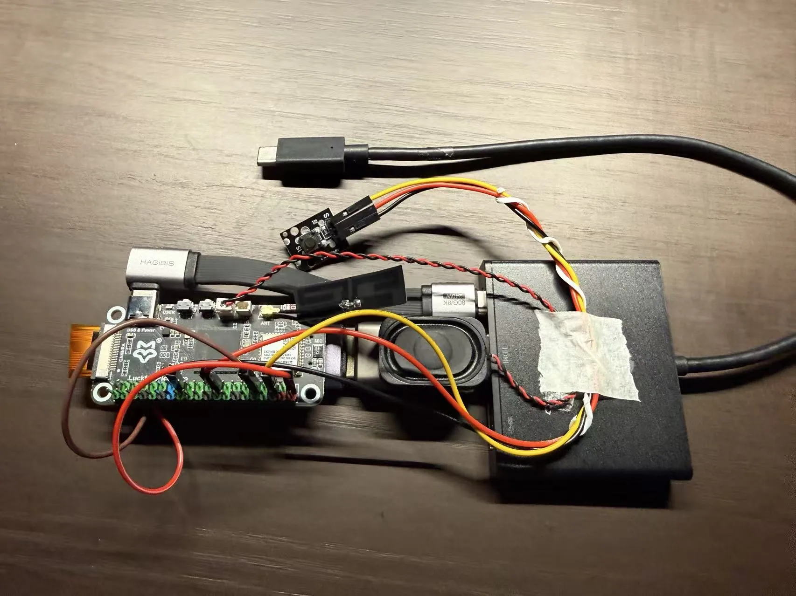

# Aiden Hardware Demo

Aiden is a **plug-and-play hardware solution for mobile AI agents**. It's a GUI agent that connects via USB-C to smartphones and computers, enabling LLM-powered control and automation across any app without system-level permissions.

This repository contains the firmware, services, and agent runtime for the current development board. A production-ready, low-power integrated device is planned for future release.



## What is Aiden?

Aiden is an external hardware AI agent that sits between your phone/computer and your workflow. By capturing the screen via HDMI, processing it with an LLM, and sending touch/keyboard input via USB HID, Aiden can:

- **Execute multi-app tasks** — Break through app sandboxing and perform workflows spanning multiple applications
- **Work without special permissions** — No jailbreak, no ADB, no developer mode required. Just plug in and go.
- **Run anywhere** — Works with iPhones, Android phones, and any USB-C computer
- **Operate continuously** — Learns your habits, updates skills, and improves over time with persistent memory

## Why External Hardware?

**System-level permission bypass**: Unlike software-only agents limited by OS restrictions, Aiden operates at the hardware layer. It sees what you see (via HDMI capture) and interacts like a human (via USB HID). This means:

- No root/jailbreak required
- Cross-app automation without API integrations
- Works on locked-down enterprise devices
- Universal compatibility — if it has a screen and USB-C, Aiden can control it

## Key Features

### 1. **True Portability**
Most mobile agent projects are lab prototypes that require a laptop or desktop to run. Aiden is:
- **Pocket-sized** — Powered entirely by your phone's USB-C port (future versions will be credit-card-sized and magnetically attach to phone backs)
- **Plug-and-play** — No setup, no pairing, no configuration wizards. Connect and start.
- **Production-ready** — Designed for daily use, not just research prototypes

### 2. **Fully Open**
- **Open-source firmware** — Complete C++ services and Go agent code
- **Open development board design** — Current prototyping board schematics and assembly guide available (production hardware designs remain proprietary)
- **Any LLM** — Configure OpenAI, Anthropic, local models, or your own deployment
- **Exportable data** — Your memory, skills, and learned behaviors are yours to keep and migrate
- **Community-driven** — Contributions welcome; flash custom firmware freely

### 3. **Privacy-First**
- **No Aiden backend** — All services (LLM, STT, TTS) are user-configured external endpoints
- **Zero data collection** — We never see your screen, conversations, or behavior
- **Self-hostable** — Run your own models; keep everything on your infrastructure
- **Auditable** — Open-source code under community scrutiny

### 4. **Adaptive Intelligence**
- **Persistent memory** — Aiden remembers device-specific context, user preferences, and past interactions
- **Self-improving skills** — Skills update based on usage patterns and new workflows
- **Personalized over time** — The more you use Aiden, the better it understands your habits and needs

### 5. **Real-Time Voice Interaction**
- **Hardware VAD** (Voice Activity Detection) — Wake-word-free voice control with sub-100ms latency
- **Streaming STT/TTS** — Natural conversation flow with live transcription and speech synthesis
- **Audio feedback** — Aiden speaks responses and status updates

### 6. **Developer-Friendly**
- **HTTP Tool API** — Call any Aiden capability (screenshot, HID, shell) via REST
- **Skills system** — Write custom behaviors in Markdown; Aiden auto-discovers and activates them
- **Modular architecture** — C++ services (Frame, Audio, HID) + Go Agent + Web UI
- **Cross-compilation toolchain** — Build for ARM devices from any x86_64 Linux/Mac
- **OTA updates** — A/B partition upgrades (two firmware slots: update installs to inactive slot, boot switches on success) with automatic rollback on failure

### 7. **Web UI & Tool Lab**
- **Browser-based control** — Chat interface, tool invocation, skill management
- **Tool Lab** — Interactive playground to test screenshot, HID, and shell tools
- **Live Activity** — iOS Dynamic Island integration for task status (when using companion app)
- **Session memory** — Automatic context compaction for long conversations

## Architecture

The project manages low-level hardware resources through **C++ services** and exposes Frame/Audio capabilities over Unix domain sockets. The **Go Agent** provides:

- Web UI for chat and tool interaction
- HTTP Tool API for external integrations
- Skills auto-discovery and runtime activation
- Voice pipeline (VAD → STT → LLM → TTS)
- USB HID automation (keyboard, mouse, touch gestures)
- Persistent memory and session compaction

**Data flow**:
```
HDMI Input → Frame Service → Screenshot Tool → LLM Agent → Tool Decisions
                                                              ↓
USB HID Output ← HID Service ← keyboard/mouse/touch tools ← Agent
```

## Hardware

Current development board uses:
- [Luckfox Pico Zero](https://wiki.luckfox.com/Luckfox-Pico-Zero) (RV1106 SoC, ARMv7)
- [TC358743XBG](https://toshiba.semicon-storage.com/eu/semiconductor/product/interface-bridge-ics-for-mobile-peripheral-devices/hdmir-interface-bridge-ics/detail.TC358743XBG.html) (HDMI-to-CSI bridge for 1080p30 capture)
- [CH375B](https://easyelecmodule.com/ch375b-u-disk-read-write-module-development-guide/) (USB host controller for HID injection)

This is a prototyping platform. Future integrated hardware will be purpose-built for size, power, and cost optimization.

## Quick Start

> **First-time users**: Go straight to [Newcomer Quickstart](docs/01-getting-started/quickstart.md) for the full onboarding flow (wiring → flashing → Wi-Fi → config → voice verification). Below is a quick build reference for developers.

Clone the repository:

```bash
git clone --recursive git@github.com:AidenAI-IO/aiden-hardware-demo.git
cd aiden-hardware-demo
```

Standard CMake build (host-native tests and SDK):

```bash
cmake -S . -B build-host
cmake --build build-host
```

Luckfox cross-compilation (ARM binaries for device):

```bash
./build.sh
```

Run host unit tests:

```bash
make test
```

Build the full firmware image:

```bash
./build_image.sh
```

Flash a prebuilt or locally built `update.img`:

```bash
./upgrade_tool/upgrade_tool uf ./update.img
```

## Documentation Index

The full documentation is organized under [`docs/`](docs/README.md):

- [Documentation Hub](docs/README.md)
- **Newcomers first: [Newcomer Quickstart](docs/01-getting-started/quickstart.md)**
- [Hardware & Wiring](docs/01-getting-started/hardware.md)
- [Firmware Build & Flashing](docs/01-getting-started/firmware.md)
- [Build & Development Environment](docs/01-getting-started/build.md)
- [Deployment to Device](docs/01-getting-started/deployment.md)
- [Architecture Overview](docs/02-architecture/overview.md)
- [Frame Service](docs/03-services/frame-service.md)
- [Audio Service](docs/03-services/audio-service.md)
- [USB HID & Device Control](docs/03-services/usb-hid.md)
- [Go Agent](docs/04-agent/overview.md)
- [Agent Configuration Reference](docs/04-agent/configuration.md)
- [Tools HTTP API](docs/04-agent/tools-http-api.md)
- [C++ SDK Reference](docs/05-sdk-and-tools/cpp-sdk.md)
- [Unix Domain Socket Protocol](docs/06-protocols/uds-protocol.md)
- [Troubleshooting](docs/07-operations/troubleshooting.md)
- [OTA](docs/08-ota/README.md)

## Contributing

Contributions are welcome! Whether you're fixing bugs, adding features, writing skills, or improving documentation, we'd love your help.

**Before contributing code**, please note:
- By submitting a contribution, you agree to license it under both AGPL-3.0 (for open-source use) and grant AidenAI-IO the right to offer it under commercial licenses
- See [LICENSE](LICENSE) for full details on our dual-licensing model
- This allows us to maintain the project's business model while keeping it open-source

For architecture details and development setup, see the [documentation](docs/README.md).

## License

This project is **dual-licensed**:

### For Open Source / Non-Commercial Use
**GNU Affero General Public License v3.0 (AGPL-3.0)**
- ✅ Free for personal, academic, and non-profit use
- ✅ Modifications must be shared under AGPL-3.0
- ✅ Network use triggers source disclosure requirements
- See [LICENSE](LICENSE) and [LICENSE-AGPL-3.0](LICENSE-AGPL-3.0)

### For Commercial Use
**Commercial License Required**
- Manufacturing and selling devices with this firmware
- Offering paid services or SaaS based on this software
- Internal use in for-profit organizations
- Integration into proprietary products

**Contact**: [your-licensing-email] for commercial licensing inquiries.

---

**Hardware designs** are licensed under CERN-OHL-S-2.0 (strongly reciprocal).

See [LICENSE](LICENSE) for complete terms, patent provisions, and contributor agreement details.
