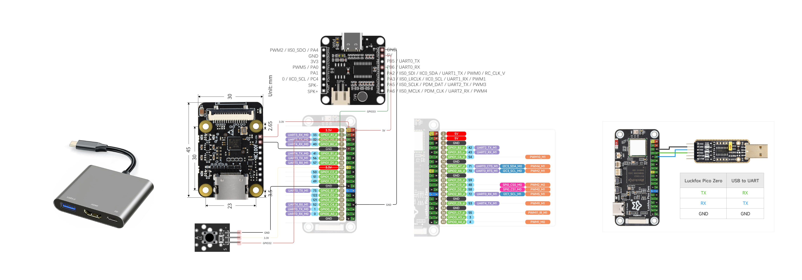

# Hardware, Wiring & Self-Assembly

## Target Hardware

This page describes the current Aiden development-board reference setup. It is intended for prototyping and development. Complete all FPC and Dupont-wire connections with the power disconnected, then recheck power and signal wiring before first power-on.

Board markings, header orientation, and connector placement can vary by module revision, so always follow the markings on the physical module.

| Hardware | Purpose | Quantity |
| --- | --- | --- |
| [Luckfox Pico Zero](https://wiki.luckfox.com/Luckfox-Pico-Zero) (RV1106) | Main board. Runs Aiden firmware and provides CSI, USB HID, and networking. | 1 |
| [HC100F](https://toshiba.semicon-storage.com/eu/semiconductor/product/interface-bridge-ics-for-mobile-peripheral-devices/hdmir-interface-bridge-ics/detail.TC358743XBG.html) (TC358743) | HDMI-to-CSI video capture board. | 1 |
| HDMI ESD protector | Protects the HDMI video-input path. | 1 |
| USB-to-TTL module | Serial-console debugging when the Pico Zero USB port is in use. | 1 (optional) |
| ASRPro 2.0 development board | Voice recognition module. | 1 |
| Type-C hub (with HDMI and USB) | Breaks out the target device's Type-C connection into HDMI video and USB data/power. | 1 |
| USB-C-to-USB-A data cable | Connects the hub's USB-A port to the Pico Zero. | 1 |
| HDMI cable | Connects the hub, ESD protector, and HC100F. | 1 |
| Mini 22P-to-15P FPC cable | Connects the HC100F CSI output to the Pico Zero CSI input. | 1 |
| 1 W / 8 Ω speaker | Voice playback through the Pico Zero speaker output. | 1 |
| Dupont wires | Connect the ASRPro, Pico Zero, and USB-to-TTL module. Prepare male-to-male, male-to-female, and female-to-female wires. | As needed |

## Core Connection Topology

The target device (iPhone / PC) connects to Aiden through a USB-C hub. The hub splits the connection into HDMI output (for screen capture) and USB-C output (for data/power to the Pico Zero):

```text
Target Device (iPhone / PC)
          │ USB-C
          ▼
      USB-C Hub
          ├─ HDMI out ──→ TC358743XBG (HDMI to CSI bridge)
          │                      │ CSI cable
          │                      ▼
          └─ USB-A out ──→ Luckfox Pico Zero (CSI input + USB)
                                   │
                                   ├─ Video capture: /dev/video0 (from TC358743 CSI)
                                   ├─ HID keyboard/pointer/control: /dev/hidg0, /dev/hidg1, /dev/hidg2
                                   ├─ Audio codec / ALSA
                                   └─ Network: Wi-Fi or USB gadget network
```

Physical wiring summary:

1. Target device USB-C → USB-C hub input
2. Hub HDMI output → TC358743XBG HDMI input
3. TC358743XBG CSI output → Pico Zero CSI input (CSI cable between the two boards)
4. Hub USB-A output → Pico Zero USB-C port (data + power)

## Wiring Diagram



The diagram shows the Pico Zero, HC100F, ASRPro, speaker, and USB-to-TTL connections. The USB-to-TTL connection is optional for debugging: cross `TX` and `RX`, and connect `GND` to `GND`.

> **Speaker wiring correction:** the speaker must connect directly to the Pico Zero speaker output. The ASRPro speaker wiring shown in the reference image is not used by the current hardware setup.

## Assembly Steps

1. Connect the target phone or computer to the upstream Type-C port of the Type-C hub.
2. Connect the hub HDMI output to the HDMI ESD protector, HDMI cable, and HC100F HDMI input in sequence.
3. Use the Mini 22P-to-15P FPC cable to connect the HC100F CSI output to the Pico Zero CSI connector. Ensure both connector latches are closed and that the cable orientation matches the connector markings.
4. Use the USB-C-to-USB-A data cable to connect the hub USB-A port to the Pico Zero USB-C port. This connection provides the USB data path and power between the target device and Pico Zero.
5. Follow the diagram to connect ASRPro power, ground, and control signals to the Pico Zero. Connect the 1 W / 8 Ω speaker directly to the Pico Zero speaker output, not to the ASRPro. Verify each connection against the board markings.
6. If serial debugging is needed, connect the Pico Zero debug header to the USB-to-TTL module as shown. Do not connect the TTL module's power wire to the Pico Zero unless the power design has been explicitly verified.

## Pre-Power Checklist

- HDMI, FPC, and USB cables are fully seated; the FPC cable is neither reversed nor damaged.
- ASRPro and Pico Zero power and ground wires have been verified against the board markings; no Dupont wires short adjacent pins.
- The speaker is connected directly to the Pico Zero speaker output, not to ASRPro.
- The HDMI ESD protector is installed between the hub and HC100F.
- The USB-to-TTL module uses only signal and ground wires, with `TX` and `RX` crossed.
- During first-time testing, confirm that the system detects the video capture device before testing USB HID and voice features.

## iOS HID Prerequisites

To control an iOS device via USB HID, enable on the target iOS device:

```text
Settings > Accessibility > Touch > AssistiveTouch
```

It is also recommended to enable **Show Onscreen Keyboard** on the AssistiveTouch page for a more stable keyboard input experience.

## Default Device Nodes

| Capability | Default node / path | Description |
| --- | --- | --- |
| Video capture | `/dev/video0` | TC358743 output to V4L2 capture device |
| HDMI subdev | `/dev/v4l-subdev2` | EDID / DV timings / HDMI sync |
| Keyboard HID | `/dev/hidg0` | Default keyboard device for Go Agent and example tools |
| Mouse/touch HID | `/dev/hidg1` | Go Agent uses the same HID device for mouse/touch input |
| Auxiliary control HID | `/dev/hidg2` | Android extension keys in touchscreen mode; Consumer Control media, volume, brightness, and screenshot keys in absolute mode |
| Frame socket | `/run/frame_service/frame_service.sock` | Default path for system service deployment |
| Audio socket | `/run/audio_service/audio_service.sock` | Default path for system service deployment |

When running the binary directly during development, the default frame socket is `/tmp/frame_service.sock`; after deployment with the firmware startup script, it defaults to `/run/frame_service/frame_service.sock`.
