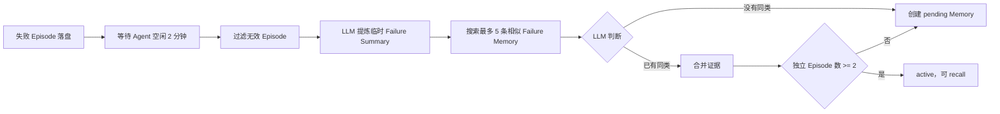

# Aiden 失败复盘：第一期实现

> 状态：已在 `docs/reflection-loop-final` worktree 实现，尚未提交。第一期只做 `Episode -> Failure Memory`，不创建或修改 Skill。

## 1. 改了什么

原来失败任务结束后，会立即写两份可 recall 的失败 Memory：一份 long-term，一份 device。一次偶发失败也会直接成为正式经验，还可能产生重复内容。

现在改为：



失败 Episode 结束时只落盘并唤醒后台 worker，不再直接生成 failure Memory。成功 Episode 仍按现有逻辑生成 procedure、navigation、calibration 等经验。

## 2. Episode 是什么

一个 Episode 是一次完整的 `Runtime.Run`：从一条用户请求开始，到这次运行成功或失败结束。一次工具调用、点击、截图或 LLM 迭代只是 Episode 中的 event。

首版直接使用现有信息：

| 信息 | 来源 | 说明 |
| --- | --- | --- |
| 用户目标 | `UserGoal` | 已有 |
| 工具调用、结果、结构化错误 | `Events` | 已有 |
| 最终结果 | `Outcome` | 已有 |
| recall 过的 Memory | `RetrievedMemoryRefs` | 已有 |
| 截图 | `ScreenshotRef` 和 artifacts | 已有，复盘最多读取 3 张 |
| App、页面 | `ObservedState` | 有则使用，不强依赖 |
| Verifier 结果 | `verifier_decision` | 有则使用，主链路不保证存在 |
| 用户中途纠正 | `steer` event | 本次实现补写到 Episode |

当前 success 规则没有改：通常 `runErr == nil` 即 success，存在 `verifier_decision` 时最后一次 `CanFinish` 可以修正结果。复盘只处理已经记录为 `Outcome.Success == false` 的 Episode，不重新判断 success。

## 3. 什么时候复盘

生产 Runtime 启动一个单线程 reflection worker。它只有一个可重置的进程内 timer，不使用 cron、ticker 或额外服务。

- 新失败 Episode 落盘后唤醒；
- Agent 启动时补扫尚未处理的 Episode；
- 临时失败的 `retry_at` 到期后再次唤醒；
- Agent 连续空闲 2 分钟后开始；
- 新任务到来立即停止尚未触发的 timer；
- 若复盘正在处理，新任务不用等待，worker 完成当前 Episode 后停止；
- 每批最多处理 5 个 Episode，始终串行，并发数为 1。

timer 不落盘。设备重启后根据 Episode 和状态文件恢复。

## 4. 如何避免重复复盘

处理状态保存在：

```text
<memory_dir>/lifecycle/reflection.yaml
```

同一 `ConfigDir` 若短暂存在多个 Runtime，批处理会通过同目录下的 `reflection.lock` 文件锁串行化；lock 文件不保存业务状态。

实际格式：

```yaml
version: 1
enabled_at: 2026-08-10T09:00:00Z
completed_through_at: 2026-08-10T09:08:00Z
completed_through_id: ep_122
episodes:
  ep_123:
    status: processing
    processing_started_at: 2026-08-10T09:10:00Z
```

状态含义：

| 状态 | 含义 |
| --- | --- |
| `processing` | worker 已领取；超过 15 分钟可重新处理 |
| `done` | 已创建或合并 Memory，不再处理 |
| `ignored` | 不值得提炼，不再处理 |
| `retry` | 临时失败；5 分钟后重新具备资格，仍需满足空闲 2 分钟；连续 3 次失败后标记为 `ignored` |

`enabled_at` 在功能第一次启用时写入，因此首版不自动回放更早的历史失败。

具备处理资格的 Episode 始终按结束时间从旧到新推进。尚未到期的 `retry/processing` 不会阻塞后续已具备资格的 Episode；即使处理水位已经越过它们，也会继续根据显式状态恢复。`completed_through_*` 是已处理水位，只保留最近 64 条 `done/ignored` 状态用于排查；`processing/retry` 不会被清理。因此状态文件大小有界，不会随生产 Episode 一直增长。

写入顺序固定为：先保存 Memory，再推进处理水位。若中间崩溃，重试会先按 Episode ID 检查 Memory 的 `EvidenceRefs`；已经写过就直接完成状态，不再调用 LLM 或创建第二条 Memory。

## 5. 哪些 Episode 会被过滤

查询阶段只取：

```text
EndedAt 非空
status != running
Outcome.Success == false
EndedAt >= reflection.enabled_at
```

代码能可靠识别并标记为 `ignored` 的情况：

- `status == interrupted`；
- 缺少用户目标；
- 没有可用 events；
- 所有结构化工具错误都只是 `ToolError.code == canceled`。

Provider 故障、外部服务不可用等情况未必有稳定错误码。代码不匹配错误字符串，而是允许 LLM 返回 `ignore`。

过滤完成后，按结束时间从旧到新选最多 5 条处理。不是先选 5 条再过滤。

## 6. LLM 提炼什么

每个 Episode 最多提炼一条临时 Failure Summary：

```json
{
  "action": "keep",
  "pattern": "发生了什么可复现的错误",
  "cause": "为什么会发生",
  "missed_signal": "当时漏看了什么",
  "guard": "下次行动前要检查或避免什么",
  "scope": "已知适用范围，不确定则为空",
  "tags": ["最多 8 个短检索词"],
  "evidence_refs": ["支持结论的 event id"]
}
```

`action` 也可以是 `ignore`。Failure Summary 不落盘，只用于搜索和判断是否合并。

输入包括 Episode 的目标、Outcome、最近最多 60 个 events，以及最多 3 张已有截图。截图优先取最后一次错误附近和最终状态；不重新截图，也不新增 OCR。

`keep` 结果必须同时提供非空的 `pattern/cause/missed_signal/guard`，并至少引用一个真实存在于 Episode 中的 event；否则视为临时处理失败并重试。

## 7. 如何判断是不是同一种失败

没有新增 fingerprint、bucket、case、candidate 或向量数据库。

处理顺序是：

1. 优先加入本 Episode recall 过的 Failure Memory；
2. 在相同 `DeviceID` 范围内，用 `pattern/cause/missed_signal/guard/scope/tags` 和 Episode 的 tags、entities 做现有词法搜索；
3. 候选只取带 `reflection:v1` 的 `pending/active` Failure Memory，最多 5 条；
4. LLM 最终只允许返回 `merge(memory_id)` 或 `create`。

App、页面和 tags 只帮助找候选，不是自动合并条件。即使 App 相同，只要错误原因和防护动作不同，也应创建新 Memory。

## 8. 新 Memory 如何保存和 recall

Failure Memory 继续使用现有 `DeviceMemoryItem`，保存在：

```text
<memory_dir>/device/failures/
```

没有新增 Memory schema。直接复用：

- `Type/Status/Title/Summary/Content`；
- `Tags/Entities/AppName/PageName`；
- `EvidenceRefs/SuccessCount/FailureCount`。

新记录会带现有 Tag：

```text
reflection:v1
```

状态规则：

| 独立失败 Episode 数 | Memory 状态 | 是否 recall |
| --- | --- | --- |
| 1 | `pending` | 否 |
| 至少 2 | `active` | 是 |

首条证据生成正文；后续 merge 只追加去重后的证据、tags 和计数，不在每次任务后动态重写正文。

正常 `recall_device_memory` 只返回 `active` 且带 `reflection:v1` 的 Failure Memory。旧 failure 文件不会删除或覆盖，但不再进入正常 failure recall。

## 9. SuccessCount 和 FailureCount

`EvidenceRefs` 表示哪些失败 Episode 经复盘确认属于这一类。两个计数只记录 recall 后的反馈：

```text
recall A + Episode success
-> A.SuccessCount + 1

recall A + Episode failure + 复盘确认 merge 到 A
-> A.FailureCount + 1，并追加 EvidenceRefs

未 recall A + 复盘 merge 到 A
-> 只追加 EvidenceRefs
```

失败 Episode 结束时不会立即增加 FailureCount，因为此时还不知道失败原因是否与 recall 的 Memory 相同。

原逻辑会把“recall Failure Memory 后成功”标为 `conflicted`。本次已改为保持 `active` 并增加 `SuccessCount`。

## 10. Skill 不在第一期

第一期到 active Failure Memory 为止，不做：

- 匹配、创建或更新 Skill；
- `SkillRef`、promoted、checkpoint；
- Skill 版本、回滚或自动演化；
- Benchmark 或 SkillOpt。

现有 `skill_manage`、`skill_sync`、`skill_merge` 不受影响。第二期可以从稳定的 active Failure Memory 开始设计 Skill 演化，不需要第一期提前写 Skill 关联字段。

## 11. 主要实现位置

- `src/agent/internal/agent/reflection.go`：状态、过滤、LLM Summary、候选搜索、merge/create；
- `src/agent/internal/agent/reflection_worker.go`：2 分钟空闲 timer 和单线程批处理；
- `src/agent/internal/agent/memory_plane.go`：关闭失败直写、唤醒 worker、更新计数；
- `src/agent/internal/agent/device_memory.go`：内部候选搜索和 recall 过滤；
- `src/agent/internal/agent/runtime.go`：worker 生命周期、任务忙闲通知、steer 写入 Episode；
- `src/agent/internal/agent/reflection_test.go`：核心流程测试。

可选的真实模型质量回归使用 `reflection_quality_cases.json`，会同时验证 Summary 内容和 merge/create 判断：

```bash
OPENROUTER_API_KEY=... go test ./internal/agent -run TestReflectionQualityCasesAgainstLiveModel -v
```
