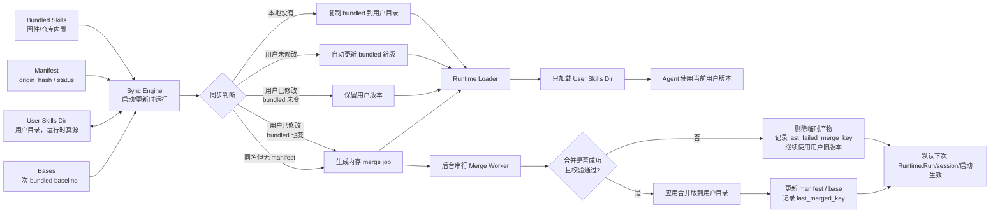

# Aiden Skills 同步与 LLM 合并设计

> 状态：方案设计
> 分支：`feature/hermes-skill-llm-merge`
> 基线：`origin/main`
> 目标：参考 Hermes 的 bundled skill 同步机制，为 Aiden 设计一套“内置 skill seed 到用户目录、运行时只加载用户目录、同名冲突由 LLM 自动合并”的 MVP 方案。

---

## 1. 核心设计

Aiden 的 skill 管理采用 Hermes 风格的单一运行时来源：

```text
repo / 固件内置 skills
  ↓ 启动 / 更新时同步
用户本地 skills 目录
  ↓
运行时只从用户本地目录加载
```

核心原则：

```text
1. 内置 skills 随固件 / 代码发布。
2. 启动或更新时，把内置 skills 同步到用户目录。
3. 用户目录是运行时唯一真源。
4. 用户自己下载 / 修改 / LLM 创建的 skills 也放用户目录。
5. 如果同名冲突，尝试 LLM 合并。
6. LLM 合并成功且校验通过，就自动应用。
7. LLM 合并失败、校验失败或应用失败，就继续使用用户旧版本，并记录 `last_failed_merge_key`。
8. LLM 合并异步执行，不阻塞启动或当前请求。
9. 不持久化 running/queued/done 状态，避免板子重启后留下悬挂任务。
```

MVP 不做用户确认流程，不做高风险 skill 的特殊审批状态，也不支持恢复覆盖前的历史用户版本。支付、授权、删除等运行时风险由工具层 / 执行层的 safety guard 处理，不放在 skill 同步流程里。

---

## 2. 当前 Aiden 实现现状

当前 main 上已有基础 Skills 机制：

```text
src/agent/internal/agent/skill_loader.go
src/agent/internal/agent/skills.go
src/agent/internal/agent/runtime.go
src/agent/config/skills/
docs/04-agent/skills.md
```

当前行为：

- `LoadConfigFromDir()` 只检查：

```text
configDir/skills
```

- 如果该目录存在，则设置：

```go
cfg.SkillsDirs = []string{skillsDir}
```

- `LoadSkillsFromDirs()` 扫描 `SKILL.md`。
- 如果发现同名 skill，会直接报错：

```go
return fmt.Errorf("duplicate skill name %q", skill.Name)
```

- 仓库里存在内置示例：

```text
src/agent/config/skills/planner/SKILL.md
src/agent/config/skills/research/SKILL.md
```

但当前没有完整的 bundled skill seed/update/merge 机制。

---

## 3. 目标行为

## 3.1 运行时单一来源

运行时只加载：

```text
configDir/skills/**/SKILL.md
```

例如设备上：

```text
/userdata/agent/skills/
```

这也是用户、App、下载器、LLM、同步器共同写入的目录。

运行时不直接扫描内置目录。

## 3.2 内置 skill 同步到用户目录

内置 skill 存在于：

```text
开发环境：src/agent/config/skills/
设备环境：/usr/share/aiden/skills/
```

启动或更新时同步到：

```text
configDir/skills/
```

同步完成后，运行时依旧只读：

```text
configDir/skills/
```

## 3.3 用户下载的 skill 也放同一目录

用户下载、App 安装、Agent/LLM 创建的 skill 也放：

```text
configDir/skills/<skill-name>/SKILL.md
```

因此运行时永远只有一个问题：

```text
扫描 configDir/skills 下有哪些 effective skills。
```

---

## 4. 总体流程图



---

## 5. 推荐目录结构

## 5.1 仓库 / 固件内置目录

```text
src/agent/config/skills/
├── planner/SKILL.md
├── research/SKILL.md
├── ui-operator/SKILL.md
├── payment-confirm/SKILL.md
└── app-login/SKILL.md
```

设备安装后可以放到：

```text
/usr/share/aiden/skills/
├── planner/SKILL.md
├── research/SKILL.md
└── ...
```

这是 bundled skills 源。

## 5.2 用户运行时目录

```text
/userdata/agent/
├── agent.toml
├── skills/
│   ├── planner/SKILL.md
│   ├── research/SKILL.md
│   ├── payment-confirm/SKILL.md
│   └── user-downloaded-skill/SKILL.md
└── skill-state/
    ├── .bundled_manifest.json
    └── bases/
        ├── planner/SKILL.md
        └── payment-confirm/SKILL.md
```

说明：

- `skills/` 是运行时唯一 skill 来源。
- `.bundled_manifest.json` 是同步器账本，不参与运行时加载。
- `bases/` 保存上次同步成功时的 bundled 内容，是 LLM 三方合并的 `base`，用于提升合并质量。
- LLM 合并候选不需要长期目录；可以先写临时文件，校验通过再覆盖用户目录，失败则删除临时文件。
- 临时文件只保证失败候选不会污染用户目录，不提供合并成功后的历史回滚能力。
- MVP 暂不保留 `backups/`，合并成功覆盖后不提供历史用户版本回滚。

### 5.3 `bases/` 的定位

`bases/` 不参与运行时加载，它只服务于 LLM 三方合并：

```text
bases/ = 上次同步/合并成功时的 bundled baseline，用于下一次三方合并。
```

三方合并需要：

```text
base     = 上次同步到用户目录时的 bundled 版本
upstream = 当前新的 bundled 版本
local    = 当前用户修改后的版本
```

LLM 有 `base` 才能判断：

```text
哪些内容是用户新增/删除；
哪些内容是官方新增/删除；
哪些内容是双方都改了同一块。
```

所以如果目标是让 LLM 合并效果更好，`bases/` 建议保留。

MVP 暂不保留 `backups/`：

```text
合并失败时不会覆盖用户旧版本，所以不需要回滚。
合并成功并校验通过后，会直接覆盖用户目录中的 SKILL.md。
如果后续发现合并效果不好，MVP 只支持恢复当前 bundled 默认版本，不支持恢复被覆盖前的历史用户版本。
```

因此 MVP 建议：

```text
保留 manifest：必须，用于判断同步状态。
保留 bases：建议，用于提升 LLM 三方合并质量。
不保留 backups：先简化，不做历史用户版本回滚。
不保留 merges：合并候选用临时文件即可。
```

---

## 6. Manifest 的作用

Manifest 不是运行时加载用的。它是同步器的账本。

它回答五个问题：

```text
1. 这个 skill 是不是以前从 bundled seed 到用户目录的？
2. 用户目录里的版本有没有被用户改过？
3. bundled 自己有没有更新过？
4. 用户是不是曾经删除过这个 bundled skill？
5. 当前用户目录版本是不是同步器上次写入的 effective copy？
```

没有 manifest 时，系统只能看到：

```text
bundled/foo/SKILL.md
user/skills/foo/SKILL.md
```

但不知道：

```text
user/foo 是不是从 bundled/foo 拷贝来的？
用户有没有改过？
bundled 后来有没有更新？
用户是不是故意删除过？
```

Manifest 提供一个关键参照点：

```text
origin_hash    = 上次同步 / 成功合并时对应的 bundled baseline hash
effective_hash = 同步器上次写入用户目录后的 effective copy hash
```

启动时现算：

```text
current_bundled_hash = 当前内置版本 hash
current_user_hash    = 当前用户目录版本 hash
origin_hash          = manifest 中记录的上次同步 hash
effective_hash       = manifest 中记录的上次系统写入用户目录后的 hash
```

然后判断：

```text
origin_hash 为空
=> 同名冲突还没有成功 baseline，按双向合并处理

user_hash == effective_hash
bundled_hash == origin_hash
=> 用户没有改过系统上次写入的 effective copy，bundled 也没变，保持当前状态

user_hash == origin_hash
bundled_hash != origin_hash
=> 用户目录仍是旧 bundled 原文，bundled 更新了，可以自动覆盖

user_hash != origin_hash
bundled_hash == origin_hash
user_hash != effective_hash
=> 用户改过，bundled 没变，保留用户版本并标记 user_modified

user_hash != origin_hash
bundled_hash == origin_hash
user_hash == effective_hash
=> 用户目录是上次 LLM 合并后的 effective copy，保持 merged 状态

user_hash != origin_hash
bundled_hash != origin_hash
=> 本地 effective copy 与 bundled baseline 有差异，bundled 也更新了，尝试 LLM 合并
```

`effective_hash` 是为了让 `merged` 状态稳定。LLM 合并成功后，用户目录内容通常不等于 bundled 原文，因此不能只用 `user_hash != origin_hash` 就判断用户又改过。

## 6.1 最小 Manifest 格式

MVP 使用最小字段即可：

```json
{
  "version": 1,
  "updated_at": "2026-05-25T10:30:00+08:00",
  "skills": {
    "planner": {
      "origin_hash": "sha256:aaa111",
      "effective_hash": "sha256:aaa111",
      "status": "synced",
      "base_path": "skill-state/bases/planner/SKILL.md",
      "last_synced_at": "2026-05-25T10:30:00+08:00"
    },
    "payment-confirm": {
      "origin_hash": "sha256:bbb222",
      "effective_hash": "sha256:merged333",
      "status": "merged",
      "base_path": "skill-state/bases/payment-confirm/SKILL.md",
      "last_synced_at": "2026-05-25T10:30:00+08:00",
      "last_merged_at": "2026-05-25T10:31:00+08:00",
      "last_merged_key": "sha256:merge-input-key"
    },
    "research": {
      "origin_hash": "sha256:ccc333",
      "status": "deleted_by_user",
      "last_synced_at": "2026-05-20T09:00:00+08:00"
    }
  }
}
```

字段含义：

- `origin_hash`：上次同步 / 成功合并后对应的 bundled baseline hash；同名冲突且从未成功 sync / merge 时可以暂为空。
- `effective_hash`：同步器上次写入 `configDir/skills/<name>/SKILL.md` 后的文件 hash；`synced` 时通常等于 `origin_hash`，`merged` 时通常不等于 `origin_hash`，同名冲突且从未成功应用时可以暂为空。
- `status`：同步状态，MVP 只保留少量状态。
- `base_path`：可选，保存上次同步的 bundled 内容，用于三方合并。
- `last_synced_at`：最近同步时间。
- `last_merged_at` / `last_merged_key`：最近成功 LLM 合并时间和输入 key。
- `last_failed_merge_key` / `last_merge_failed_at` / `last_merge_error`：最近失败的合并输入 key、时间和错误摘要，用于避免同一组输入反复重试。

不需要把 `current_bundled_hash` 和当前 `user_hash` 长期写入 manifest。它们可以每次启动时现算。`effective_hash` 不是当前 user hash 的缓存，而是“同步器上次成功写入用户目录”的参照点。

## 6.2 MVP 状态

MVP 保留这些状态：

```text
synced
user_modified
merged
deleted_by_user
```

含义：

- `synced`：用户目录版本等于当前 bundled baseline，通常 `effective_hash == origin_hash`。
- `user_modified`：用户目录版本和同步器上次写入的 effective copy 不一致，即 `user_hash != effective_hash`。
- `merged`：用户目录版本是 LLM 合并后的结果，通常 `user_hash == effective_hash` 且 `effective_hash != origin_hash`。
- `deleted_by_user`：用户曾删除该 bundled skill，不自动重新 copy。

合并失败不需要单独状态。失败时继续使用用户旧版本，状态保持或回到 `user_modified`。

如果读取到旧 manifest 没有 `effective_hash`，且已有 `origin_hash`，MVP 可以临时按 `effective_hash = origin_hash` 兼容；下一次成功 sync / merge / reset 后写入真实 `effective_hash`。如果 `origin_hash` 也为空，表示同名冲突还没有任何成功 baseline，应按双向合并冲突处理。

---

## 7. 同步触发时机

## 7.1 Agent 启动时

```text
LoadConfigFromDir(configDir)
  ↓
SyncBundledSkills(configDir, bundledSkillsDir)
  ↓
LoadSkillsFromDirs([]string{configDir/skills})
```

注意顺序：

```text
先同步，再加载。
```

## 7.2 App / 固件更新后

固件或 agent binary 更新后，应运行一次：

```text
SyncBundledSkills()
```

## 7.3 手动触发

MVP 可以先不做 CLI。内部保留函数即可：

```go
func SyncBundledSkills(ctx context.Context, opts SkillSyncOptions) (*SkillSyncReport, error)
```

后续如果需要，再提供：

```text
skills sync
skills reset <name> --restore
```

---

## 8. 异步合并与失败去重

LLM 合并是耗时任务，不能阻塞 Agent 启动或当前用户请求。

启动时 `SyncBundledSkills()` 只做轻量工作：

```text
扫描 bundled/user skills
读取 manifest
计算 hash
执行无需 LLM 的 copy/update/keep
发现需要 LLM 合并时，生成内存 merge job
```

然后立刻进入运行时加载：

```text
LoadSkillsFromDirs(configDir/skills)
```

合并完成前，运行时继续使用用户目录里的当前版本。

### 8.1 不持久化 running/queued/done

MVP 不把以下状态写入 manifest：

```text
queued
running
done
```

原因：如果把 `running` 持久化，板子重启、进程崩溃或网络断开后，LLM 请求已经中断，没有 worker 会回来把 `running` 改成成功或失败，容易留下悬挂状态。

因此：

```text
running 只存在内存里。
manifest 不记录 running。
manifest 只记录 last_failed_merge_key / last_merged_key。
```

### 8.2 merge_key

每次需要 LLM 合并时，计算一个输入 key：

```text
merge_key = hash(skill_name + base_hash + upstream_hash + local_hash)
```

其中：

```text
base_hash     = 上次 bundled baseline hash
upstream_hash = 当前 bundled hash
local_hash    = 当前用户 skill hash
```

没有 base 的双向合并使用空 `base_hash`，并把 merge mode 纳入 key，避免和三方合并 key 混淆。

这个 key 表示“这一组输入是否已经尝试过”。

### 8.3 启动时如何决定是否入队

```text
if need_merge:
    merge_key = hash(skill_name + base_hash + upstream_hash + local_hash)

    if last_failed_merge_key == merge_key:
        跳过，不重复尝试同一组已经失败的输入
    else:
        加入内存 mergeJobs
```

如果用户修改了 skill，或者 bundled 再次升级，`merge_key` 会变化，就可以重新尝试。

### 8.4 后台串行处理

MVP 使用一个后台 worker 串行处理合并任务：

```text
按 skill name 排序
一个一个调用 LLM 合并
一个 skill 失败不影响下一个 skill
```

不建议 MVP 并行处理。串行更简单：

```text
避免 LLM API 并发限流
避免 manifest 写竞争
避免多个 worker 同时覆盖 skills 目录
方便定位失败
```

### 8.5 合并成功

```text
write merged_skill_md → 临时文件
校验临时文件通过
确认 hash(user_path) == job.local_hash
move 临时文件 → user_path
merged_hash = hash(merged_skill_md)
copy current bundled → base_path
origin_hash = current bundled hash
effective_hash = merged_hash
status = merged
last_merged_key = merge_key
last_merged_at = now
清除 last_failed_merge_key / last_merge_error
```

MVP 的默认生效边界是下一次 `Runtime.Run()` / 下一次 session / 重启后生效，不在同一次 agent loop 中途生效。

这里的下一次 `Runtime.Run()` 指外部用户请求进入 runtime 的下一次完整执行，而不是同一次 Run 内的下一步 tool call 或下一次 LLM call：

```text
一次 Runtime.Run
  = 组装 prompt
  + resolve skills
  + LLM/tool loop
  + 返回本轮响应
```

因此如果后台 merge 在某次 Run 进行中完成：

```text
当前 Run 已经 resolve 过 skills，不改变。
下一次用户请求 / 下一次 Runtime.Run 开始前重新加载，才看到 merged skill。
```

同进程热加载采用 dirty flag 语义：merge worker 成功应用合并结果后标记 runtime skills dirty；下一次 `Runtime.Run()` 开始前重新加载 `configDir/skills` 并替换 `SkillIndex`。不要在同一次 Run 的 LLM/tool loop 中途替换 system prompt、skill instructions 或 tool restriction。

### 8.6 合并失败

```text
删除临时合并产物
不覆盖 user_path
继续使用用户旧版本
status = user_modified
last_failed_merge_key = merge_key
last_merge_failed_at = now
last_merge_error = 简短错误摘要
```

所有失败路径都必须记录 `last_failed_merge_key`，包括 LLM 返回失败、LLM 调用错误、输出校验失败、临时文件写入失败、应用前发现输入过期等。合并失败不是系统错误，只表示这次 bundled 更新没有合入用户版本。

### 8.7 应用前防止覆盖新修改

后台合并是异步任务。合并运行期间，用户或 Agent 可能又修改了同一个 skill。

因此应用 candidate 前必须重新计算当前用户文件 hash：

```text
if hash(user_path) != job.local_hash:
    说明合并输入已经过期
    删除临时 candidate
    不覆盖 user_path
    不更新 origin_hash / base_path
    记录 last_failed_merge_key = merge_key
    记录 last_merge_error = "local changed before apply"
    等下次扫描用新的 local 重新生成 merge_key
```

这是异步期间 local 被更新导致的应用失败。虽然要记录 `last_failed_merge_key`，但下一次扫描会用新的 `local_hash` 生成新的 `merge_key`，因此不会阻止针对最新 local 的重试。

---

## 9. 同步规则

## 9.1 新 bundled skill，本地不存在

条件：

```text
bundled exists
user_path not exists
manifest has no record
```

行为：

```text
copy bundled → configDir/skills/<name>/SKILL.md
copy bundled → skill-state/bases/<name>/SKILL.md
record origin_hash = bundled_hash
record effective_hash = bundled_hash
status = synced
```

## 9.2 bundled skill 更新，用户没改过

条件：

```text
user_hash == origin_hash
bundled_hash != origin_hash
```

行为：

```text
copy bundled → user_path
copy bundled → base_path
update origin_hash = bundled_hash
update effective_hash = bundled_hash
status = synced
```

## 9.3 用户改过，bundled 没变

条件：

```text
user_hash != origin_hash
bundled_hash == origin_hash
user_hash != effective_hash
```

行为：

```text
不覆盖
继续使用用户版本
status = user_modified
effective_hash 保持不变
```

如果 `user_hash == effective_hash && bundled_hash == origin_hash`，说明用户目录仍是同步器上次写入的 effective copy。此时保持原状态：`synced` 继续为 `synced`，`merged` 继续为 `merged`。

## 9.4 用户删除过 bundled skill

条件：

```text
manifest has record
user_path missing
```

行为：

```text
尊重删除
status = deleted_by_user
不要重新 copy
```

除非后续用户显式 restore。

## 9.5 repo / 固件删除 bundled skill

条件：

```text
manifest has record
bundled no longer exists
```

行为：

```text
不直接删除用户目录 skill
可以清理或标记 manifest stale
```

MVP 可以只清理 manifest 中不再存在的 bundled 记录，用户目录文件保持不动。

## 9.6 本地 effective 与 baseline 有差异，bundled 也更新

条件：

```text
user_hash != origin_hash
bundled_hash != origin_hash
```

这里既包括用户手动修改过的情况，也包括上次已经 LLM 合并成功、当前 user_path 是 merged effective copy 的情况。

行为：

```text
生成后台 LLM 合并 job，不阻塞启动
base     = base_path 中保存的上次 bundled 内容
upstream = 当前 bundled 内容
local    = 当前 user_path 内容
```

如果 LLM 合并成功且校验通过：

```text
write merged_skill_md → 临时文件
校验临时文件通过
确认 hash(user_path) == job.local_hash
move 临时文件 → user_path
copy current bundled → base_path
update origin_hash = bundled_hash
update effective_hash = hash(merged_skill_md)
status = merged
```

如果 LLM 合并失败、校验失败或应用失败：

```text
丢弃结果
继续使用用户旧版本
status = user_modified
last_failed_merge_key = merge_key
last_merge_failed_at = now
last_merge_error = 简短错误摘要
```

## 9.7 同名但没有 manifest

这是用户先安装了同名 skill，后来系统也新增了同名 bundled skill 的情况：

```text
user/skills/foo/SKILL.md exists
bundled/foo/SKILL.md exists
manifest has no foo record
```

此时没有共同 base，不能做标准三方合并。若之前已经因为同名冲突失败过，manifest 里可能已有一条 `origin_hash` 为空、只记录 `last_failed_merge_key` 的冲突记录；这种记录也按本节处理。

MVP 策略：

```text
生成后台 LLM 双向合并 job，不阻塞启动
upstream = bundled foo
local    = user foo
```

如果合并成功且校验通过：

```text
write merged_skill_md → 临时文件
校验临时文件通过
move 临时文件 → user foo
copy bundled foo → base_path
record origin_hash = bundled_hash
record effective_hash = hash(merged_skill_md)
status = merged
```

如果合并失败、校验失败或应用失败：

```text
继续使用用户旧版本
不覆盖
删除临时合并产物
创建或更新 manifest 冲突记录
origin_hash 保持为空
effective_hash 保持为空
status = user_modified
记录 last_failed_merge_key = merge_key
记录 last_merge_failed_at = now
记录 last_merge_error = 简短错误摘要
```

下次扫描时，如果 `origin_hash` 仍为空，就重新按双向合并计算 `merge_key`。输入没变则命中 `last_failed_merge_key` 并跳过；用户 skill 或 bundled skill 任一侧变化后，`merge_key` 改变，可以重新尝试。

---

## 10. LLM 合并契约

## 10.1 三方合并输入

```json
{
  "mode": "three_way",
  "skill_name": "payment-confirm",
  "base": {
    "label": "bundled@last_sync",
    "content": "..."
  },
  "upstream": {
    "label": "bundled@current",
    "content": "..."
  },
  "local": {
    "label": "user@current",
    "content": "..."
  },
  "policy": {
    "preserve_user_intent": true,
    "preserve_upstream_bugfixes": true,
    "output_valid_skill_md": true
  }
}
```

## 10.2 双向合并输入

```json
{
  "mode": "two_way_no_base",
  "skill_name": "foo",
  "upstream": {
    "label": "bundled@current",
    "content": "..."
  },
  "local": {
    "label": "user@current",
    "content": "..."
  },
  "policy": {
    "preserve_user_intent": true,
    "merge_compatible_upstream_improvements": true,
    "output_valid_skill_md": true
  }
}
```

## 10.3 LLM 输出

成功：

```json
{
  "status": "merged",
  "merged_skill_md": "---\nname: payment-confirm\ndescription: ...\n---\n...",
  "summary": "保留用户自定义确认话术，合入内置新版的截图前检查步骤。"
}
```

失败：

```json
{
  "status": "failed",
  "merged_skill_md": "",
  "summary": "local 和 bundled 对核心操作流程冲突，无法可靠合并。"
}
```

MVP 不需要 `requires_review`、`risk_level`、`confidence`。是否应用只看程序校验是否通过。

---

## 11. LLM 合并原则

合并 prompt 必须明确：

```text
你正在合并 Aiden Agent 的 SKILL.md。
Skill 是影响设备行为的 SOP，不是普通文案。

目标：
1. 保留用户 local 的明确偏好和本地适配。
2. 合入 bundled upstream 的 bugfix、工具名更新和新流程。
3. 输出必须是合法 SKILL.md，保留 YAML frontmatter。
4. skill name 必须保持不变。
5. 如果不能可靠合并，返回 status=failed。
```

禁止：

```text
- 不得简单拼接 base/upstream/local。
- 不得输出没有 frontmatter 的 markdown。
- 不得改名导致运行时 skill name 变化。
- 不得返回解释文本冒充 SKILL.md。
```

---

## 12. 合并成功校验

LLM 输出不能直接应用。MVP 使用程序校验判断是否成功。

合并成功必须满足：

```text
1. LLM 调用成功。
2. result.status == "merged"。
3. merged_skill_md 非空。
4. merged_skill_md 可解析 frontmatter。
5. frontmatter.name == expected skill name。
6. description 非空。
7. body 非空。
8. 文件大小不超过上限，例如 32KB。
9. 如果有 allowed_tools，则引用的工具名都存在；`delegate_<child>` 形式的子 Agent 委派 pseudo-tool 允许通过。
```

伪代码：

```go
func MergeOK(result MergeResult, expectedName string) bool {
    if result.Status != "merged" {
        return false
    }
    if strings.TrimSpace(result.MergedSkillMD) == "" {
        return false
    }

    skill, err := ParseSkillMarkdown(result.MergedSkillMD)
    if err != nil {
        return false
    }
    if skill.Name != expectedName {
        return false
    }
    if strings.TrimSpace(skill.Description) == "" {
        return false
    }
    if strings.TrimSpace(skill.Body) == "" {
        return false
    }
    if len(result.MergedSkillMD) > MaxSkillSize {
        return false
    }
    if !AllowedToolsExist(skill.AllowedTools) {
        return false
    }
    return true
}
```

校验失败时：

```text
不应用 candidate
删除临时合并产物
继续加载用户旧版本
status = user_modified
last_failed_merge_key = merge_key
last_merge_failed_at = now
last_merge_error = 校验失败摘要
```

---

## 13. 应用策略

LLM 合并产物先写入临时文件，例如：

```text
skill-state/tmp/<name>.candidate.SKILL.md
```

校验通过后才覆盖用户目录；校验失败则删除临时文件。MVP 只有两个最终结果。

## 13.1 合并成功并校验通过

```text
write merged_skill_md → 临时文件
校验临时文件通过
确认 hash(user_path) == job.local_hash
move 临时文件 → user_path
copy current bundled → base_path
update manifest.origin_hash = current bundled hash
update manifest.effective_hash = hash(merged_skill_md)
status = merged
```

## 13.2 合并失败、校验失败或应用失败

```text
删除临时合并产物
不覆盖 user_path
继续使用用户旧版本
status = user_modified
last_failed_merge_key = merge_key
last_merge_failed_at = now
last_merge_error = 简短错误摘要
```

关键原则：

```text
合并失败不是系统错误。
合并失败只是表示这次 bundled 更新没有合入用户版本。
运行时继续使用用户目录中的旧 SKILL.md。
```

---

## 14. 恢复默认版本

MVP 不保留历史用户版本备份，因此不提供“恢复到覆盖前用户版本”的能力。

只保留一个简单恢复操作：恢复当前 bundled 默认版本。

语义类似：

```text
skills reset <name> --restore
```

行为：

```text
copy current bundled → user_path
copy current bundled → base_path
origin_hash = bundled_hash
effective_hash = bundled_hash
status = synced
```

这个操作会丢弃用户当前修改，适合用户明确表示“恢复官方默认 skill”。

---

## 15. 运行时加载

运行时保持简单：

```text
LoadSkillsFromDirs([]string{configDir/skills})
```

运行时不需要知道：

```text
bundled
manifest
base
```

运行时看到的只有：

```text
用户目录里的 effective SKILL.md
```

这和 Hermes 的“用户 profile skills 是运行时真源”一致。

---

## 16. 与当前 Aiden 代码的改造点

## 16.1 新增 sync 模块

建议新增：

```text
src/agent/internal/agent/skill_sync.go
src/agent/internal/agent/skill_sync_test.go
```

核心类型：

```go
type SkillSyncOptions struct {
    ConfigDir         string
    BundledSkillsDir string
    Quiet             bool
    MergeWithLLM      bool
}

type SkillSyncReport struct {
    Copied        []string
    Updated       []string
    Merged        []string
    KeptUser      []string
    DeletedByUser []string
    MergeNeeded   []SkillMergeJob
    MergeFailed   []string
}

func SyncBundledSkills(ctx context.Context, opts SkillSyncOptions) (*SkillSyncReport, error)
```

## 16.2 启动时调用

在 `NewRuntime()` 或 `LoadConfigFromDir()` 后、加载 skills 前调用：

```go
SyncBundledSkills(ctx, SkillSyncOptions{
    ConfigDir: cfg.ConfigDir,
    BundledSkillsDir: bundledSkillsDir,
    Quiet: true,
    MergeWithLLM: true,
})
```

然后仍然：

```go
LoadSkillsFromDirs([]string{filepath.Join(configDir, "skills")})
```

## 16.3 bundledSkillsDir 来源

开发环境：

```text
src/agent/config/skills
```

设备安装环境：

```text
/usr/share/aiden/skills
```

MVP 可以从 build-time 常量、配置项或相对路径解析。

## 16.4 manifest 路径

```go
manifestPath := filepath.Join(configDir, "skill-state", ".bundled_manifest.json")
```

---

## 17. 用户可见行为

普通同步：

```text
已同步 2 个内置 skills。
```

发现用户修改但 bundled 没变：

```text
payment-confirm 已被用户修改，继续使用用户版本。
```

发现用户修改且 bundled 也更新：

```text
payment-confirm 同时存在内置更新和用户修改，已加入后台合并任务。
```

合并成功：

```text
payment-confirm 后台合并完成，已应用内置更新。
```

合并失败：

```text
payment-confirm 合并失败，继续使用用户旧版本。
```

---

## 18. Skill Tools 与 System Prompt

除了文件同步/合并框架，Aiden 还需要给 Agent 暴露一组 skill tools，并在 system prompt 中说明何时读取、何时修改 skill。

MVP 工具沿用 Hermes 的命名和分层思路：

```text
skill_list
skill_read
skill_manage
skill_mark_used
```

其中 `skill_manage` 可以创建、修改、删除 `configDir/skills/` 下的任意 effective skill，管理 supporting files，并维护 lifecycle 状态。`skill_mark_used` 用于把“实际使用过某个 skill”和“只是读取过 skill”区分开。

注意：

```text
configDir/skills/ 是运行时真源，可以被 skill_manage 修改。
bundled source 目录不是运行时真源，不能被 skill_manage 修改。
skill-state/ 由同步/合并系统维护，不能被 skill_manage 直接修改。
```

### 18.1 `skill_list`

用途：列出 `configDir/skills/` 下已安装 skill 的 metadata，不加载全文。

输入示例：

```json
{
  "query": "payment login",
  "limit": 20
}
```

输出示例：

```json
[
  {
    "name": "payment-confirm",
    "description": "付款前确认金额、收款方和操作目标",
    "state": "active",
    "view_count": 12,
    "use_count": 5,
    "modify_count": 1
  }
]
```

规则：

```text
默认过滤 state=archived 的 skill。
传 include_archived=true 可包含 archived。
传 state=active/stale/archived 可按 lifecycle 状态过滤。
```

Agent 在遇到可复用流程、App 操作、排查步骤、设备设置、登录、支付确认、表单填写等任务时，应先调用 `skill_list` 查找相关 skill。

### 18.2 `skill_read`

用途：读取某个 skill 的完整 `SKILL.md`。

输入示例：

```json
{
  "name": "payment-confirm"
}
```

输出示例：

```json
{
  "name": "payment-confirm",
  "path": "configDir/skills/payment-confirm/SKILL.md",
  "content": "---
name: payment-confirm
description: ...
---
..."
}
```

规则：

```text
如果 skill_list 返回相关 skill，Agent 必须先 skill_read 再执行。
不要一次性读取所有 skill。
修改已有 skill 前，必须先 skill_read 当前内容。
```

### 18.3 `skill_manage`

用途：创建、修改、删除 `configDir/skills/` 下的 effective skills，并管理其 supporting files。

沿用 Hermes 的管理动作，并增加 lifecycle 动作：

```text
create
edit
patch
delete
write_file
remove_file
mark_stale
archive
restore_archive
```

其中 `create/edit/patch/delete` 操作 `SKILL.md`；`write_file/remove_file` 操作 skill 目录下的 supporting files；`mark_stale/archive/restore_archive` 只更新 `usage.json` 中的 lifecycle state。

#### create

创建新 skill。

规则：

```text
目标路径必须不存在。
写入 configDir/skills/<name>/SKILL.md。
content 必须是完整合法的 SKILL.md。
frontmatter.name 必须等于 name。
description 非空。
body 非空。
```

如果已存在，返回错误，提示使用 `edit` 或 `patch`。

#### edit

整篇替换已有 skill。

规则：

```text
目标路径必须存在。
content 必须是完整合法的 SKILL.md。
frontmatter.name 必须等于 name。
description 非空。
body 非空。
edit 前必须先 skill_read。
```

`edit` 适合 skill 大部分过时、需要整体重写的情况。

#### patch

局部修改已有 skill。

规则：

```text
目标路径必须存在。
old_string 必须唯一匹配。
用 new_string 替换 old_string。
替换后必须重新校验 SKILL.md。
patch 前必须先 skill_read。
```

`patch` 比 `edit` 更安全，应鼓励 Agent 优先使用 `patch` 修正小问题。

#### delete

删除或移除某个 effective skill。

MVP 采用“直接删除目录”的语义，行为类似 Hermes 的 delete，但 Aiden 不做 absorbed_into 重写：

```text
目标路径必须存在。
删除 configDir/skills/<name>/ 整个 skill 目录。
如果该 skill 在 bundled manifest 中有记录，status = deleted_by_user。
如果该 skill 不在 manifest 中，直接删除即可。
```

删除 bundled-derived skill 时不要删除 bundled source，也不要删除 `bases/`；`bases/` 可作为同步器历史状态保留。

为了避免误删，system prompt 应要求：只有当用户明确要求删除，或 skill 明显过时且当前任务目标就是清理 skill 时，才使用 `delete`。

#### write_file

写入 skill supporting file。

允许路径必须位于该 skill 目录下的以下子目录：

```text
references/
templates/
scripts/
assets/
```

示例：

```text
configDir/skills/<name>/references/api.md
configDir/skills/<name>/templates/prompt.txt
configDir/skills/<name>/scripts/check.py
configDir/skills/<name>/assets/example.png
```

规则：

```text
不能写 SKILL.md；SKILL.md 用 create/edit/patch。
不能写出 skill 目录。
不能写 configDir/skill-state。
不能写 bundled source。
父目录不存在时可以创建。
写入后可更新 usage.json 中的 modified 统计。
```

#### remove_file

删除 skill supporting file。

规则：

```text
只能删除 references/、templates/、scripts/、assets/ 下的文件。
不能删除 SKILL.md。
不能删除整个 skill 目录；删除整个 skill 用 action=delete。
不能删除 configDir/skill-state 或 bundled source。
```

#### mark_stale / archive / restore_archive

维护 lifecycle 状态。

规则：

```text
目标 skill 必须存在。
mark_stale：state = stale。
archive：state = archived，skill_list 默认不再返回。
restore_archive：state = active。
只写 usage.json，不移动文件，不修改 SKILL.md，不修改 manifest。
```

### 18.4 `skill_manage` 路径边界

允许修改：

```text
configDir/skills/<name>/SKILL.md
configDir/skills/<name>/references/**
configDir/skills/<name>/templates/**
configDir/skills/<name>/scripts/**
configDir/skills/<name>/assets/**
```

禁止修改：

```text
/usr/share/aiden/skills/<name>/SKILL.md
src/agent/config/skills/<name>/SKILL.md
configDir/skill-state/.bundled_manifest.json
configDir/skill-state/bases/<name>/SKILL.md
任意 configDir/skills 以外路径
```

也就是说，Agent 可以修改用户运行时使用的 effective copy，但不能修改固件/仓库内置源文件，也不能直接修改同步器状态文件。

### 18.5 `skill_manage` 后 manifest 如何更新

如果修改的 skill 在 `.bundled_manifest.json` 中有记录，说明它是 bundled-derived effective copy。

`skill_manage` 修改 `SKILL.md` 后：

```text
status = user_modified
origin_hash 不变
effective_hash 不变
base_path 不变
清除 last_failed_merge_key / last_merge_error
```

不要更新 `origin_hash`，因为 `origin_hash` 代表 bundled baseline，不跟用户/Agent 修改走。也不要更新 `effective_hash`，因为它代表同步器上次成功写入用户目录的参照点。

`write_file/remove_file` 只修改 supporting files，不改变 SKILL.md merge 输入，因此不清除 `last_failed_merge_key`。`mark_stale/archive/restore_archive` 只写 `usage.json`，不写 manifest。

如果修改的 skill 不在 manifest 中：

```text
不写 manifest
```

因为 manifest 只管理 bundled sync，不是全量 skill registry。

### 18.6 `skill_manage` Schema 建议

```json
{
  "name": "skill_manage",
  "description": "Create or modify installed skills under configDir/skills. Does not modify bundled source skills or skill-state.",
  "parameters": {
    "type": "object",
    "properties": {
      "action": {
        "type": "string",
        "enum": ["create", "edit", "patch", "delete", "write_file", "remove_file", "mark_stale", "archive", "restore_archive"]
      },
      "name": {
        "type": "string",
        "description": "Skill name. Must match frontmatter.name and target directory."
      },
      "content": {
        "type": "string",
        "description": "Full SKILL.md content for create/edit."
      },
      "old_string": {
        "type": "string",
        "description": "String to replace for patch. Must match uniquely."
      },
      "new_string": {
        "type": "string",
        "description": "Replacement string for patch."
      },
      "file_path": {
        "type": "string",
        "description": "Supporting file path under references/, templates/, scripts/, or assets/ for write_file/remove_file."
      },
      "file_content": {
        "type": "string",
        "description": "Content to write for write_file."
      },
      "reason": {
        "type": "string",
        "description": "Why this skill is being created or modified."
      }
    },
    "required": ["action", "name", "reason"]
  }
}
```

参数要求：

```text
action=create/edit：content 必填。
action=patch：old_string 和 new_string 必填。
action=delete：不需要 content/old_string/new_string。
action=write_file：file_path 和 file_content 必填。
action=remove_file：file_path 必填。
action=mark_stale/archive/restore_archive：不需要 content/old_string/new_string/file_path。
```

### 18.7 `skill_mark_used`

用途：标记某个 skill 已被实际用于当前任务。

输入示例：

```json
{
  "name": "payment-confirm"
}
```

行为：

```text
目标 skill 必须存在。
use_count += 1。
last_used_at = now。
```

### 18.8 System Prompt 规则

建议加入 Aiden system prompt：

```text
## Skills

Skills are reusable SOPs for app operations, troubleshooting workflows, device procedures, and learned tool usage. They are not memory. Use memory for stable facts and user preferences; use skills for repeatable procedures.

Available skill tools:
- skill_list: list installed skills from configDir/skills.
- skill_read: read a full SKILL.md from configDir/skills.
- skill_manage: create, edit, patch, delete skills and manage supporting files under configDir/skills.
- skill_mark_used: mark a skill as actually used after following it.

Skill usage rules:
1. configDir/skills is the runtime source of truth. Skills in this directory are effective installed skills.
2. Before planning a reusable procedure, app operation, troubleshooting workflow, payment/authorization flow, form submission, device setting change, or known repeated task, call skill_list.
3. If skill_list returns a relevant skill, call skill_read before acting.
4. Do not load all skills. Search metadata first, then read only relevant skills.
5. Treat a loaded skill as the task SOP. Follow it unless it conflicts with user instructions, safety policy, current screen state, or observed tool results.
6. If a skill is stale or partially wrong, adapt during the current task based on evidence.
7. After actually following a skill for the task, call skill_mark_used.
8. When a reusable procedure should be saved or corrected, use skill_manage.
9. skill_manage may create or modify any skill under configDir/skills, including local copies originally seeded from bundled skills.
10. skill_manage must never modify bundled source files such as /usr/share/aiden/skills or src/agent/config/skills.
11. skill_manage must never directly modify configDir/skill-state files.
12. Before modifying an existing skill, call skill_read first.
13. Prefer action=patch for small corrections. Use action=edit only when rewriting the whole skill is necessary.
14. Use action=delete only when the user explicitly requests deletion or the current task is skill cleanup.
15. Use write_file/remove_file only for supporting files under references/, templates/, scripts/, or assets/.
16. Use mark_stale/archive/restore_archive only for lifecycle state changes; these do not edit SKILL.md.
17. Do not store one-off task progress, transient state, secrets, raw logs, or personal facts in skills.
18. Create/update skills only for reusable procedures, app operation workflows, troubleshooting steps, tool usage patterns, and verified recurring processes.
```

### 18.9 Skill 统计与使用记录

Hermes 除了 bundled manifest 外，还有 curator/usage 侧的统计，用来维护 agent-created skills。它记录的是 skill 查看、使用、修改等活动，不是 bundled sync 的必要状态。

Aiden 里这部分应与 manifest 分离：

```text
.bundled_manifest.json = bundled sync / merge 账本
usage.json             = runtime usage / maintenance 统计
```

统计不参与以下核心判断：

```text
是否用户改过 skill
bundled 是否更新
是否需要 LLM 合并
LLM 合并的 base 是什么
skill 是否有效
```

这些仍然由 manifest、hash、bases 和 SKILL.md 校验决定。

统计主要用于后续能力：

```text
skill_list 排序：常用、最近用过、匹配度高的 skill 可以排前。
调试：解释为什么 Agent 经常读取/使用某个 skill。
维护：发现长期不用、经常被修改、经常 read 但不用的 skill。
curator：后续可以归档 stale skill、合并重复 skill、提示重写过时 skill。
App UI：展示最近使用、常用、最近修改的 skills。
```

MVP 不做复杂 curator，但实现一个轻量 usage sidecar：

```text
configDir/skill-state/usage.json
```

推荐最小字段：

```json
{
  "payment-confirm": {
    "view_count": 12,
    "use_count": 5,
    "modify_count": 1,
    "last_viewed_at": "2026-05-25T12:00:00+08:00",
    "last_used_at": "2026-05-25T12:05:00+08:00",
    "last_modified_at": "2026-05-25T12:10:00+08:00",
    "state": "active",
    "state_changed_at": "2026-05-25T12:10:00+08:00"
  }
}
```

字段含义：

```text
view_count：skill_read 时递增，表示 Agent 查看过该 skill。
use_count：skill_mark_used 时递增，表示 Agent 已实际按该 skill 执行过任务。
modify_count：skill_manage create/edit/patch/delete/write_file/remove_file 成功后递增。
last_viewed_at：最近一次 skill_read 时间。
last_used_at：最近一次 skill_mark_used 时间。
last_modified_at：最近一次 skill_manage 成功修改时间。
state：skill lifecycle 状态，MVP 支持 active / stale / archived。
state_changed_at：最近一次 lifecycle 状态变化时间。
```

`view_count`、`use_count`、`modify_count` 都是累计计数，只增不减。生命周期判断依赖 `last_viewed_at` / `last_used_at` / `last_modified_at`，不通过递减计数表达衰减。

`skill_mark_used` 用于区分“读取了 skill”和“实际按该 skill 执行了任务”：

```text
skill_mark_used(name)
```

usage 更新规则：

```text
skill_read 成功：
  view_count += 1
  last_viewed_at = now

skill_mark_used 成功：
  use_count += 1
  last_used_at = now

skill_manage 成功：
  modify_count += 1
  last_modified_at = now

skill_manage mark_stale/archive/restore_archive 成功：
  state = stale/archived/active
  state_changed_at = now
```

实现要求：

```text
usage.json 原子写入。
skill_read、skill_mark_used 和 skill_manage 并发写 usage.json 时需要加 usage 写锁。
usage.json 不写进 SKILL.md frontmatter，避免频繁统计更新污染 skill 内容 diff。
```

usage 统计不参与 skill 同步/合并主流程。它是后续 skill curator、推荐排序、陈旧 skill 清理和调试体验的基础能力。

### 18.10 Skill Lifecycle

Lifecycle 是 skill 生命周期管理能力。它和 bundled sync/merge 是两套系统：

```text
sync/merge：维护 builtin/bundled skills 到用户目录的同步和冲突合并。
lifecycle：维护 usage.json 中的 state/use_count/view_count 等统计和展示状态。
```

MVP 支持手动 lifecycle 状态，并对 agent-created skill 做轻量自动 stale/archive；不做自动 prune，不做 pinned，不自动删除任何 skill。

#### agent-created skill 元数据

`skill_manage(action=create)` 由 Agent 创建新 skill 时，建议自动补充：

```yaml
---
name: hotel-wifi-login-debug
description: 酒店 Wi-Fi 登录页排查流程
source: agent
created_by: agent
---
```

如果 Agent 修改已有 builtin/user/merged skill，不应把 `source` 改成 `agent`。这类修改只表示 effective copy 被编辑，bundled manifest 中如有记录则标记 `status=user_modified`。

#### Lifecycle 状态

Lifecycle 在 `usage.json` 中维护状态，而不是写进 manifest：

```json
{
  "hotel-wifi-login-debug": {
    "view_count": 2,
    "use_count": 1,
    "modify_count": 0,
    "last_viewed_at": "2026-01-01T10:00:00+08:00",
    "last_used_at": "2026-01-01T10:10:00+08:00",
    "last_modified_at": "2026-01-01T09:00:00+08:00",
    "state": "active",
    "state_changed_at": "2026-01-01T09:00:00+08:00"
  }
}
```

建议状态：

```text
active   = 正常可用，默认出现在 skill_list。
stale    = 疑似过时或长期不用，仍可用，但排序降低或提示复查。
archived = 已归档，默认不出现在 skill_list，但文件仍保留，可 restore。
```

MVP 不做 `pruned/deleted` 自动状态。真正删除应由用户明确触发 `skill_manage delete`。

#### stale 如何判定

`stale` 表示疑似过时或需要复查。MVP 支持两种进入方式：

```text
1. skill_manage action=mark_stale 手动设置。
2. 对 source=agent 或 created_by=agent 的 skill，skill_list 时发现最近使用时间超过 90 天，自动标记 stale。自动扫描最多 24 小时运行一次。
```

可选规则：

```text
自动 stale 只处理 source=agent / created_by=agent，并参考以下条件：

1. 90 天未被实际使用，进入 stale。
2. 180 天未被实际使用，进入 archived。
3. view_count 很高但 use_count 很低，说明描述可能误导。
4. modify_count 很高，说明流程不稳定，可标记为需要复查，而不是直接 archive。
```

注意：

```text
stale 不是删除。
stale skill 仍可读、可用，只是排序降低或在 UI 中提示可能过时。
```

#### archive 如何判定

`archive` 是比 stale 更进一步的整理动作。

MVP 支持两种归档方式：

```text
1. skill_manage action=archive 手动设置 state=archived。
2. 对 source=agent 或 created_by=agent 的 skill，skill_list 时发现最近使用时间超过 180 天，自动标记 archived。自动扫描最多 24 小时运行一次。
```

归档不移动文件：

```text
保持文件位置，在 usage.json 中 state=archived，skill_list 默认过滤 archived。
```

这样不移动文件，恢复简单，也不影响路径和同步逻辑。

#### restore

`restore` 用于恢复 archived skill。

恢复 archived skill 使用 `skill_manage action=restore_archive`：

```text
state = active
```

如果 archived / stale skill 被实际召回使用，`skill_mark_used` 会自动恢复：

```text
state = active
last_used_at = now
state_changed_at = now
```

#### prune

`prune` 是最终清理。Aiden 不建议 MVP 自动 prune。

如果未来要做，必须满足：

```text
只处理 source=agent。
已经 archived 很长时间。
删除前有备份或用户确认。
永远不 prune builtin/user/merged skills。
```

#### Lifecycle 与 usage 的关系

usage 是 lifecycle 的状态存储：

```text
skill_read 更新 view_count / last_viewed_at。
skill_manage 更新 modify_count / last_modified_at。
skill_mark_used 更新 use_count / last_used_at。
skill_manage mark_stale/archive/restore_archive 更新 state / state_changed_at。
skill_list 对 source=agent / created_by=agent 的 skill 执行 90/180 天 stale/archive 评估，扫描结果通过 lifecycle_scan.json 节流到最多 24 小时一次。
skill_mark_used 对 stale/archived skill 执行自动 restore。
skill_list 默认过滤 archived，除非 include_archived=true 或显式 state=archived。
```

Lifecycle 不参与实时任务执行，也不影响当前 skill 同步/合并主流程。


## 19. MVP 实施阶段

## Phase 1：Hermes 式 seed/sync

- 新增 `SyncBundledSkills()`。
- 新内置 skill 自动 copy 到 `configDir/skills`。
- 未修改的 bundled skill 自动更新。
- 用户修改过且 bundled 未变时，不覆盖。
- 用户删除过的 bundled skill 不重加。
- 写 `.bundled_manifest.json`，记录 `origin_hash` 和 `effective_hash`。
- 运行时只从 `configDir/skills` 加载。

## Phase 2：base 支持

- 保存上次同步的 bundled 内容到 `skill-state/bases/<name>/SKILL.md`。
- 支持恢复当前 bundled 默认版本。
- 不保留历史用户版本 backup，MVP 不支持恢复覆盖前的用户版本。

## Phase 3：LLM 合并

- 新增 `SkillMergeModel` 接口。
- 本地 effective copy 与 bundled baseline 有差异且 bundled 也更新时，生成后台三方合并任务。
- 同名但无 manifest 时，生成后台双向合并任务。
- 后台 worker 串行调用 LLM，输出 `merged_skill_md`。
- 通过程序校验后自动应用。
- 合并失败、校验失败或应用失败则继续使用用户旧版本，并记录 `last_failed_merge_key` 避免同一组输入反复重试。

---

## 20. 总结

Aiden skills 管理采用：

```text
bundled skills
  ↓ seed/sync/merge
configDir/skills 作为运行时唯一真源
  ↓
Agent 自动发现和 activate_skill 使用
```

同步策略参考 Hermes：

```text
新 skill 自动复制；
未修改的 bundled skill 自动更新；
用户修改过的不直接覆盖；
用户删除过的不重加；
repo / 固件删除 bundled skill 时，不直接删用户本地。
```

Aiden 在 Hermes 基础上新增：

```text
同名冲突 / 本地 effective 与 baseline 不同且 bundled 已更新时，允许 LLM 做语义合并。
```

MVP 的关键简化：

```text
不做用户确认；
不做高风险合并审批；
合并成功并通过校验就应用；
合并失败、校验失败或应用失败就继续使用用户旧版本，并记录 last_failed_merge_key；
LLM 合并后台异步串行执行；
manifest 不持久化 running/queued/done，只记录 last_failed_merge_key / last_merged_key；
应用合并结果前必须确认 user_path 仍等于 job.local_hash，避免覆盖异步期间的新修改；若不相等，按应用失败记录 last_failed_merge_key。
```

Manifest 的定位：

```text
不是运行时依赖，而是同步器账本。
它记录上次 bundled 同步的 baseline，帮助判断用户是否改过、bundled 是否更新、是否需要 LLM 合并。
它同时记录 effective_hash，帮助区分“用户又改过”和“当前文件正是上次 merged 结果”。
```

辅助目录的定位：

```text
bases/ 是为了合并质量：保存三方合并所需的 base。
backups/ 不进入 MVP：先不支持历史用户版本回滚。
merges/ 不进入 MVP：合并候选用临时文件，校验后立即应用或删除。
```
