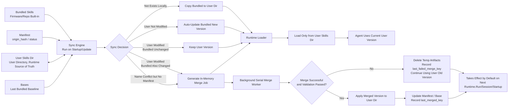

# Aiden Skills Sync and LLM Merge Design

> Status: Design Proposal
> Branch: `feature/hermes-skill-llm-merge`
> Baseline: `origin/main`
> Goal: Drawing from Hermes' bundled skill sync mechanism, design an MVP solution for Aiden that “seeds bundled skills to user directory, loads only from user directory at runtime, and auto-merges name conflicts via LLM.”

---

## 1. Core Design

Aiden's skill management adopts Hermes-style single runtime source:

```text
repo / firmware bundled skills
  ↓ sync on startup / update
user local skills directory
  ↓
runtime loads only from user local directory
```

Core principles:

```text
1. Bundled skills are released with firmware / code.
2. On startup or update, sync bundled skills to user directory.
3. User directory is the sole runtime source of truth.
4. User-downloaded / modified / LLM-created skills also go in user directory.
5. If name conflict, attempt LLM merge.
6. If LLM merge succeeds and validation passes, auto-apply.
7. If LLM merge fails, validation fails, or application fails, continue using old user version and record `last_failed_merge_key`.
8. LLM merge executes asynchronously, doesn't block startup or current request.
9. Don't persist running/queued/done state to avoid dangling tasks after board restart.
```

MVP does not include user confirmation flow, special approval state for high-risk skills, or restoration of historical user versions before overwrite. Runtime risks like payment, authorization, deletion are handled by tool layer / execution layer safety guards, not in the skill sync flow.

---

## 2. Current Aiden Implementation Status

Current main branch has basic Skills mechanism:

```text
src/agent/internal/agent/skill_loader.go
src/agent/internal/agent/skills.go
src/agent/internal/agent/runtime.go
src/agent/config/skills/
docs/04-agent/skills.md
```

Current behavior:

- `LoadConfigFromDir()` only checks:

```text
configDir/skills
```

- If this directory exists, sets:

```go
cfg.SkillsDirs = []string{skillsDir}
```

- `LoadSkillsFromDirs()` scans for `SKILL.md`.
- If duplicate skill name found, directly errors:

```go
return fmt.Errorf("duplicate skill name %q", skill.Name)
```

- Repository contains bundled examples:

```text
src/agent/config/skills/planner/SKILL.md
src/agent/config/skills/research/SKILL.md
```

But currently lacks complete bundled skill seed/update/merge mechanism.

---

## 3. Target Behavior

## 3.1 Single Runtime Source

Runtime only loads:

```text
configDir/skills/**/SKILL.md
```

For example, on device:

```text
/userdata/agent/skills/
```

This is also where user, app, downloader, LLM, and syncer all write to.

Runtime does not directly scan bundled directory.

## 3.2 Sync Bundled Skills to User Directory

Bundled skills exist in:

```text
Development: src/agent/config/skills/
Device: /oem/usr/share/aiden/skills/
```

Synced on startup or update to:

```text
configDir/skills/
```

After sync completes, runtime still only reads:

```text
configDir/skills/
```

## 3.3 User-Downloaded Skills Also in Same Directory

User-downloaded, app-installed, Agent/LLM-created skills also go in:

```text
configDir/skills/<skill-name>/SKILL.md
```

Therefore runtime always has only one question:

```text
Scan configDir/skills for which effective skills exist.
```

---

## 4. Overall Flow Diagram



---

## 5. Recommended Directory Structure

## 5.1 Repository / Firmware Built-in Directory

```text
src/agent/config/skills/
├── planner/SKILL.md
├── research/SKILL.md
├── ui-operator/SKILL.md
├── payment-confirm/SKILL.md
└── app-login/SKILL.md
```

After device installation, can be placed at:

```text
/oem/usr/share/aiden/skills/
├── planner/SKILL.md
├── research/SKILL.md
└── ...
```

This is the bundled skills source.

## 5.2 User Runtime Directory

```text
/userdata/agent/
├── agent.toml
├── skills/
│   ├── planner/SKILL.md
│   ├── research/SKILL.md
│   ├── payment-confirm/SKILL.md
│   └── user-downloaded-skill/SKILL.md
└── skill-state/
    ├── .bundled_manifest.json
    └── bases/
        ├── planner/SKILL.md
        └── payment-confirm/SKILL.md
```

Explanation:

- `skills/` is the sole runtime skill source.
- `.bundled_manifest.json` is the syncer's ledger, not involved in runtime loading.
- `bases/` saves the bundled content from the last successful sync, serving as the `base` for LLM three-way merge to improve merge quality.
- LLM merge candidates don't need a long-term directory; can write to temp files first, overwrite user directory after validation passes, delete temp files on failure.
- Temp files only ensure failed candidates don't pollute user directory, don't provide historical rollback capability after successful merge.
- MVP does not retain `backups/`, doesn't provide historical user version rollback after successful merge overwrites.

### 5.3 Positioning of `bases/`

`bases/` does not participate in runtime loading, it only serves LLM three-way merge:

```text
bases/ = bundled baseline from last successful sync/merge, used for next three-way merge.
```

Three-way merge requires:

```text
base     = bundled version from last sync to user directory
upstream = current new bundled version
local    = current user-modified version
```

LLM needs `base` to determine:

```text
Which content was added/deleted by user;
Which content was added/deleted by official;
Which content was modified by both sides in the same place.
```

So if the goal is to improve LLM merge quality, `bases/` is recommended to keep.

MVP does not retain `backups/`:

```text
When merge fails, user old version won't be overwritten, so no rollback needed.
After merge succeeds and validation passes, will directly overwrite SKILL.md in user directory.
If later found merge quality is poor, MVP only supports restoring current bundled default version, doesn't support restoring historical user version before overwrite.
```

Therefore MVP recommends:

```text
Retain manifest: Required, used to determine sync status.
Retain bases: Recommended, used to improve LLM three-way merge quality.
Don't retain backups: Simplify first, don't do historical user version rollback.
Don't retain merges: Merge candidates use temp files.
```

---

## 6. Role of Manifest

Manifest is not for runtime loading. It's the syncer's ledger.

It answers five questions:

```text
1. Was this skill previously seeded from bundled to user directory?
2. Has the version in user directory been modified by user?
3. Has bundled itself been updated?
4. Did user previously delete this bundled skill?
5. Is the current user directory version the effective copy last written by syncer?
```

Without manifest, system can only see:

```text
bundled/foo/SKILL.md
user/skills/foo/SKILL.md
```

But doesn't know:

```text
Was user/foo copied from bundled/foo?
Has user modified it?
Was bundled updated later?
Did user intentionally delete it?
```

Manifest provides a critical reference point:

```text
origin_hash    = bundled baseline hash from last sync / successful merge
effective_hash = effective copy hash after syncer last wrote to user directory
```

Calculated at startup:

```text
current_bundled_hash = current built-in version hash
current_user_hash    = current user directory version hash
origin_hash          = last sync hash recorded in manifest
effective_hash       = hash after system last wrote to user directory, recorded in manifest
```

Then determine:

```text
origin_hash is empty
=> Name conflict doesn't have successful baseline yet, handle as two-way merge

user_hash == effective_hash
bundled_hash == origin_hash
=> User hasn't modified the effective copy system last wrote, bundled hasn't changed, maintain current state

user_hash == origin_hash
bundled_hash != origin_hash
=> User directory is still old bundled original, bundled updated, can auto-overwrite

user_hash != origin_hash
bundled_hash == origin_hash
user_hash != effective_hash
=> User modified, bundled unchanged, keep user version and mark user_modified

user_hash != origin_hash
bundled_hash == origin_hash
user_hash == effective_hash
=> User directory is effective copy from last LLM merge, maintain merged state

user_hash != origin_hash
bundled_hash != origin_hash
=> Local effective copy differs from bundled baseline, bundled also updated, attempt LLM merge
```

`effective_hash` is to keep `merged` state stable. After LLM merge succeeds, user directory content usually doesn't equal bundled original, so can't use `user_hash != origin_hash` alone to determine user modified again.

## 6.1 Minimal Manifest Format

MVP uses minimal fields:

```json
{
  “version”: 1,
  “updated_at”: “2026-05-25T10:30:00+08:00”,
  “skills”: {
    “planner”: {
      “origin_hash”: “sha256:aaa111”,
      “effective_hash”: “sha256:aaa111”,
      “status”: “synced”,
      “base_path”: “skill-state/bases/planner/SKILL.md”,
      “last_synced_at”: “2026-05-25T10:30:00+08:00”
    },
    “payment-confirm”: {
      “origin_hash”: “sha256:bbb222”,
      “effective_hash”: “sha256:merged333”,
      “status”: “merged”,
      “base_path”: “skill-state/bases/payment-confirm/SKILL.md”,
      “last_synced_at”: “2026-05-25T10:30:00+08:00”,
      “last_merged_at”: “2026-05-25T10:31:00+08:00”,
      “last_merged_key”: “sha256:merge-input-key”
    },
    “research”: {
      “origin_hash”: “sha256:ccc333”,
      “status”: “deleted_by_user”,
      “last_synced_at”: “2026-05-20T09:00:00+08:00”
    }
  }
}
```

Field meanings:

- `origin_hash`: Bundled baseline hash from last sync / successful merge; can be temporarily empty for name conflicts that never successfully synced/merged.
- `effective_hash`: File hash after syncer last wrote to `configDir/skills/<name>/SKILL.md`; usually equals `origin_hash` when `synced`, usually doesn't equal `origin_hash` when `merged`, can be temporarily empty for name conflicts never successfully applied.
- `status`: Sync status, MVP only retains a few states.
- `base_path`: Optional, saves bundled content from last sync, used for three-way merge.
- `last_synced_at`: Most recent sync time.
- `last_merged_at` / `last_merged_key`: Most recent successful LLM merge time and input key.
- `last_failed_merge_key` / `last_merge_failed_at` / `last_merge_error`: Most recent failed merge input key, time, and error summary, used to avoid repeated retries with same input set.

Don't need to persist `current_bundled_hash` and current `user_hash` long-term in manifest. They can be calculated at each startup. `effective_hash` is not a cache of current user hash, but a reference point for “syncer last successfully wrote to user directory”.

## 6.2 MVP States

MVP retains these states:

```text
synced
user_modified
merged
deleted_by_user
```

Meanings:

- `synced`: User directory version equals current bundled baseline, usually `effective_hash == origin_hash`.
- `user_modified`: User directory version differs from effective copy syncer last wrote, i.e., `user_hash != effective_hash`.
- `merged`: User directory version is result of LLM merge, usually `user_hash == effective_hash` and `effective_hash != origin_hash`.
- `deleted_by_user`: User previously deleted this bundled skill, don't auto re-copy.

Merge failure doesn't need separate state. On failure, continue using user old version, status maintains or returns to `user_modified`.

If reading old manifest without `effective_hash`, but has `origin_hash`, MVP can temporarily treat as `effective_hash = origin_hash` for compatibility; write real `effective_hash` on next successful sync/merge/reset. If `origin_hash` is also empty, indicates name conflict hasn't had any successful baseline, should handle as two-way merge conflict.

---

## 7. Sync Trigger Timing

## 7.1 On Agent Startup

```text
LoadConfigFromDir(configDir)
  ↓
SyncBundledSkills(configDir, bundledSkillsDir)
  ↓
LoadSkillsFromDirs([]string{configDir/skills})
```

Note the order:

```text
Sync first, then load.
```

## 7.2 After App / Firmware Update

After firmware or agent binary update, should run once:

```text
SyncBundledSkills()
```

## 7.3 Manual Trigger

MVP can skip CLI first. Just keep internal function:

```go
func SyncBundledSkills(ctx context.Context, opts SkillSyncOptions) (*SkillSyncReport, error)
```

Later if needed, provide:

```text
skills sync
skills reset <name> --restore
```

---

## 8. Async Merge and Failure Deduplication

LLM merge is time-consuming task, can't block Agent startup or current user request.

At startup, `SyncBundledSkills()` only does lightweight work:

```text
Scan bundled/user skills
Read manifest
Calculate hash
Execute copy/update/keep that don't need LLM
Generate in-memory merge job when LLM merge needed
```

Then immediately enter runtime loading:

```text
LoadSkillsFromDirs(configDir/skills)
```

Before merge completes, runtime continues using current version in user directory.

### 8.1 Don't Persist running/queued/done

MVP doesn't write these states to manifest:

```text
queued
running
done
```

Reason: If persisting `running`, after board restart, process crash, or network disconnect, LLM request has been interrupted, no worker will come back to change `running` to success or failure, easy to leave dangling state.

Therefore:

```text
running only exists in memory.
manifest doesn't record running.
manifest only records last_failed_merge_key / last_merged_key.
```

### 8.2 merge_key

Each time LLM merge is needed, calculate an input key:

```text
merge_key = hash(skill_name + base_hash + upstream_hash + local_hash)
```

Where:

```text
base_hash     = last bundled baseline hash
upstream_hash = current bundled hash
local_hash    = current user skill hash
```

Two-way merge without base uses empty `base_hash`, and includes merge mode in key to avoid confusion with three-way merge key.

This key represents “whether this input set has been attempted”.

### 8.3 How to Decide Whether to Enqueue at Startup

```text
if need_merge:
    merge_key = hash(skill_name + base_hash + upstream_hash + local_hash)

    if last_failed_merge_key == merge_key:
        Skip, don't retry same already-failed input set
    else:
        Add to in-memory mergeJobs
```

If user modifies skill, or bundled upgrades again, `merge_key` will change, can retry.

### 8.4 Background Serial Processing

MVP uses one background worker to process merge tasks serially:

```text
Sort by skill name
Call LLM merge one by one
One skill failure doesn't affect next skill
```

Don't recommend MVP parallel processing. Serial is simpler:

```text
Avoid LLM API concurrent rate limiting
Avoid manifest write race
Avoid multiple workers overwriting skills directory simultaneously
Easier to locate failures
```

### 8.5 Merge Success

```text
write merged_skill_md → temp file
validate temp file passes
confirm hash(user_path) == job.local_hash
move temp file → user_path
merged_hash = hash(merged_skill_md)
copy current bundled → base_path
origin_hash = current bundled hash
effective_hash = merged_hash
status = merged
last_merged_key = merge_key
last_merged_at = now
clear last_failed_merge_key / last_merge_error
```

MVP's default effective boundary is next `Runtime.Run()` / next session / after restart, doesn't take effect mid-way through same agent loop.

The next `Runtime.Run()` here refers to next complete execution when external user request enters runtime, not next tool call or next LLM call within same Run:

```text
One Runtime.Run
  = assemble prompt
  + resolve skills
  + LLM/tool loop
  + return this round's response
```

Therefore if background merge completes during a Run in progress:

```text
Current Run already resolved skills, don't change.
Next user request / next Runtime.Run will reload before start, then see merged skill.
```

In-process hot reload uses dirty flag semantics: merge worker marks runtime skills dirty after successfully applying merge result; before next `Runtime.Run()` starts, reload `configDir/skills` and replace `SkillIndex`. Don't replace system prompt, skill instructions, or tool restriction mid-way through LLM/tool loop of same Run.

### 8.6 Merge Failure

```text
delete temp merge artifacts
don't overwrite user_path
continue using user old version
status = user_modified
last_failed_merge_key = merge_key
last_merge_failed_at = now
last_merge_error = brief error summary
```

All failure paths must record `last_failed_merge_key`, including LLM returns failure, LLM call error, output validation failure, temp file write failure, discovered input expired before application, etc. Merge failure is not system error, only indicates this bundled update wasn't merged into user version.

### 8.7 Prevent Overwriting New Modifications Before Application

Background merge is async task. During merge run, user or Agent might modify same skill again.

Therefore must recalculate current user file hash before applying candidate:

```text
if hash(user_path) != job.local_hash:
    indicates merge input already expired
    delete temp candidate
    don't overwrite user_path
    don't update origin_hash / base_path
    record last_failed_merge_key = merge_key
    record last_merge_error = “local changed before apply”
    wait for next scan to regenerate merge_key with new local
```

This is application failure caused by local being updated during async period. Although must record `last_failed_merge_key`, next scan will generate new `merge_key` with new `local_hash`, so won't block retry against latest local.

---

## 9. Sync Rules

## 9.1 New Bundled Skill, Doesn't Exist Locally

Conditions:

```text
bundled exists
user_path not exists
manifest has no record
```

Behavior:

```text
copy bundled → configDir/skills/<name>/SKILL.md
copy bundled → skill-state/bases/<name>/SKILL.md
record origin_hash = bundled_hash
record effective_hash = bundled_hash
status = synced
```

## 9.2 Bundled Skill Updated, User Hasn't Modified

Conditions:

```text
user_hash == origin_hash
bundled_hash != origin_hash
```

Behavior:

```text
copy bundled → user_path
copy bundled → base_path
update origin_hash = bundled_hash
update effective_hash = bundled_hash
status = synced
```

## 9.3 User Modified, Bundled Unchanged

Conditions:

```text
user_hash != origin_hash
bundled_hash == origin_hash
user_hash != effective_hash
```

Behavior:

```text
don't overwrite
continue using user version
status = user_modified
effective_hash remains unchanged
```

If `user_hash == effective_hash && bundled_hash == origin_hash`, indicates user directory is still effective copy syncer last wrote. Maintain original state: `synced` continues as `synced`, `merged` continues as `merged`.

## 9.4 User Deleted Bundled Skill

Conditions:

```text
manifest has record
user_path missing
```

Behavior:

```text
respect deletion
status = deleted_by_user
don't re-copy
```

Unless user explicitly restores later.

## 9.5 Repo / Firmware Deleted Bundled Skill

Conditions:

```text
manifest has record
bundled no longer exists
```

Behavior:

```text
don't directly delete user directory skill
can clean up or mark manifest stale
```

MVP can just clean up bundled records that no longer exist in manifest, keep user directory files unchanged.

## 9.6 Local Effective Differs from Baseline, Bundled Also Updated

Conditions:

```text
user_hash != origin_hash
bundled_hash != origin_hash
```

This includes both cases where user manually modified, and where last LLM merge already succeeded and current user_path is merged effective copy.

Behavior:

```text
generate background LLM merge job, don't block startup
base     = last bundled content saved in base_path
upstream = current bundled content
local    = current user_path content
```

If LLM merge succeeds and validation passes:

```text
write merged_skill_md → temp file
validate temp file passes
confirm hash(user_path) == job.local_hash
move temp file → user_path
copy current bundled → base_path
update origin_hash = bundled_hash
update effective_hash = hash(merged_skill_md)
status = merged
```

If LLM merge fails, validation fails, or application fails:

```text
discard result
continue using user old version
status = user_modified
last_failed_merge_key = merge_key
last_merge_failed_at = now
last_merge_error = brief error summary
```

## 9.7 Same Name but No Manifest

This is case where user installed same-name skill first, later system also added same-name bundled skill:

```text
user/skills/foo/SKILL.md exists
bundled/foo/SKILL.md exists
manifest has no foo record
```

At this point no common base, can't do standard three-way merge. If previously failed due to name conflict, manifest might already have a conflict record with empty `origin_hash` and only `last_failed_merge_key` recorded; this type of record also handled in this section.

MVP strategy:

```text
generate background LLM two-way merge job, don't block startup
upstream = bundled foo
local    = user foo
```

If merge succeeds and validation passes:

```text
write merged_skill_md → temp file
validate temp file passes
move temp file → user foo
copy bundled foo → base_path
record origin_hash = bundled_hash
record effective_hash = hash(merged_skill_md)
status = merged
```

If merge fails, validation fails, or application fails:

```text
continue using user old version
don't overwrite
delete temp merge artifacts
create or update manifest conflict record
origin_hash remains empty
effective_hash remains empty
status = user_modified
record last_failed_merge_key = merge_key
record last_merge_failed_at = now
record last_merge_error = brief error summary
```

Next scan, if `origin_hash` still empty, recalculate `merge_key` as two-way merge. If input unchanged, hits `last_failed_merge_key` and skips; after either user skill or bundled skill changes, `merge_key` changes, can retry.

---

## 10. LLM Merge Contract

## 10.1 Three-Way Merge Input

```json
{
  "mode": "three_way",
  "skill_name": "payment-confirm",
  "base": {
    "label": "bundled@last_sync",
    "content": "..."
  },
  "upstream": {
    "label": "bundled@current",
    "content": "..."
  },
  "local": {
    "label": "user@current",
    "content": "..."
  },
  "policy": {
    "preserve_user_intent": true,
    "preserve_upstream_bugfixes": true,
    "output_valid_skill_md": true
  }
}
```

## 10.2 Two-Way Merge Input

```json
{
  "mode": "two_way_no_base",
  "skill_name": "foo",
  "upstream": {
    "label": "bundled@current",
    "content": "..."
  },
  "local": {
    "label": "user@current",
    "content": "..."
  },
  "policy": {
    "preserve_user_intent": true,
    "merge_compatible_upstream_improvements": true,
    "output_valid_skill_md": true
  }
}
```

## 10.3 LLM Output

Success:

```json
{
  "status": "merged",
  "merged_skill_md": "---\nname: payment-confirm\ndescription: ...\n---\n...",
  "summary": "Preserved user custom confirmation wording, merged built-in new version's pre-screenshot check steps."
}
```

Failure:

```json
{
  "status": "failed",
  "merged_skill_md": "",
  "summary": "local and bundled conflict on core operation flow, cannot reliably merge."
}
```

MVP doesn't need `requires_review`, `risk_level`, `confidence`. Whether to apply only depends on whether program validation passes.

---

## 11. LLM Merge Principles

Merge prompt must clarify:

```text
You are merging Aiden Agent's SKILL.md.
Skill is SOP that affects device behavior, not ordinary copy.

Goals:
1. Preserve user local's explicit preferences and local adaptations.
2. Merge bundled upstream's bugfixes, tool name updates, and new flows.
3. Output must be valid SKILL.md, retain YAML frontmatter.
4. skill name must remain unchanged.
5. If cannot reliably merge, return status=failed.
```

Prohibitions:

```text
- Must not simply concatenate base/upstream/local.
- Must not output markdown without frontmatter.
- Must not rename causing runtime skill name to change.
- Must not return explanatory text masquerading as SKILL.md.
```

---

## 12. Merge Success Validation

LLM output cannot be directly applied. MVP uses program validation to determine success.

Merge success must satisfy:

```text
1. LLM call succeeds.
2. result.status == "merged".
3. merged_skill_md non-empty.
4. merged_skill_md can parse frontmatter.
5. frontmatter.name == expected skill name.
6. description non-empty.
7. body non-empty.
8. file size doesn't exceed limit, e.g., 32KB.
9. If has allowed_tools, then referenced tool names all exist; delegate_<child> form child Agent delegation pseudo-tools allowed to pass.
```

Pseudocode:

```go
func MergeOK(result MergeResult, expectedName string) bool {
    if result.Status != "merged" {
        return false
    }
    if strings.TrimSpace(result.MergedSkillMD) == "" {
        return false
    }

    skill, err := ParseSkillMarkdown(result.MergedSkillMD)
    if err != nil {
        return false
    }
    if skill.Name != expectedName {
        return false
    }
    if strings.TrimSpace(skill.Description) == "" {
        return false
    }
    if strings.TrimSpace(skill.Body) == "" {
        return false
    }
    if len(result.MergedSkillMD) > MaxSkillSize {
        return false
    }
    if !AllowedToolsExist(skill.AllowedTools) {
        return false
    }
    return true
}
```

When validation fails:

```text
don't apply candidate
delete temp merge artifacts
continue loading user old version
status = user_modified
last_failed_merge_key = merge_key
last_merge_failed_at = now
last_merge_error = validation failure summary
```

---

## 13. Application Strategy

LLM merge artifact first writes to temp file, e.g.:

```text
skill-state/tmp/<name>.candidate.SKILL.md
```

Only overwrite user directory after validation passes; delete temp file if validation fails. MVP only has two final results.

## 13.1 Merge Succeeds and Validation Passes

```text
write merged_skill_md → temp file
validate temp file passes
confirm hash(user_path) == job.local_hash
move temp file → user_path
copy current bundled → base_path
update manifest.origin_hash = current bundled hash
update manifest.effective_hash = hash(merged_skill_md)
status = merged
```

## 13.2 Merge Fails, Validation Fails, or Application Fails

```text
delete temp merge artifacts
don't overwrite user_path
continue using user old version
status = user_modified
last_failed_merge_key = merge_key
last_merge_failed_at = now
last_merge_error = brief error summary
```

Key principle:

```text
Merge failure is not system error.
Merge failure only indicates this bundled update wasn't merged into user version.
Runtime continues using old SKILL.md in user directory.
```

---

## 14. Restore Default Version

MVP doesn't retain historical user version backups, so doesn't provide “restore to user version before overwrite” capability.

Only retains one simple restore operation: restore current bundled default version.

Semantics similar to:

```text
skills reset <name> --restore
```

Behavior:

```text
copy current bundled → user_path
copy current bundled → base_path
origin_hash = bundled_hash
effective_hash = bundled_hash
status = synced
```

This operation discards user's current modifications, suitable when user explicitly indicates “restore official default skill”.

---

## 15. Runtime Loading

Runtime keeps it simple:

```text
LoadSkillsFromDirs([]string{configDir/skills})
```

Runtime doesn't need to know:

```text
bundled
manifest
base
```

Runtime only sees:

```text
effective SKILL.md in user directory
```

This is consistent with Hermes' “user profile skills is runtime source of truth”.

---

## 16. Refactoring Points for Current Aiden Code

## 16.1 Add sync Module

Recommend adding:

```text
src/agent/internal/agent/skill_sync.go
src/agent/internal/agent/skill_sync_test.go
```

Core types:

```go
type SkillSyncOptions struct {
    ConfigDir        string
    BundledSkillsDir string
    MergeModel       SkillMergeModel
    Quiet            bool
}

type SkillSyncReport struct {
    Copied        []string
    Updated       []string
    KeptUser      []string
    DeletedByUser []string
    Stale         []string
    MergeNeeded   []SkillMergeJob
}

func SyncBundledSkills(ctx context.Context, opts SkillSyncOptions) (*SkillSyncReport, error)
```

## 16.2 Call on Startup

Call after `NewRuntime()` or `LoadConfigFromDir()`, before loading skills:

```go
SyncBundledSkills(ctx, SkillSyncOptions{
    ConfigDir: cfg.ConfigDir,
    BundledSkillsDir: bundledSkillsDir,
    MergeModel: cfg.SkillMergeModel,
    Quiet: true,
})
```

Then still:

```go
LoadSkillsFromDirs([]string{filepath.Join(configDir, “skills”)})
```

## 16.3 bundledSkillsDir Source

Development environment:

```text
src/agent/config/skills
```

Device installation environment:

```text
/oem/usr/share/aiden/skills
```

MVP can resolve from build-time constant, config item, or relative path.

## 16.4 manifest Path

```go
manifestPath := filepath.Join(configDir, “skill-state”, “.bundled_manifest.json”)
```

---

## 17. User-Visible Behavior

Normal sync:

```text
Synced 2 built-in skills.
```

User modified but bundled unchanged:

```text
payment-confirm has been modified by user, continuing with user version.
```

User modified and bundled also updated:

```text
payment-confirm has both built-in updates and user modifications, added to background merge tasks.
```

Merge succeeded:

```text
payment-confirm background merge completed, built-in updates applied.
```

Merge failed:

```text
payment-confirm merge failed, continuing with user old version.
```

---

## 18. Skill Tools and System Prompt

In addition to file sync/merge framework, Aiden also needs to expose a set of skill tools to Agent, and explain in system prompt when to read and when to modify skills.

MVP tools follow Hermes' naming and layering approach:

```text
skill_list
skill_read
skill_manage
skill_mark_used
```

Where `skill_manage` can create, modify, delete any effective skill under `configDir/skills/`, manage supporting files, and maintain lifecycle state. `skill_mark_used` is used to distinguish “actually used a skill” from “only read a skill”.

These skill meta-tools are registered with runtime and all four remain callable by the conversational Agent. `allowed_tools` is parsed for validation and forward compatibility; it does not currently expand or narrow the Agent tool catalog for active skills. The HTTP Tool API exposes only the non-maintenance skill tools; `skill_manage` and `skill_mark_used` are not exposed via HTTP.

Note:

```text
configDir/skills/ is runtime source of truth, can be modified by skill_manage.
bundled source directory is not runtime source of truth, cannot be modified by skill_manage.
skill-state/ is maintained by sync/merge system, cannot be directly modified by skill_manage.
```

### 18.1 `skill_list`

Purpose: List metadata of installed skills under `configDir/skills/`, without loading full text.

Input example:

```json
{
  “query”: “payment login”,
  “limit”: 20
}
```

Output example:

```json
[
  {
    “name”: “payment-confirm”,
    “description”: “Confirm amount, payee, and operation target before payment”,
    “state”: “active”,
    “view_count”: 12,
    “use_count”: 5,
    “modify_count”: 1
  }
]
```

Rules:

```text
By default filter skills with state=archived.
Pass include_archived=true to include archived.
Pass state=active/stale/archived to filter by lifecycle state.
```

When Agent encounters reusable flows, App operations, troubleshooting steps, device settings, login, payment confirmation, form filling, etc., should first check Available skills catalog in prompt; if catalog is insufficient to judge, or needs to search by keyword/state, then call `skill_list` to find relevant skills.

### 18.2 `skill_read`

Purpose: Read complete `SKILL.md` of a skill, or read allowed linked/supporting file under that skill.

Input example:

```json
{
  “name”: “payment-confirm”,
  “file_path”: “references/merchant-checklist.md”
}
```

If `file_path` omitted, defaults to reading `SKILL.md`. Output is UTF-8 text itself, no longer wrapped in JSON; when reading `SKILL.md`, will append list of linked files that can be read via `skill_read {“name”:”...”,”file_path”:”...”}` at the end.

Output example:

```markdown
---
name: payment-confirm
description: ...
---

...

---

Linked files available via skill_read {“name”:”payment-confirm”,”file_path”:...}:

- references/merchant-checklist.md
```

Rules:

```text
If skill_list returns relevant skill, Agent must skill_read first before executing.
Don't read all skills at once.
Before modifying existing skill, must skill_read current content first.
file_path can only be SKILL.md, or relative path under references/, templates/, scripts/, assets/.
Read content must be UTF-8 text, single file max 64KB; binary assets not directly read through skill_read.
Path resolution must anchor both configDir/skills root directory and target skill directory; reject ../, absolute paths, supporting file symlink escapes, and symlink escapes of configDir/skills/<name> itself.
```

### 18.3 `skill_manage`

Purpose: Create, modify, delete effective skills under `configDir/skills/`, and manage their supporting files.

Follow Hermes' management actions, and add lifecycle actions:

```text
create
edit
patch
delete
write_file
remove_file
mark_stale
archive
restore_archive
```

Where `create/edit/patch/delete` operate on `SKILL.md`; `write_file/remove_file` operate on supporting files under skill directory; `mark_stale/archive/restore_archive` only update lifecycle state in `usage.json`.

#### create

Create new skill.

Rules:

```text
Target path must not exist.
Write to configDir/skills/<name>/SKILL.md.
content must be complete valid SKILL.md.
frontmatter.name must equal name.
description non-empty.
body non-empty.
```

If already exists, return error, prompt to use `edit` or `patch`.

#### edit

Replace entire existing skill.

Rules:

```text
Target path must exist.
content must be complete valid SKILL.md.
frontmatter.name must equal name.
description non-empty.
body non-empty.
Must skill_read before edit.
```

`edit` is suitable when most of skill is outdated and needs complete rewrite.

#### patch

Partially modify existing skill.

Rules:

```text
Target path must exist.
old_string must match uniquely.
Replace old_string with new_string.
Must re-validate SKILL.md after replacement.
Must skill_read before patch.
```

`patch` is safer than `edit`, should encourage Agent to prioritize using `patch` to fix minor issues.

#### delete

Delete or remove an effective skill.

MVP adopts “directly delete directory” semantics, behavior similar to Hermes' delete, but Aiden doesn't do absorbed_into rewriting:

```text
Target path must exist.
Delete entire skill directory configDir/skills/<name>/.
If this skill has record in bundled manifest, status = deleted_by_user.
If this skill not in manifest, directly delete.
```

When deleting bundled-derived skill, don't delete bundled source, also don't delete `bases/`; `bases/` can be retained as syncer historical state.

To avoid accidental deletion, system prompt should require: only use `delete` when user explicitly requests deletion, or skill is obviously outdated and current task goal is to clean up skills.

#### write_file

Write skill supporting file.

Allowed paths must be located in following subdirectories under that skill directory:

```text
references/
templates/
scripts/
assets/
```

Example:

```text
configDir/skills/<name>/references/api.md
configDir/skills/<name>/templates/prompt.txt
configDir/skills/<name>/scripts/check.py
configDir/skills/<name>/assets/example.png
```

Rules:

```text
Cannot write SKILL.md; use create/edit/patch for SKILL.md.
Cannot write outside skill directory.
Cannot write configDir/skill-state.
Cannot write bundled source.
Can create parent directory if doesn't exist.
After write can update modified statistics in usage.json.
```

#### remove_file

Delete skill supporting file.

Rules:

```text
Can only delete files under references/, templates/, scripts/, assets/.
Cannot delete SKILL.md.
Cannot delete entire skill directory; use action=delete to delete entire skill.
Cannot delete configDir/skill-state or bundled source.
```

#### mark_stale / archive / restore_archive

Maintain lifecycle state.

Rules:

```text
Target skill must exist.
mark_stale: state = stale.
archive: state = archived, skill_list no longer returns by default.
restore_archive: state = active.
Only write usage.json, don't move files, don't modify SKILL.md, don't modify manifest.
```

### 18.4 `skill_manage` Path Boundaries

Allowed to modify:

```text
configDir/skills/<name>/SKILL.md
configDir/skills/<name>/references/**
configDir/skills/<name>/templates/**
configDir/skills/<name>/scripts/**
configDir/skills/<name>/assets/**
```

Prohibited to modify:

```text
/oem/usr/share/aiden/skills/<name>/SKILL.md
src/agent/config/skills/<name>/SKILL.md
configDir/skill-state/.bundled_manifest.json
configDir/skill-state/bases/<name>/SKILL.md
any path outside configDir/skills
```

In other words, Agent can modify effective copy used at user runtime, but cannot modify firmware/repo built-in source files, also cannot directly modify syncer state files.

### 18.5 How manifest Updates After `skill_manage`

If the modified skill has a record in `.bundled_manifest.json`, indicates it's bundled-derived effective copy.

After `skill_manage` modifies `SKILL.md`:

```text
status = user_modified
origin_hash unchanged
effective_hash unchanged
base_path unchanged
clear last_failed_merge_key / last_merge_error
```

Don't update `origin_hash`, because `origin_hash` represents bundled baseline, doesn't follow user/Agent modifications. Also don't update `effective_hash`, because it represents reference point when syncer last successfully wrote to user directory.

`write_file/remove_file` only modifies supporting files, doesn't change SKILL.md merge input, so doesn't clear `last_failed_merge_key`. `mark_stale/archive/restore_archive` only writes `usage.json`, doesn't write manifest.

If modified skill not in manifest:

```text
don't write manifest
```

Because manifest only manages bundled sync, not full skill registry.

### 18.6 `skill_manage` Schema Recommendation

```json
{
  "name": "skill_manage",
  "description": "Create or modify installed skills under configDir/skills. Does not modify bundled source skills or skill-state.",
  "parameters": {
    "type": "object",
    "properties": {
      "action": {
        "type": "string",
        "enum": [
          "create",
          "edit",
          "patch",
          "delete",
          "write_file",
          "remove_file",
          "mark_stale",
          "archive",
          "restore_archive"
        ]
      },
      "name": {
        "type": "string",
        "description": "Skill name. Must match frontmatter.name and target directory."
      },
      "content": {
        "type": "string",
        "description": "Full SKILL.md content for create/edit."
      },
      "old_string": {
        "type": "string",
        "description": "String to replace for patch. Must match uniquely."
      },
      "new_string": {
        "type": "string",
        "description": "Replacement string for patch."
      },
      "file_path": {
        "type": "string",
        "description": "Supporting file path under references/, templates/, scripts/, or assets/ for write_file/remove_file."
      },
      "file_content": {
        "type": "string",
        "description": "Content to write for write_file."
      },
      "reason": {
        "type": "string",
        "description": "Why this skill is being created or modified."
      }
    },
    "required": ["action", "name", "reason"]
  }
}
```

Parameter requirements:

```text
action=create/edit: content required.
action=patch: old_string and new_string required.
action=delete: don't need content/old_string/new_string.
action=write_file: file_path and file_content required.
action=remove_file: file_path required.
action=mark_stale/archive/restore_archive: don't need content/old_string/new_string/file_path.
```

### 18.7 `skill_mark_used`

Purpose: Mark that a skill has been actually used for current task.

Input example:

```json
{
  "name": "payment-confirm"
}
```

Behavior:

```text
Target skill must exist.
use_count += 1.
last_used_at = now.
```

### 18.8 System Prompt Rules

Recommend adding to Aiden system prompt:

```markdown
## Skills

Skills are reusable operation flows, not memory. They suit App operations, troubleshooting, device flows, forms/authorization/payment, repetitive tasks, and validated tool usage patterns.

### Available Information

- Available skills lists names and descriptions of currently available skills; Active skills lists complete instructions for skills already activated and injected this round.
- skill_list is for browsing or searching skills, skill_read is for loading relevant skill's SKILL.md or linked files, skill_manage is for creating, editing, archiving, or maintaining skills, skill_mark_used is for recording actual use.

### Usage Rules

- Before action, check Available skills first; for reusable flows, App operations, troubleshooting, device settings, form submission, payment/authorization, or known repetitive tasks, prioritize matching skills.
- If Available skills insufficient to judge, use skill_list to search; after finding relevant skill, skill_read first, then execute.
- Don't read all skills. Only read skills relevant to current task; if relevant skill already in Active skills, prioritize executing according to already-activated instructions, only skill_read again when needing complete SKILL.md details.
- Loaded skill is SOP for this task; unless it conflicts with user instructions, safety rules, current screen state, or tool results. When skill is outdated or partially wrong, adjust this execution based on current evidence.
- After actually executing according to a skill, if skill_mark_used tool exists, call it with that skill name.

### Maintenance Rules

- Only write or update skills for reusable flows; don't save one-time progress, temporary state, secrets, raw logs, or personal facts.
- Must skill_read first before modifying existing skill; prioritize skill_manage action=patch for small changes, only use action=edit for complete rewrite.
- skill_manage can only maintain skills under configDir/skills, and supporting files under references/, templates/, scripts/, assets/.
- Don't directly modify bundled source or configDir/skill-state files.
```

This prompt section can remain static because skill instructions are loaded through the static Agent tool catalog rather than by expanding tools from active skill `allowed_tools` metadata.

### 18.9 Skill Statistics and Usage Records

In addition to bundled manifest, Hermes also has curator/usage side statistics, used to maintain agent-created skills. It records skill viewing, usage, modification and other activities, not necessary state for bundled sync.

In Aiden this part should be separated from manifest:

```text
.bundled_manifest.json = bundled sync / merge ledger
usage.json             = runtime usage / maintenance statistics
```

Statistics don't participate in following core decisions:

```text
Whether user modified skill
Whether bundled updated
Whether LLM merge needed
What is base for LLM merge
Whether skill is valid
```

These are still determined by manifest, hash, bases, and SKILL.md validation.

Statistics mainly used for subsequent capabilities:

```text
skill_list sorting: commonly used, recently used, high-match skills can rank higher.
Debugging: explain why Agent frequently reads/uses certain skill.
Maintenance: discover skills that are unused long-term, frequently modified, frequently read but not used.
curator: can later archive stale skills, merge duplicate skills, prompt rewrite outdated skills.
App UI: display recently used, commonly used, recently modified skills.
```

MVP doesn't do complex curator, but implements lightweight usage sidecar:

```text
configDir/skill-state/usage.json
```

Recommended minimal fields:

```json
{
  “payment-confirm”: {
    “view_count”: 12,
    “use_count”: 5,
    “modify_count”: 1,
    “last_viewed_at”: “2026-05-25T12:00:00+08:00”,
    “last_used_at”: “2026-05-25T12:05:00+08:00”,
    “last_modified_at”: “2026-05-25T12:10:00+08:00”,
    “state”: “active”,
    “state_changed_at”: “2026-05-25T12:10:00+08:00”
  }
}
```

Field meanings:

```text
view_count: Incremented on skill_read, indicates Agent viewed this skill.
use_count: Incremented on skill_mark_used, indicates Agent actually executed task according to this skill.
modify_count: Incremented after skill_manage create/edit/patch/delete/write_file/remove_file succeeds.
last_viewed_at: Most recent skill_read time.
last_used_at: Most recent skill_mark_used time.
last_modified_at: Most recent successful skill_manage modification time.
state: skill lifecycle state, MVP supports active / stale / archived.
state_changed_at: Most recent lifecycle state change time.
```

`view_count`, `use_count`, `modify_count` are all cumulative counters, only increase not decrease. Lifecycle decisions rely on `last_viewed_at` / `last_used_at` / `last_modified_at`, don't express decay through decrementing counters.

`skill_mark_used` is used to distinguish “read skill” from “actually executed task according to skill”:

```text
skill_mark_used(name)
```

usage update rules:

```text
skill_read succeeds:
  view_count += 1
  last_viewed_at = now

skill_mark_used succeeds:
  use_count += 1
  last_used_at = now

skill_manage succeeds:
  modify_count += 1
  last_modified_at = now

skill_manage mark_stale/archive/restore_archive succeeds:
  state = stale/archived/active
  state_changed_at = now
```

Implementation requirements:

```text
usage.json atomic write.
When skill_read, skill_mark_used, and skill_manage write usage.json concurrently, need usage write lock.
usage.json not written into SKILL.md frontmatter, avoiding frequent statistics updates polluting skill content diff.
```

usage statistics don't participate in skill sync/merge main flow. It's foundational capability for subsequent skill curator, recommendation sorting, stale skill cleanup, and debugging experience.

### 18.10 Skill Lifecycle

Lifecycle is skill lifecycle management capability. It and bundled sync/merge are two separate systems:

```text
sync/merge: Maintains sync and conflict merge of builtin/bundled skills to user directory.
lifecycle: Maintains statistics and display state like state/use_count/view_count in usage.json.
```

MVP supports manual lifecycle state, and does lightweight automatic stale/archive for agent-created skills; doesn't do automatic prune, doesn't do pinned, never auto-deletes any skill.

#### agent-created skill metadata

When `skill_manage(action=create)` creates new skill by Agent, recommend auto-supplementing:

```yaml
---
name: hotel-wifi-login-debug
description: Hotel Wi-Fi login page troubleshooting flow
source: agent
created_by: agent
---
```

If Agent modifies existing builtin/user/merged skill, shouldn't change `source` to `agent`. This type of modification only indicates effective copy was edited, if there's record in bundled manifest then mark `status=user_modified`.

#### Lifecycle States

Lifecycle maintains state in `usage.json`, not written into manifest:

```json
{
  “hotel-wifi-login-debug”: {
    “view_count”: 2,
    “use_count”: 1,
    “modify_count”: 0,
    “last_viewed_at”: “2026-01-01T10:00:00+08:00”,
    “last_used_at”: “2026-01-01T10:10:00+08:00”,
    “last_modified_at”: “2026-01-01T09:00:00+08:00”,
    “state”: “active”,
    “state_changed_at”: “2026-01-01T09:00:00+08:00”
  }
}
```

Recommended states:

```text
active   = Normal usable, appears in skill_list by default.
stale    = Suspected outdated or unused long-term, still usable, but sorting lowered or prompted to review.
archived = Already archived, doesn't appear in skill_list by default, but file still retained, can restore.
```

MVP doesn't do `pruned/deleted` automatic state. Real deletion should be triggered by user explicitly via `skill_manage delete`.

#### How stale is Determined

`stale` indicates suspected outdated or needs review. MVP supports two entry methods:

```text
1. skill_manage action=mark_stale manual setting.
2. For skills with source=agent or created_by=agent, when skill_list discovers last use time exceeds 90 days, auto-mark stale. Automatic scan runs at most once per 24 hours.
```

Optional rules:

```text
Automatic stale only handles source=agent / created_by=agent, and considers following conditions:

1. Not actually used for 90 days, enters stale.
2. Not actually used for 180 days, enters archived.
3. view_count very high but use_count very low, indicates description might be misleading.
4. modify_count very high, indicates flow unstable, can mark as needs review, not directly archive.
```

Note:

```text
stale is not deletion.
stale skill still readable, usable, just sorting lowered or UI prompts might be outdated.
```

#### How archive is Determined

`archive` is a further organization action beyond stale.

MVP supports two archiving methods:

```text
1. skill_manage action=archive manually sets state=archived.
2. For skills with source=agent or created_by=agent, when skill_list discovers last use time exceeds 180 days, auto-mark archived. Automatic scan runs at most once per 24 hours.
```

Archiving doesn't move files:

```text
Keep file location, set state=archived in usage.json, skill_list filters archived by default.
```

This way doesn't move files, restore is simple, also doesn't affect paths and sync logic.

#### restore

`restore` is for restoring archived skill.

Restoring archived skill uses `skill_manage action=restore_archive`:

```text
state = active
```

If archived / stale skill is actually recalled for use, `skill_mark_used` auto-restores:

```text
state = active
last_used_at = now
state_changed_at = now
```

#### prune

`prune` is final cleanup. Aiden doesn't recommend MVP auto-prune.

If doing it in future, must satisfy:

```text
Only handle source=agent.
Already archived for very long time.
Before deletion have backup or user confirmation.
Never prune builtin/user/merged skills.
```

#### Relationship Between Lifecycle and usage

usage is lifecycle's state storage:

```text
skill_read updates view_count / last_viewed_at.
skill_manage updates modify_count / last_modified_at.
skill_mark_used updates use_count / last_used_at.
skill_manage mark_stale/archive/restore_archive updates state / state_changed_at.
skill_list performs 90/180 day stale/archive evaluation for skills with source=agent / created_by=agent, scan results throttled through lifecycle_scan.json to at most once per 24 hours.
skill_mark_used performs auto-restore on stale/archived skills.
skill_list filters archived by default, unless include_archived=true or explicit state=archived.
```

Lifecycle doesn't participate in real-time task execution, also doesn't affect current skill sync/merge main flow.

## 19. MVP Implementation Phases

## Phase 1: Hermes-style seed/sync

- Add `SyncBundledSkills()`.
- New built-in skills auto-copy to `configDir/skills`.
- Unmodified bundled skills auto-update.
- When user modified and bundled unchanged, don't overwrite.
- User-deleted bundled skills don't re-add.
- Write `.bundled_manifest.json`, record `origin_hash` and `effective_hash`.
- Runtime only loads from `configDir/skills`.

## Phase 2: base Support

- Save last synced bundled content to `skill-state/bases/<name>/SKILL.md`.
- Support restoring current bundled default version.
- Don't retain historical user version backups, MVP doesn't support restoring user version before overwrite.

## Phase 3: LLM Merge

- Add `SkillMergeModel` interface.
- When local effective copy differs from bundled baseline and bundled also updated, generate background three-way merge task.
- When same name but no manifest, generate background two-way merge task.
- Background worker serially calls LLM, outputs `merged_skill_md`.
- Auto-apply after passing program validation.
- If merge fails, validation fails, or application fails, continue using user old version, and record `last_failed_merge_key` to avoid repeated retries with same input set.

---

## 20. Summary

Aiden skills management adopts:

```text
bundled skills
  ↓ seed/sync/merge
configDir/skills as sole runtime source of truth
  ↓
Agent displays Available skills in prompt, and loads complete flows on-demand via skill_read
```

Sync strategy references Hermes:

```text
New skills auto-copy;
Unmodified bundled skills auto-update;
User-modified not directly overwritten;
User-deleted not re-added;
When repo / firmware deletes bundled skill, don't directly delete user local.
```

Aiden adds on top of Hermes:

```text
When name conflict / local effective differs from baseline and bundled already updated, allow LLM to do semantic merge.
```

MVP's key simplifications:

```text
Don't do user confirmation;
Don't do high-risk merge approval;
Apply if merge succeeds and validation passes;
Continue using user old version and record last_failed_merge_key if merge fails, validation fails, or application fails;
LLM merge executes asynchronously serially in background;
manifest doesn't persist running/queued/done, only records last_failed_merge_key / last_merged_key;
Must confirm user_path still equals job.local_hash before applying merge result, avoiding overwriting new modifications during async period; if not equal, record last_failed_merge_key as application failure.
```

Manifest's positioning:

```text
Not runtime dependency, but syncer's ledger.
It records bundled baseline from last sync, helps determine whether user modified, whether bundled updated, whether LLM merge needed.
It also records effective_hash, helps distinguish “user modified again” from “current file is exactly last merged result”.
```

Positioning of auxiliary directories:

```text
bases/ is for merge quality: saves base needed for three-way merge.
backups/ doesn't enter MVP: don't support historical user version rollback yet.
merges/ doesn't enter MVP: merge candidates use temp files, apply or delete immediately after validation.
```
