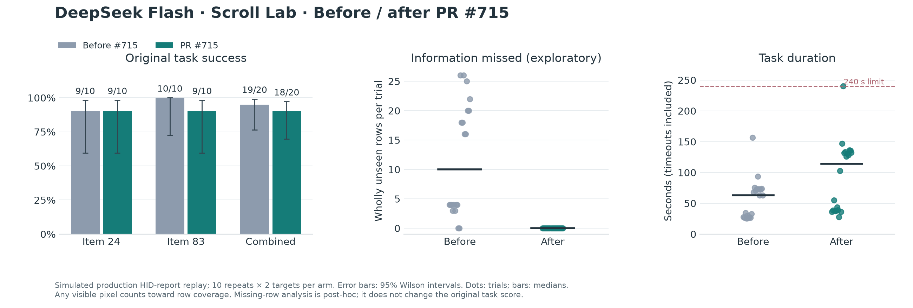
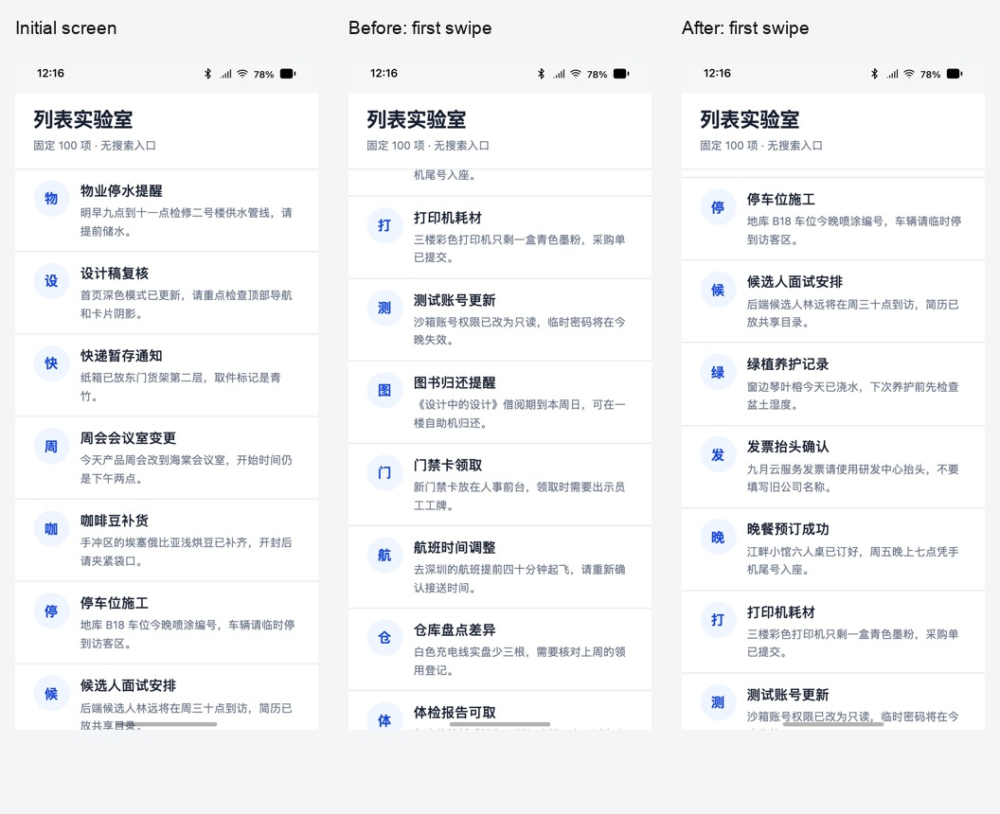

# PR #715: DeepSeek Scroll Lab comparison

> Historical fixed-target experiment. This did not implement the user's later
> clarified ten-random-target, immediate-stop protocol. See the
> [corrected baseline](../pr715-visible10-before-20260921/README.md), which is kept
> separate and currently has no after-version counterpart. Reverse scrolling
> was possible here, although an overshoot could never be scored as success.

**The existing target-search suite did not show a success-rate improvement.**
Before #715, 19/20 trials passed (95%); with #715, 18/20 passed (90%). The
simulation did show a substantial reduction in release inertia and missing
intermediate information. These are different findings and should be reported
separately.

## Original, unchanged benchmark

| Target | Before #715 | With #715 | Change |
| --- | ---: | ---: | ---: |
| Item 24: 取回蓝色雨伞 | 9/10 (90%) | 9/10 (90%) | 0 pp |
| Item 83: 冷链样品交接 | 10/10 (100%) | 9/10 (90%) | −10 pp |
| Combined | **19/20 (95%)** | **18/20 (90%)** | **−5 pp** |

Combined 95% Wilson intervals are 76.4–99.1% before and 69.9–97.2% after.
Fisher's two-sided p-value is 1.00. This small experiment supports neither an
overall success improvement nor a statistically established regression.

The two tasks come from [firmware #703](https://github.com/AidenAI-IO/aiden-firmware/pull/703)
and [MobileGym #3](https://github.com/AidenAI-IO/mobilegym/pull/3). The original
`mobilegym_scroll_regression.json` is unchanged: correct app, detail route and
selected item; at most 40 tool calls; at most 240 seconds; and a monotonic
`maxFirstVisibleOrdinal` no greater than the target ordinal.

“No rollback” is a **scoring constraint**, not a disabled reverse gesture.
Scrolling back remains possible, but it cannot erase a prior overshoot. The
last before trial demonstrated this: it eventually opened item 24 correctly,
but its high-water mark was 30, so it failed.

| Failed trial | Observed cause | Target overshoot |
| --- | --- | ---: |
| `before-024-10` | The agent lost track of numbering, scrolled past the target, then returned and opened it. Highest first-visible row: 30. | Yes |
| `after-024-09` | Opened the correct detail page, but used 48 tools: 40 shell calls reading skill-result files, two skill reads, one screenshot, five gestures. Failed the 40-call limit. Highest first-visible row: 19. | No |
| `after-083-02` | Target was visible in the saved screenshot. The model decided to recount from the top and timed out at 240 seconds. Highest first-visible row: 77. | No |

All 40 trials, including these three failures, remain in the denominator. No
failed trial was selectively rerun. Four completed pilot trials were excluded.

## Release inertia and missing information

| Measure | Before #715 | With #715 |
| --- | ---: | ---: |
| Target-overshoot failures | 1/20 | 0/20 |
| Trials with wholly unseen intermediate rows, exploratory | **18/20 (90%)** | **0/20 (0%)** |
| Wholly unseen rows, summed across trials | **237** | **0** |
| Recorded model-selected swipes | 111 | 199 |
| Swipes with nonzero measured coast | 109/111 | 0/199 |
| Median absolute coast after release | **502 CSS px** | **0 CSS px** |
| Maximum absolute coast after release | 600 CSS px | 0 CSS px |

The unchanged suite only requires finding one named target. It can pass even
when several earlier rows were completely absent from every settled screenshot.
For example, `before-024-01` passed while rows 8, 9, 18, and 19 were never
available in the saved settled views. Its after counterpart had no such gaps.

The coverage analysis was introduced **after the first 12 formal trials** and is
exploratory. It checks rows 1 through the requested target, using the actual
rendered row geometry and initial/post-swipe viewport positions. Even one pixel
of intersection counts as visible; motion frames that were not observed by the
Agent do not. Geometric availability does not prove the model read the row.
`coverage.json` lists the missing ordinals for every trial.

The two before trials with no final coverage gaps were `before-024-09` (the
model chose 400 ms swipes) and `before-024-10` (repeated reverse scrolling
eventually exposed the rows, but the irreversible target-overshoot check
failed). Thus, “ever available by task end” is a weaker measure than uninterrupted
forward coverage.

## Cost in actions and time

| Target | Median time before → after | Median swipes before → after | Median total tools before → after |
| --- | ---: | ---: | ---: |
| Item 24 | 27.6 → 38.4 s | 2 → 4 | 9 → 11 |
| Item 83 | 72.9 → 132.9 s | 8 → 15 | 15 → 22 |

Timeouts and failed runs are included. Removing inertia preserves overlapping
views but requires more gestures at the selected endpoints. The PR's guidance
did not consistently make the model use the full visible scrollable region.

## Method and limitations

- Before source: `b4281646d4a02acc6a169760096fd44448e26a23`, the PR's exact parent.
- After source: `3e9eac9ecd425b4f5e2f1279e0f527d0ec6a85d2`,
  [firmware #715](https://github.com/AidenAI-IO/aiden-firmware/pull/715).
- MobileGym: `d0549195beccbe08f963bf7758bef3a65fe3ac08`, the #703 pinned commit.
- Agent: the board's active `deepseek` / `deepseek-flash` configuration,
  `https://api.deepseek.com`, chat-completions mode, `max_response_tokens=1396`.
  No temperature override. API credentials were read through SSH and excluded
  from reports. Obsolete `input_mode=text` was removed for local startup;
  raw HTTP logging and voice effects were disabled equally in both arms.
- Ten repeats for each of two fixed targets per arm; each before/after pair
  ran concurrently in separate browser environments. Target order alternated.
  Every trial used a fresh Agent process, runtime directory, and simulator reset.
- Deterministic repository assertions, with no LLM judge. Both versions used
  their own bundled skills and tool descriptions, so this evaluates the complete
  PR (guidance plus HID trajectory), not a trajectory-only ablation.

**This is a simulated production-HID-report replay experiment.** The standard
MobileGym HTTP provider bypasses #715's HID implementation. Each arm therefore
captures the real `HIDProvider.SwipeWithOptions` output from its source revision,
then replays those reports into the same MobileGym page. The production code is
unmodified. Both arms use an identical 100 ms finite-window release-velocity
estimator and MobileGym #3's original Android fling functions, with inertia
enabled. That estimator is required because #3's stock total-travel/time
estimate cannot distinguish a slow release tail.

The 100 ms estimator is an approximation, not Android's full VelocityTracker.
Report timing was measured on the Mac, not through board USB polling. No real
phone success rate was measured. The reported 0 CSS px is the browser's measured
scroll displacement, not a claim of mathematically zero release velocity. The
fixed-path after probes predicted about 0.1 CSS px of coast below that resolution.

Fixed-path probes (480 CSS px travel, excluded from task rates) recorded before
coast of 1560 / 385 / 121 CSS px at requested durations 120 / 300 / 600 ms;
the after arm measured 0 / 0 / 0 CSS px.

## Data and reproduction

- [Reproduction harness](../../../../benchmark/scripts/pr715/README.md).
- [Machine-readable comparison](comparison.json), [trial CSV](comparison.csv),
  [all original result records](trial-results.jsonl).
- [Exploratory coverage](coverage.json), [rendered row geometry](row-geometry.json),
  [fixed-path probes](probes.json), [input manifest](manifest.json), and [audit](audit.json).
- Full local run directory: `benchmark/runs/pr715-scroll-comparison-20260921/`.
  It contains all per-trial reports, histories, traces, pre/post screenshots,
  post-swipe screenshots, environment states, and 310 raw HID recordings.
- Full raw-data archive: `benchmark/runs/pr715-scroll-comparison-20260921.tar.gz`.
  The compact evidence in this directory is tracked in Git; large raw artifacts
  remain local. `SHA256SUMS.txt` in the run directory inventories the full artifact
  set; `archive-sha256.txt` records the archive checksum.

Validation: all 40 planned trials and 13,456 HID reports audited; all 310
post-swipe first-visible rows matched the independent geometry calculation;
all 248 Agent shell calls only read saved tool-result files; no board credential
value appeared in the artifacts. The MNK Go test suite and 46 focused Python
benchmark tests passed. The board configuration and running Agent were unchanged.

Research context: Lark **【Aiden】【Research】UI滚动屏幕操作工具的优化**,
`d979c419-cf57-41f5-8b92-b26f1ffe17eb` (design section). The card was read only.

The defensible claim is: **#715 reduced simulated release inertia and
intermediate information loss under the tested model and list. This run did
not establish a higher success rate on the original target-search suite.**
