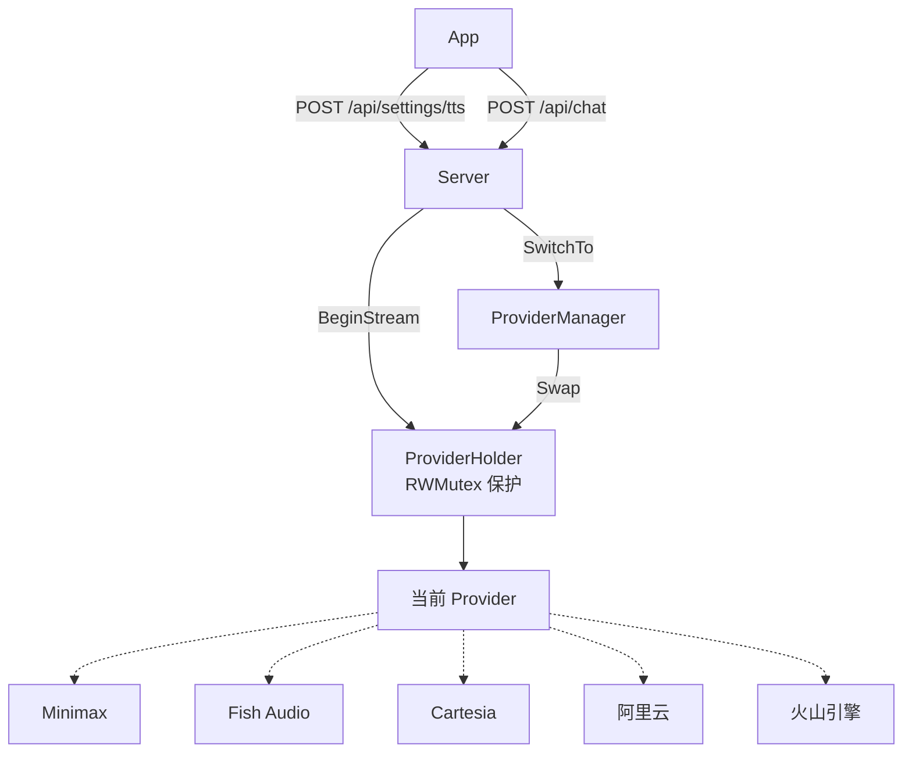
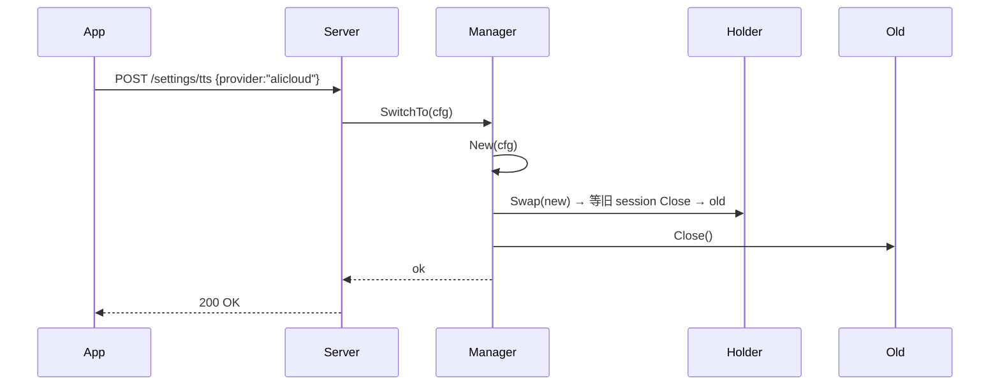
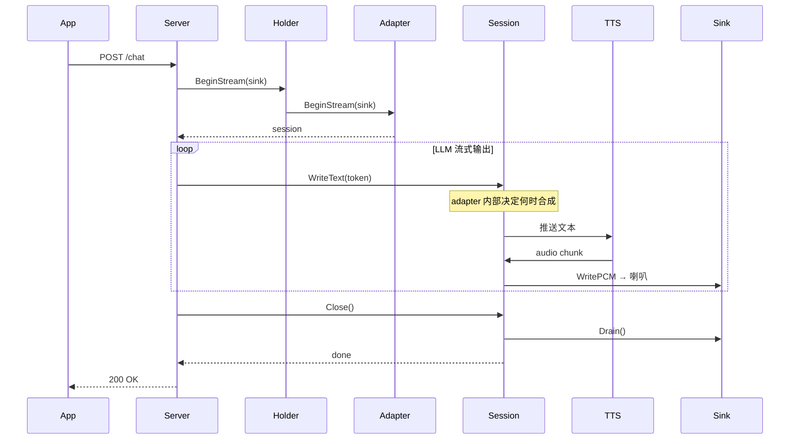

# TTS 可插拔模块实现指南

## 背景

当前 TTS 模块硬编码了 Minimax 作为唯一 provider。随着业务需求变化（延迟优化、中文质量、成本控制），需要支持多 provider 切换，且 app 端可运行时切换而无需重启服务。

## 目标

- 统一 TTS Provider 抽象，新增 provider 只需实现 adapter
- 所有 provider 统一走 streaming 接口（BeginStream → WriteText → Close）
- 非流式 provider（如 Minimax）在 adapter 内部自行 buffer 到句子边界再发送
- 支持 app 运行时切换 provider，不中断当前播放

## 架构总览



## 接口设计

### 核心接口（唯一）

```go
// TTSProvider 是 TTS 后端的统一抽象。
// 所有 adapter 必须实现，统一走 streaming 模式。
type TTSProvider interface {
    Name() string
    Capabilities() Capabilities
    BeginStream(ctx context.Context, sink AudioSink) (StreamSession, error)
    Close() error
}

// StreamSession 是一个 TTS 合成会话。
// 上层把 LLM 的 token 逐个 WriteText 进来，最后 Close 等待播放完毕。
type StreamSession interface {
    WriteText(text string) error
    Flush() error
    Close() error
    Err() error
}

type Capabilities struct {
    SupportsContextContinuation bool  // 跨句连续上下文（Cartesia）
    SupportedSampleRates        []int
    MaxTextLength               int   // 0=无限制
    RegionRestricted            bool  // 需要代理
}
```

**设计要点**：

- 没有 `Synthesize(text)` 方法——所有 provider 统一走 `BeginStream`
- 没有 `StreamingProvider` 扩展接口——不需要 type assertion 探测
- 上层只有一条代码路径，adapter 内部自行决定 buffer 策略

### 音频输出

```go
type AudioSink interface {
    Format() AudioFormat
    WritePCM(data []byte) error
    Drain(ctx context.Context) error
    Stop() error
}

type AudioFormat struct {
    SampleRate int
    Channels   int
    BitWidth   int
}
```

### 配置

```go
type ProviderConfig struct {
    Provider   string
    APIKey     string
    Endpoint   string
    Voice      string
    Language   string
    SampleRate int
    SpeedRatio float64
    Proxy      ProxyConfig
    Extra      map[string]any
}
```

### 工厂函数

```go
func New(cfg ProviderConfig) (TTSProvider, error) {
	name := strings.ToLower(strings.TrimSpace(cfg.Provider))
	factory, ok := factories[name]
	if !ok {
		return nil, fmt.Errorf("tts: unknown provider %q", cfg.Provider)
	}
	return factory(cfg)
}
```

Adapter 通过 `init()` 调用 `tts.Register(...)` 注册。当前只注册 canonical provider 名：`minimax`、`minimax-ws`、`fish-audio`、`alicloud`、`volcengine`。不提供 alias。

## 运行时切换

### ProviderHolder

```go
type ProviderHolder struct {
	mu       sync.RWMutex
	current  TTSProvider
	activeWG *sync.WaitGroup
}

func NewProviderHolder(initial TTSProvider) *ProviderHolder {
	return &ProviderHolder{current: initial, activeWG: &sync.WaitGroup{}}
}

func (h *ProviderHolder) Swap(next TTSProvider) TTSProvider {
	h.mu.Lock()
	old := h.current
	oldWG := h.activeWG
	h.current = next
	h.activeWG = &sync.WaitGroup{}
	h.mu.Unlock()

	// 等旧 provider 已创建的 session 全部 Close，再返回 old 给 Manager 关闭。
	oldWG.Wait()
	return old
}

func (h *ProviderHolder) Name() string {
    h.mu.RLock()
    defer h.mu.RUnlock()
    return h.current.Name()
}

func (h *ProviderHolder) Capabilities() Capabilities {
    h.mu.RLock()
    defer h.mu.RUnlock()
    return h.current.Capabilities()
}

func (h *ProviderHolder) BeginStream(ctx context.Context, sink AudioSink) (StreamSession, error) {
	h.mu.RLock()
	p := h.current
	wg := h.activeWG
	wg.Add(1)
	h.mu.RUnlock()

	session, err := p.BeginStream(ctx, sink)
	if err != nil {
		wg.Done()
		return nil, err
	}
	return &trackedSession{StreamSession: session, done: wg}, nil
}

func (h *ProviderHolder) Close() error {
    h.mu.Lock()
    defer h.mu.Unlock()
    if h.current == nil {
        return nil
    }
    err := h.current.Close()
    h.current = nil
    return err
}
```

### ProviderManager

```go
type ProviderManager struct {
	holder *ProviderHolder
	logger Logger
}

func NewProviderManager(initial TTSProvider, logger Logger) *ProviderManager {
	return &ProviderManager{holder: NewProviderHolder(initial), logger: logger}
}

func (m *ProviderManager) Holder() *ProviderHolder {
    return m.holder
}

func (m *ProviderManager) SwitchTo(cfg ProviderConfig) error {
    next, err := New(cfg)
    if err != nil {
        return fmt.Errorf("create %s: %w", cfg.Provider, err)
    }

	old := m.holder.Swap(next) // 阻塞到旧 provider 的 session 全部 Close
	if old != nil {
		m.logger.Info("TTS switched: %s -> %s", old.Name(), next.Name())
		_ = old.Close()
	}
	return nil
}
```

### 切换时序



## 上层调用

统一一条路径，不需要判断 provider 能力：

```go
func (s *Server) handleChat(...) {
    sink := tts.NewAudioServiceSink(s.audioClient)
    session, err := s.tts.BeginStream(ctx, sink)
    if err != nil {
        // TTS 不可用，继续不带语音
    } else {
        runReq.StreamWriter = newSessionWriter(session)
    }

    result, _ := s.runtime.Run(ctx, runReq)

    if session != nil {
        session.Close()
    }
}

// sessionWriter 把 io.Writer 桥接到 StreamSession
type sessionWriter struct {
    session tts.StreamSession
}

func (w *sessionWriter) Write(p []byte) (int, error) {
    if err := w.session.WriteText(string(p)); err != nil {
        return len(p), nil // 不阻断 LLM
    }
    return len(p), nil
}
```

### 对话流程



## Adapter 内部 Buffer 策略

不同 provider 的 adapter 在 `WriteText` 内部自行决定何时真正发送：

### Fish Audio / Cartesia（真流式）

```go
func (s *session) WriteText(text string) error {
    // 每个 token 立即推到 WebSocket
    return s.conn.WriteMessage(msgpack.Marshal(TextEvent{Text: text}))
}
```

### Minimax（句子级，adapter 内部 buffer）

```go
func (s *session) WriteText(text string) error {
    s.buf.WriteString(text)

    // 检查是否到句子边界
    if chunk := s.extractSentence(); chunk != "" {
        return s.synthesizeChunk(chunk)
    }
    return nil
}

func (s *session) Close() error {
    // flush 剩余 buffer
    if s.buf.Len() > 0 {
        s.synthesizeChunk(s.buf.String())
    }
    return s.sink.Drain(context.Background())
}
```

**关键**：buffer 逻辑从上层（streamingSpeechWriter）下沉到 adapter 内部。上层完全不关心底层是"真流式"还是"假流式"。

## 错误处理

```go
var (
    ErrProviderNotFound    = errors.New("tts: provider not found")
    ErrConnectionFailed    = errors.New("tts: connection failed")
    ErrInsufficientBalance = errors.New("tts: insufficient balance")
    ErrAuthFailed          = errors.New("tts: authentication failed")
    ErrSessionClosed       = errors.New("tts: session already closed")
    ErrRateLimited         = errors.New("tts: rate limited")
)
```

## 目录结构

```
tts/
├── provider.go      # TTSProvider, StreamSession, AudioSink, Capabilities
├── holder.go        # ProviderHolder
├── manager.go       # ProviderManager
├── factory.go       # New()
├── sink.go          # AudioServiceSink
├── resampling_sink.go # PCM16 mono 线性重采样
├── errors.go
│
├── adapters/
│   ├── minimax/     # 内部 buffer 到句子边界
│   ├── fishaudio/   # 真流式 token 推送
│   ├── alicloud/    # 阿里云 Qwen-TTS
│   ├── volcengine/  # 火山引擎 WebSocket 双向流式 V3
│
└── testing/
    ├── mock.go
    └── contract.go
```

## Adapter 实现骨架

```go
package fishaudio

const providerName = "fish-audio"

type Adapter struct {
    apiKey   string
    voice    string
    proxyURL string
}

var _ tts.TTSProvider = (*Adapter)(nil)

func New(cfg tts.ProviderConfig) (tts.TTSProvider, error) {
    return &Adapter{
        apiKey:   cfg.APIKey,
        voice:    cfg.Voice,
        proxyURL: cfg.Proxy.AllProxy,
    }, nil
}

func (a *Adapter) Name() string              { return providerName }
func (a *Adapter) Capabilities() tts.Capabilities { return tts.Capabilities{...} }
func (a *Adapter) Close() error              { return nil }

func (a *Adapter) BeginStream(ctx context.Context, sink tts.AudioSink) (tts.StreamSession, error) {
    conn, err := a.dial(ctx)
    if err != nil {
        return nil, err
    }
    s := &session{conn: conn, sink: sink, ctx: ctx}
    go s.readLoop()
    return s, nil
}
```

## 测试

### 契约测试

```go
func TestProviderContract(t *testing.T, p tts.TTSProvider) {
    t.Run("Name", func(t *testing.T) {
        require.NotEmpty(t, p.Name())
    })
    t.Run("BeginStream and close", func(t *testing.T) {
        session, err := p.BeginStream(ctx, mockSink)
        require.NoError(t, err)
        require.NoError(t, session.WriteText("hello"))
        require.NoError(t, session.Close())
    })
    t.Run("Context cancellation", func(t *testing.T) {
        ctx, cancel := context.WithCancel(context.Background())
        cancel()
        _, err := p.BeginStream(ctx, mockSink)
        require.Error(t, err)
    })
}
```

### Holder 切换测试

```go
func TestHolder_SwapSafe(t *testing.T) {
    p1 := newMockProvider("old")
    p2 := newMockProvider("new")
    holder := tts.NewProviderHolder(p1)

    session, _ := holder.BeginStream(ctx, sink)
    // 切换不影响已有 session
    holder.Swap(p2)
    require.NoError(t, session.WriteText("still works"))
    require.NoError(t, session.Close())
    require.Equal(t, "new", holder.Name())
}
```

## 配置示例

```toml
[tts]
provider = "fish-audio"
api_key = "xxx"
reference_id = "xxx"
speed = 1.0

[proxy]
all_proxy = "socks5://192.168.31.142:7897"
```

## HTTP API

```
POST /api/settings/tts
{ "provider": "alicloud", "voice": "Cherry", "speed": 1.0 }
→ 200 OK | 400 error

GET /api/settings/tts
→ { "provider": "alicloud", "capabilities": {...} }
```

## 迁移路径

| Phase | 内容                                          | 影响     |
| ----- | --------------------------------------------- | -------- |
| 1     | 创建 `tts/` 包，定义接口 + Holder + Manager   | 无       |
| 2     | 包装现有实现为 adapter（Minimax 内部 buffer） | 无       |
| 3     | 上层切换到 Holder，删除旧 TTSClient / streamingSpeechWriter | 功能变更 |

每个 phase 独立 PR。
