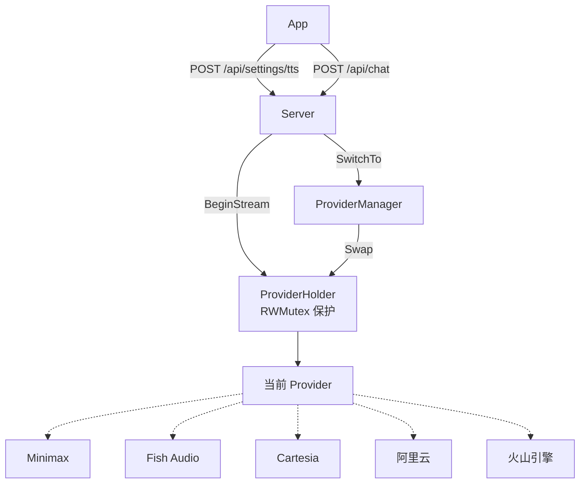
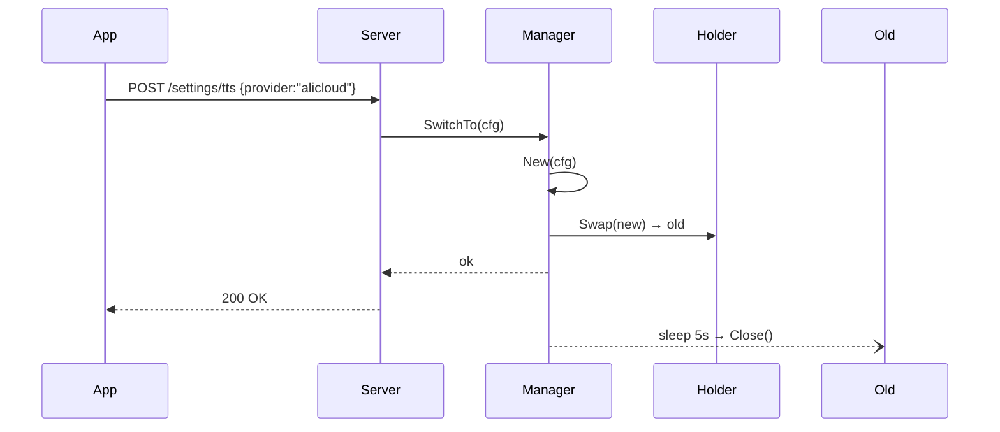
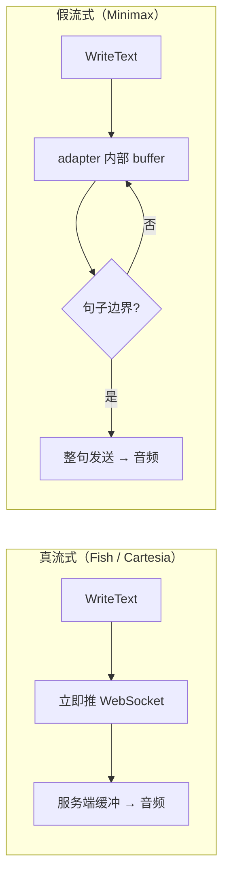

# TTS 可插拔模块技术提案

## 背景

当前 TTS 模块硬编码了 Minimax 作为唯一 provider。随着业务需求变化（延迟优化、中文质量、成本控制），需要支持多 provider 切换，且 app 端可运行时切换而无需重启服务。

## 目标

- 统一 TTS Provider 抽象，新增 provider 只需实现 adapter
- 所有 provider 统一走 streaming 接口，上层只有一条代码路径
- 支持 app 运行时切换 provider，不中断当前播放

## 架构



## 核心接口

```go
type TTSProvider interface {
    Name() string
    Capabilities() Capabilities
    BeginStream(ctx context.Context, sink AudioSink) (StreamSession, error)
    Close() error
}

type StreamSession interface {
    WriteText(text string) error
    Flush() error
    Close() error
    Err() error
}

type AudioSink interface {
    Format() AudioFormat
    WritePCM(data []byte) error
    Drain(ctx context.Context) error
    Stop() error
}
```

**设计要点**：没有 `Synthesize(text)` 方法，所有 provider 统一走 `BeginStream`。非流式 provider（Minimax）在 adapter 内部自行 buffer 到句子边界再发送，上层不感知。

## 上层调用

一条路径，不需要判断 provider 能力：

```go
session, _ := s.tts.BeginStream(ctx, sink)
runReq.StreamWriter = newSessionWriter(session)
s.runtime.Run(ctx, runReq)  // LLM token 直接写入 session
session.Close()             // flush + 等待播放完毕
```

## 运行时切换



进行中的合成继续用旧 provider 播完，下一次调用使用新 provider。

## Adapter 内部 Buffer 策略



上层完全不关心底层是哪种模式。

## 工厂函数

```go
func New(cfg ProviderConfig) (TTSProvider, error) {
	name := strings.ToLower(strings.TrimSpace(cfg.Provider))
	factory, ok := factories[name]
	if !ok {
		return nil, ErrProviderNotFound
	}
	return factory(cfg)
}
```

Adapter 通过 `tts.Register(...)` 注册。当前实现只包含 canonical provider 名：`minimax`、`minimax-ws`、`fish-audio`、`alicloud`、`volcengine`。不提供 alias。

## 目录结构

```
tts/
├── provider.go      # 接口定义
├── holder.go        # ProviderHolder（运行时替换）
├── manager.go       # ProviderManager（切换协调）
├── factory.go       # New()
├── sink.go          # AudioSink 实现
├── errors.go
└── adapters/
    ├── minimax/     # 内部 buffer 到句子边界
    ├── fishaudio/   # 真流式
    ├── alicloud/    # 阿里云 Qwen-TTS
    └── volcengine/  # 火山引擎 WebSocket 双向流式 V3
```

## 迁移路径

| Phase | 内容                                                       | 影响     |
| ----- | ---------------------------------------------------------- | -------- |
| 1     | 创建 `tts/` 包，定义接口 + Holder + Manager                | 无       |
| 2     | 包装现有实现为 adapter                                     | 无       |
| 3     | 上层切换到 Holder，删除旧 TTSClient / streamingSpeechWriter，加 HTTP API | 功能变更 |

每个 phase 独立 PR，独立部署。
