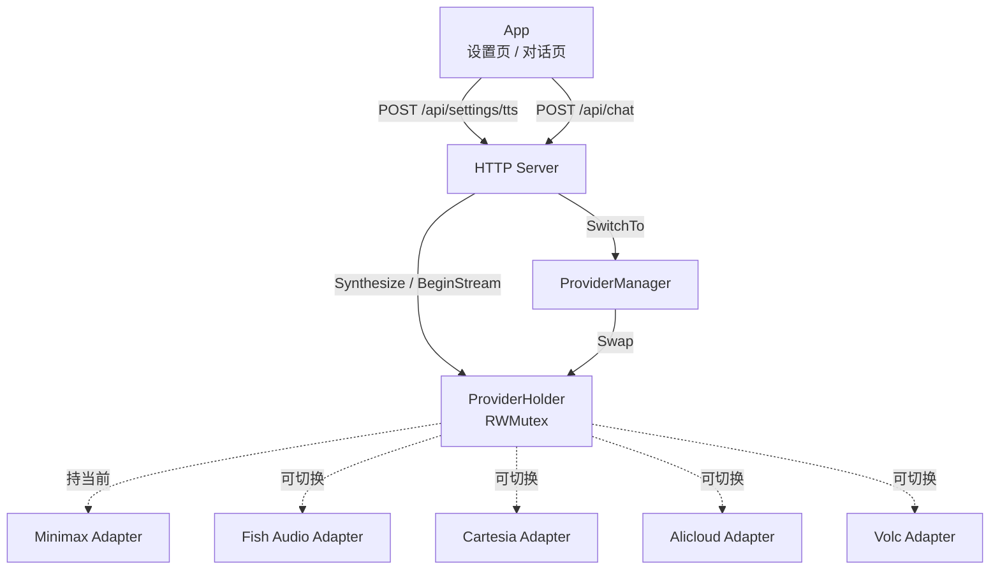
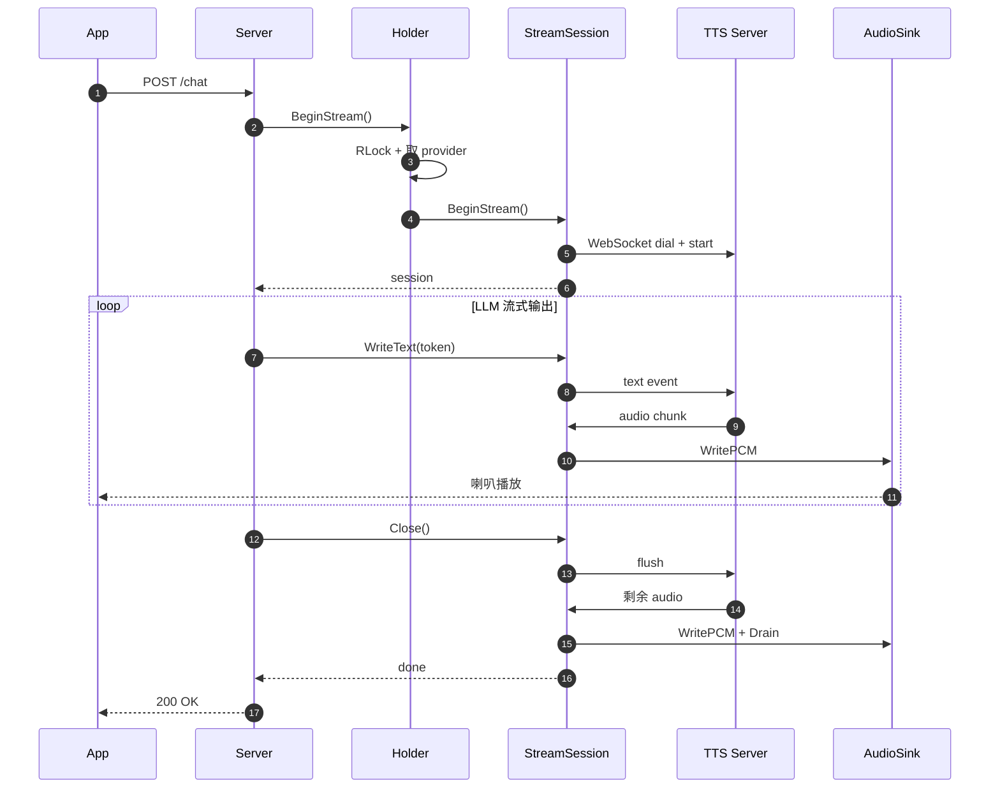
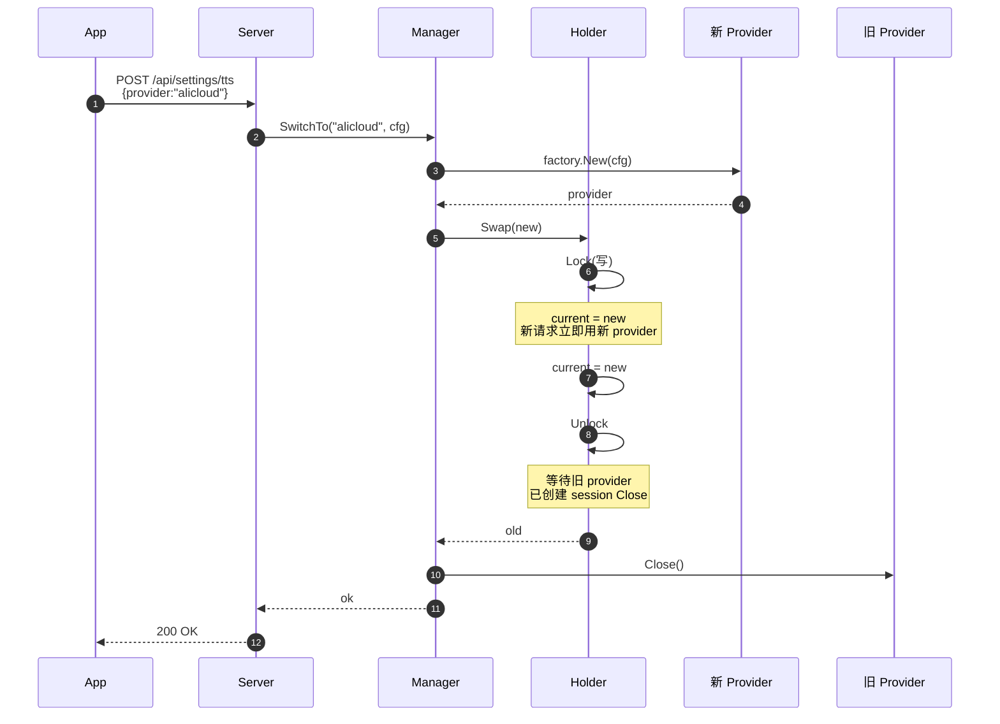
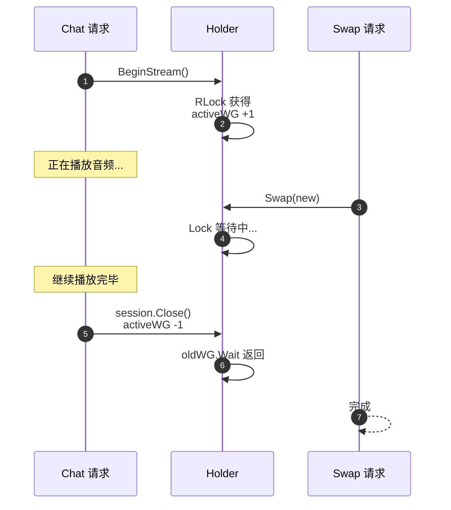
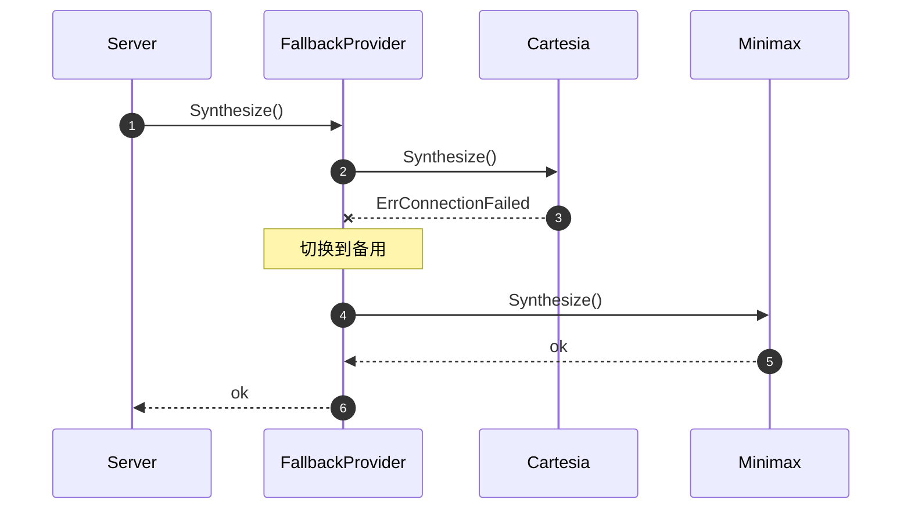
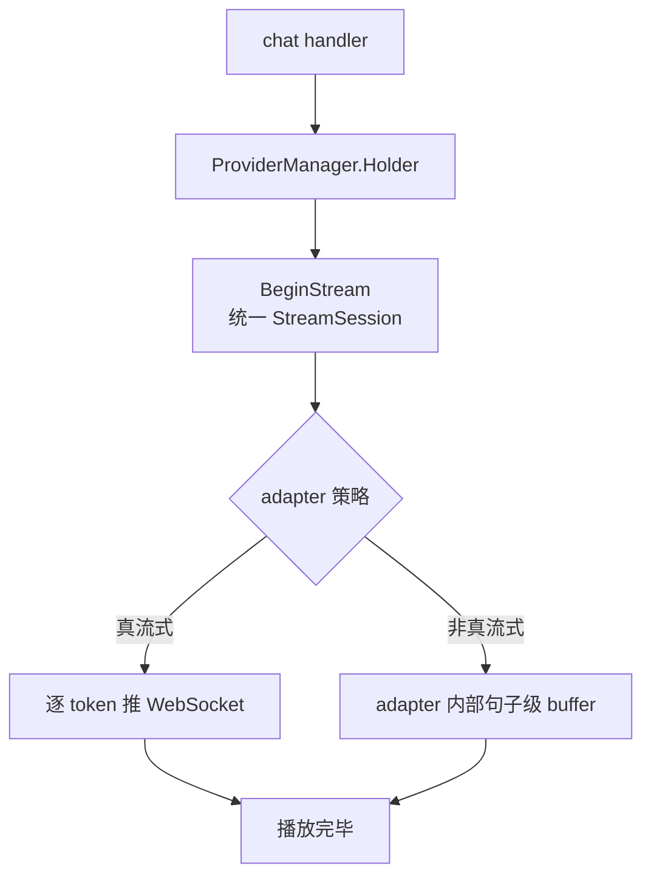
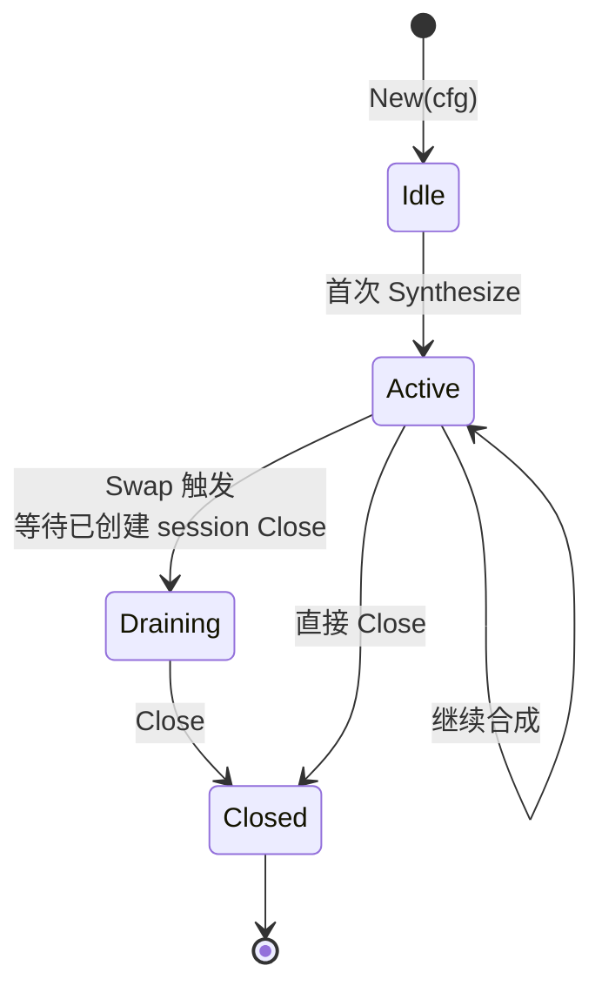
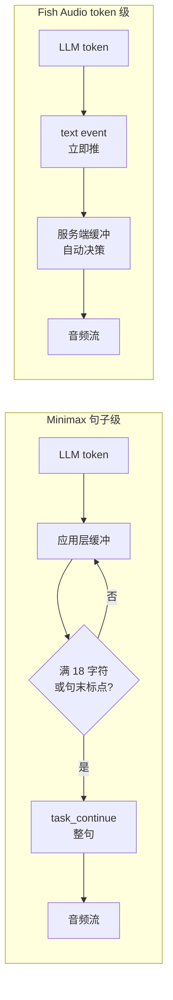

# TTS 模块流程图（Mermaid 版本）

## 1. 模块关系图

```mermaid
flowchart TD
    App[App<br/>设置页 / 对话页]
    Server[HTTP Server]
    Manager[ProviderManager]
    Holder[ProviderHolder<br/>RWMutex]
    Minimax[Minimax Adapter]
    Fish[Fish Audio Adapter]
    Cartesia[Cartesia Adapter]
    Alicloud[Alicloud Adapter]
    Volc[Volc Adapter]

    App -->|POST /api/settings/tts| Server
    App -->|POST /api/chat| Server
    Server -->|SwitchTo| Manager
    Server -->|Synthesize / BeginStream| Holder
    Manager -->|Swap| Holder
    Holder -.持当前.-> Minimax
    Holder -.可切换.-> Fish
    Holder -.可切换.-> Cartesia
    Holder -.可切换.-> Alicloud
    Holder -.可切换.-> Volc
```

## 2. 对话流程（流式 TTS）

```mermaid
sequenceDiagram
    autonumber
    participant App
    participant Server
    participant Holder
    participant Session as StreamSession
    participant TTS as TTS Server
    participant Sink as AudioSink

    App->>Server: POST /chat
    Server->>Holder: BeginStream()
    Holder->>Holder: RLock + 取 provider
    Holder->>Session: BeginStream()
    Session->>TTS: WebSocket dial + start
    Session-->>Server: session

    loop LLM 流式输出
        Server->>Session: WriteText(token)
        Session->>TTS: text event
        TTS->>Session: audio chunk
        Session->>Sink: WritePCM
        Sink-->>App: 喇叭播放
    end

    Server->>Session: Close()
    Session->>TTS: flush
    TTS->>Session: 剩余 audio
    Session->>Sink: WritePCM + Drain
    Session-->>Server: done
    Server-->>App: 200 OK
```

## 3. 运行时切换 Provider

```mermaid
sequenceDiagram
    autonumber
    participant App
    participant Server
    participant Manager
    participant Holder
    participant New as 新 Provider
    participant Old as 旧 Provider

    App->>Server: POST /api/settings/tts<br/>{provider:"alicloud"}
    Server->>Manager: SwitchTo("alicloud", cfg)
    Manager->>New: factory.New(cfg)
    New-->>Manager: provider
    Manager->>Holder: Swap(new)
    Holder->>Holder: Lock(写)
    Note over Holder: current = new<br/>新请求立即用新 provider
    Holder->>Holder: current = new
    Holder->>Holder: Unlock
    Note over Holder: 等待旧 provider<br/>已创建 session Close
    Holder-->>Manager: old

    Manager->>Old: Close()
    Manager-->>Server: ok
    Server-->>App: 200 OK
```

## 4. 切换与进行中合成的并发

```mermaid
sequenceDiagram
    autonumber
    participant Chat as Chat 请求
    participant Holder
    participant Swap as Swap 请求

    Chat->>Holder: BeginStream()
    Holder->>Holder: RLock 获得<br/>activeWG +1

    Note over Chat: 正在播放音频...

    Swap->>Holder: Swap(new)
    Holder->>Holder: Lock 等待中...

    Note over Chat: 继续播放完毕

    Chat->>Holder: session.Close()<br/>activeWG -1
    Holder->>Holder: oldWG.Wait 返回
    Swap-->>Swap: 完成
```

## 5. Fallback 流程

```mermaid
sequenceDiagram
    autonumber
    participant Server
    participant Fallback as FallbackProvider
    participant Primary as Cartesia
    participant Secondary as Minimax

    Server->>Fallback: Synthesize()
    Fallback->>Primary: Synthesize()
    Primary--xFallback: ErrConnectionFailed
    Note over Fallback: 切换到备用
    Fallback->>Secondary: Synthesize()
    Secondary-->>Fallback: ok
    Fallback-->>Server: ok
```

## 6. 能力探测

```mermaid
flowchart TD
    Start[chat handler] --> Holder[ProviderManager.Holder]
    Holder --> Stream[BeginStream<br/>统一 StreamSession]
    Stream --> Adapter{adapter 策略}
    Adapter -->|真流式| Token[逐 token 推 WebSocket]
    Adapter -->|非真流式| Buffer[adapter 内部句子级 buffer]
    Token --> Done[播放完毕]
    Buffer --> Done
```

## 7. Provider 状态机

```mermaid
stateDiagram-v2
    [*] --> Idle: New(cfg)
    Idle --> Active: 首次 Synthesize
    Active --> Active: 继续合成
    Active --> Draining: Swap 触发<br/>等待已创建 session Close
    Draining --> Closed: Close
    Active --> Closed: 直接 Close
    Closed --> [*]
```

## 8. 推送粒度对比

```mermaid
flowchart LR
    subgraph Minimax[Minimax 句子级]
        M1[LLM token] --> M2[应用层缓冲]
        M2 --> M3{满 18 字符<br/>或句末标点?}
        M3 -->|否| M2
        M3 -->|是| M4[task_continue<br/>整句]
        M4 --> M5[音频流]
    end

    subgraph Fish[Fish Audio token 级]
        F1[LLM token] --> F2[text event<br/>立即推]
        F2 --> F3[服务端缓冲<br/>自动决策]
        F3 --> F4[音频流]
    end
```
